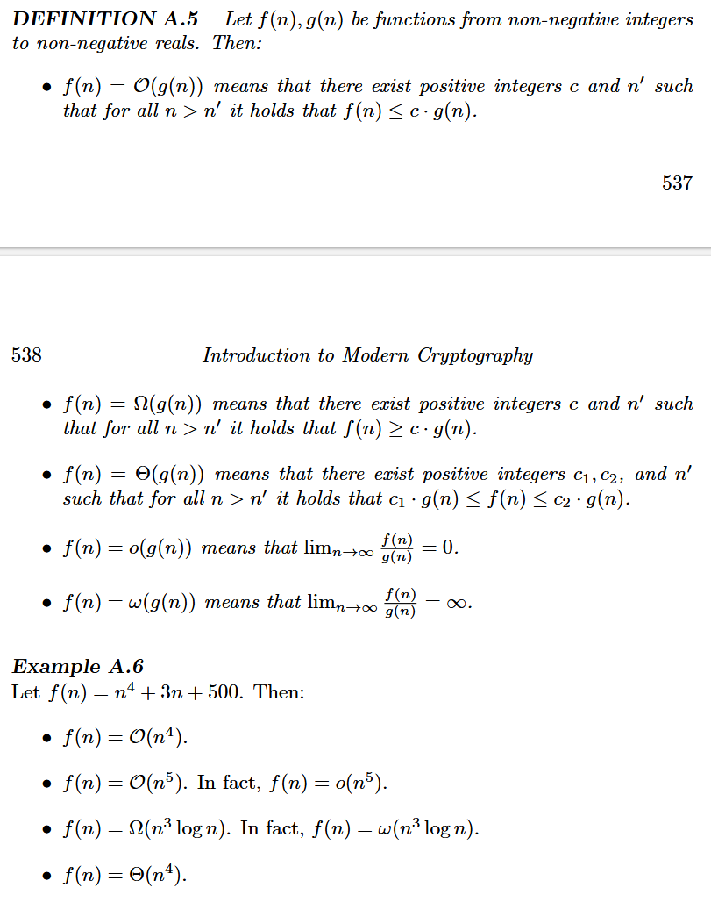

# What did you learn？

> 计算复杂度与计算复杂类别

## [Number 4: The Complexity Class P](https://bristolcrypto.blogspot.com/2014/10/52-things-number-4-complexity-class-p.html)

> On the topic of Theoretical Computer Science
> 参考[*Introduction to the Theory of Computation* by Michael Sipser](http://www.amazon.co.uk/Introduction-Theory-Computation-Michael-Sipser/dp/0619217642)

### 1. Complexity and Big O Notation

复杂度的概念是为了更直观的判断一个任务有多困难，我们当然也可以通过计算机解决这个问题的时间来判断，但是根据上一章的内容，这种方法是不合理的，因为不同硬件的计算能力不同。所以我们需要一个更加抽象的方法，可以忽略掉具体细节。具体方法为限制所需的**操作数**，也叫（时间）复杂度理论（(time) complexity theory）
注意，操作数往往与任务的输入密切相关，会随着操作数的不同而不同，甚至两个输入的长度一样，操作数也可能会完全不同。
> 分解256和323，都是9 bit，但是前者远快于后者，256=2^8，323=17*19

因此，我们通常选择**最坏情况分析**，记录特定长度的所有输入的最长运行时间，也就是需要一个**上界**，这就是大 O 表示法（Big O notation）。随着输入长度$n$的增加，我们可以忽略所有非主项以及常数系数。
> $\mathcal{O}(t(n))=\mathcal{O}(6n^3-n^2+1)=\mathcal{O}(n^3)$

标准定义：

### 2. Turing Machines

现在我们给出执行计算中最常用的模型————Turing Machines。

- **alphabet**: 非空有限集合
- **string**: alphabet 中元素的有限序列
- **language**: string 的集合
- **tape**: 无限长的带子，每个位置要么为空，要么包含一个alphabet的元素
  - 最开始时，tape最左边$n$个位置为输入，非空（因此也可以确定输入停止位置），其余为空
- **tape head**: 可以沿着tape向左或向右移动，读取或写入tape上的元素
  - 最开始在tape最左端并读取第一个符号
- **transition function**: 根据读取的符号和当前状态，决定下一步的动作，返回：
  - 一个新的状态
  - 另一个用于**写入**其所在方块的符号（尽管该符号可能与已写入的符号相同）
  - 一个新的移动方向：left or right
- **accept state** or **reject state**: 最后的状态，决定输入是被接受还是被拒绝，这两种都被称为**halting**（停机）
  - 可能会陷入无限循环，既不接受也不拒绝
- **decide**: 如果机器可以接受某个 language 的 string，并拒绝其它 string，就称机器可以决定这个 language ，这个 language 就被称为**decidable**（可判定的）
  - 例如：一个表示整数的字符串是否属于表示素数的字符串语言
- **Church-Turing thesis**: 任何真实计算机可以做的事情，图灵机都可以做
  - 也就是说，图灵机是计算的最终标准
- **time complexity class $\mathrm{TIME}(t(n))$**: 在$\mathcal{O}(t(n))$ 时间内，图灵机可判定的所有language的集合

这样我们就将**计算问题**转化为有关**语言成员资格**的问题（即，输入字符串是某种语言的成员吗?
> 例如：一个表示整数的字符串是否属于表示素数的字符串语言

### 3. The Complexity Class P

**P** 是图灵机可以在**多项式时间**内解决的所有问题的集合，也就是说，如果一个问题的解决时间复杂度是$\mathcal{O}(n^k), k>0$，那么这个问题就属于P类问题。P类问题是计算机科学中最重要的问题之一，因为它们是可以在多项式时间内解决的问题，这意味着它们是可以在实际中解决的问题。
> $k$ 变得非常大时，问题当然也变得非常困难，但是依然是多项式时间，增长速度完全比不上$n$在指数位置上时（e.g. $2^n$）。

以素数问题为例，判断一个数是否是素数，可以通过试除法，时间复杂度是$\mathcal{O}(\sqrt{n})$，因此是P类问题。
再以路径问题（判断有向图中AB两点是否存在路劲）为例，可以通过深度优先搜索，时间复杂度是$\mathcal{O}(n^2)$，因此是P类问题。

## [Number 5: What is meant by the complexity class NP?](https://bristolcrypto.blogspot.com/2014/11/52-things-number-5-what-is-meant-by.html)

- **P** is the class of languages decidable in polynomial time by a deterministic Turing machine.
- **NP** is the class of languages decidable in polynomial time by a **nondeterministic** Turing machine.

### 1. What is a Nondeterministic Turing Machine (NDTM)?

如果相同的输入，图灵机的转换函数（transition function）输出不同。问题就像一棵树，会衍生出很多不同的分支（答案），NDTM 会迅速计算所有的分支，如果其中一个分支可以被接受，那么这个输入就是可以接受的。
> 这种情况下 transition function 更正确的叫法是 transition relation

和上一章一样，这个定义从语言成员资格（language membership）概括到决策（decision），再到计算问题（computational problems）

### 2. Some Examples of NP problems

首先还是上一章的路径问题，假设一个有向图有$n$个节点，我们想知道是否存在一条从 A 到 B 的路径。 NDTM 可以解决这个问题，它的工作原理基本上是  在每次有交叉点时通过分支来尝试每条路线。如果有某个分支可以到达B，那么这个问题就终止于accept state，反之为reject state。在 $n$ 步内（即遍历 $n$ 条边之后）未到达 B 的分支都会终止于 reject state。所以每条路径至多包含$n - 1$个节点，任何有效的路径都会被检测到，因此本机可以正确地判断该路径是否存在。。

另一个经典例子是**满足性问题（satisfiability problem，SAT）**：Given an expression in $n$ boolean variables, is there an assignment of the variables such that the expression evaluates to True?
> 给定一个包含 n 个布尔变量的表达式，是否存在变量赋值使得该表达式的计算结果为真？

例如，对于表达式$(A \wedge B) \vee (A \wedge \neg B)$就是可以满足的，只需要$A = B = True$就可以了。
> 在标准形式中， SAT 是一个决策问题，只需要判断存不存在就行，至于答案是哪个不需要关心

### 3. Ok, so there are problems in NP. What is interesting about it?

首先我们可以确定$P \subseteq NP$，因为 DTM 可以看作是一个 NDTM，只是碰巧永远不会分支。所以，真正的问题是**哪些事情可以在 NP 中做而在 P 中不能做？**
> $P \overset{?}{=} NP$，是一个[千年问题](https://www.claymath.org/)，也称为百万悬赏问题

我们确实发现了一些已知存在于 NP 中但不知道是否存在于 P 中的问题，也许未来的研究会表明这些问题也存在于 P 中。

**[B站相关解说](https://b23.tv/bnB8rdS)**
> 里面很有趣的一句话：如果能快速地检验答案，是否代表也有快速方法破解问题呢？

许多有趣的密码系统（特别是在公钥密码中）都是基于计算问题“困难”的假设而安全的，这通常意味着“至少与 NP 中的任何问题一样困难”。

有个很有趣的定理叫做[Cook-Levin theorem](https://en.wikipedia.org/wiki/Cook%E2%80%93Levin_theorem)，它表明 SAT 是 NP 完全问题(**NP-complete**)的第一个例子，也就是说，任何 NP 问题都可以在多项式时间内归约到 SAT。这意味着，如果我们可以在多项式时间内解决 SAT，那么我们就可以在多项式时间内解决 NP 中的任何问题。

## [Number 6: How can we interpret NP as the set of theorems whose proofs can be checked in polynomial time?](https://bristolcrypto.blogspot.com/2014/11/52-things-number-6-how-can-we-interpret.html)

直接上结论：

$\mathrm{NP}$ is the class of languages that have **polynomial time verifiers**.
> 假设一个元素$x\in L$，其中$L$是一个 NP 语言，我们有一个证明器（prover）$P$，当给定$x$的时候，可以输出一个证据（witness）$w$，从$x$得到$w$的可以是指数复杂度，但如果将$x,w$给验证器（verifiers）$V$，$V$可以在多项式时间内判断$x \overset{?}{\in} L$。

这个结论证明其实很直观，NDTM在上章被比作一棵树，验证就是从这棵树最顶端的叶子（$w$）往下找根($x$)的过程，这个过程非常简单。
[正式证明](http://en.wikipedia.org/wiki/NP_(complexity)#Equivalence_of_definitions)
> $P \overset{?}{=} NP$也可以理解为  **从叶子找根**  和  **从根找叶子**  这两个过程是不是可以一样简单？？毕竟我们没有任何证据证明**没有**简单聪明的办法从根找到叶子（解题）

我们可以非常简单的想到：这个过程不就是**密码体制**的构建原理吗？$V$ 是解密算法，$w$ 是密钥，$x$ 是密文，$L$ 是明文。
> $P$可以理解为尝试破解密码的人？或者密钥生成算法？
> 注意不是所有 NP 问题都适合构建密码体制，因为 NP 问题是基于最差情况复杂度研究的，并不代表它的难度是均匀固定的。而密码学追求稳定的难度。

因此，P vs NP 问题在密码学中可以理解为：**是否存在一个简单的方法可以破解密码？**。一旦这个问题被解决，密码学简单讲就是会崩溃~
> 补充：整数分解问题并没有证据证明其是不是 NP-complete 问题，也没有证明它是不是 P 问题。

## [Number 7: How does randomness help in computation, and what is the class BPP?](https://bristolcrypto.blogspot.com/2014/11/52-things-number-7-how-does-randomness.html)

- **P** is the class of languages decidable in polynomial time by a deterministic Turing machine.
- **NP** is the class of languages decidable in polynomial time by a **nondeterministic** Turing machine.
- **BPP** is the class of languages that are recognised by a **probabilistic polynomial time Turing machine** with an error probability of $\frac{1}{3}$

### 1. What is the Probabilistic Turing Machine (PTM)?

上上章的NDTM可以看作是一个可以同时尝试所有可能性的“上帝”，而[Probabilistic Turing Machine](https://en.wikipedia.org/wiki/Probabilistic_Turing_machine)则更像一个只能尝试部分可能性的“凡人 ”。只能随机选择部分分支，所以即使面对同一个输入，既可能accept，也可能reject，甚至可能永远不停。这种图灵机衍生出了**RP**，**ZPP**等，以及本章的**BPP**。

### 2. What is the complexity class BPP?

**BPP (Bounded-Error probabilistic polynomial time)** 包含PTM可以在多项式时间内解决的决策问题，但是**错误率有$\frac{1}{3}$**。
> 根据**放大引理**(amplification lemma)，错误概率可以限制为 $0$ 到 $\frac{1}{2}$ 之间的任何值（别问，问就是看不懂证明）

**BPP包含着P！**，这个很好理解，当只有一个分支的时候，PTM会以 1 的概率“随机”选到这个分支，所以P是BPP的子集。
> 同样，$P \overset{?}{=} BPP$

### 3. An example of a BPP Problem

曾经最著名的 BPP 中已知但 P 中未知的问题就是判断一个数是不是素数，但是2002年一个确定的多项式算法（[AKS primality test](http://en.wikipedia.org/wiki/AKS_primality_test)）证明了这个问题其实是 P 问题。

另一个著名的 BPP 中已知但目前 P 中未知的问题是多项式恒等性检验（[polynomial identity testing](http://en.wikipedia.org/wiki/Schwartz%E2%80%93Zippel_lemma)），即确定一个多项式是不是恒等于 0 多项式

## [Number 8: How does interaction help in computation, and what is the class IP?](https://bristolcrypto.blogspot.com/2014/12/52-things-number-8-how-does-interaction.html)

### 1. Interactive Proof Systems

首先介绍一下交互证明系统（Interactive Proof Systems），这是由Shafi Goldwasser、Silvio Micali和Charles Rackoff在1985年提出的。这也是**零知识证明**（Zero-knowledge proof）的基础。特点就是除了所证明**断言**（**assertion**）的有效性之外，什么也不透露。与经典证明系统不同的是，交互证明系统增加了两个元素：

- **randomisation**：验证器（verifier）是概率性的，有小概率会出错
- **interaction**：证明者（prover）和验证者（verifier）之间会交互，验证过程是一个动态的过程

> the set of languages of interactive proof systems is in a large complexity class **IP**.

证明系统应该包含一下性质：

- **Efficiency**：验证得快对吧，不然验个一百年？
- **Soundness**：如果断言是假的，非法证明不能随便伪造
- **Completeness**：如果断言是真的，一定存在合法证明

### 2. Classical proofs

具体概念参考上面和[这里](https://en.wikipedia.org/wiki/Interactive_proof_system)。

主要补充一点：我们知道 NP 可以看作一个语言类（a class of languages），里面的成员都可以被快速验证（回忆叶子到根），即有一个**证书**（certificate），非成员则没有。所以 NP 正是一类经典证明语言。
> NP is exactly the class of languages of classical proofs.

### 3. Interactive Proofs

首先回答一个问题：**为什么交互证明系统比经典证明系统（在某些方面）更强大？**

通过举一个例子：**图同构 与 图非同构**
> Graph Isomorphism and Graph Non-isomorphism.

两个图$G,H$如果[同构](https://www.zhihu.com/question/326620873)，说明$G$通过顶点的某种重排可以变为$H$。即以下language:
$$ISO = \{ <G,H> | G,H \text{ are isomorphic graphs} \}$$
这个问题是一个 NP 问题，因为一旦知道重排指令，很容易就可以验证。

同样的，根据图非同构问题，我们可以定义以下language：
$$NOISO = \{ <G,H> | G,H \text{ are}\ \mathbf{not}\ \text{isomorphic graphs} \}$$
看似只是加了一个 not，但是验证突然变得很难了，至少用经典证明很难。因为我们没办法在短时间内尝试所有的可能性然后说这俩图确实不同构。那用交互证明怎么做呢？

首先假设有两个图$G_0,G_1$，验证者（verifier）随机选取一个 bit $b \in \{0,1\}$和一个置换（permutation）$\pi$，将$\pi$作用于$G_b$后得到图$H$，证明者（prover）收到$H$后，发送一个比特$b'$给验证者。验证者当且仅当$b=b'$时接受。

这个协议的背后逻辑是：如果$G_0,G_1$不是同构的，那么证明者可以识别$H$来自$G_0$还是$G_1$。如果$G_0,G_1$是同构的，那么证明者没有办法识别$H$来自$G_0$还是$G_1$。相反，如果$G_0,G_1$是同构的，那么证明者的行为就像是随机的，验证者接受的概率是$\frac{1}{2}$。

至此，我们发现了交互证明系统的相比经典证明系统存在着不可替代性。
紧接着我们给出 IPS 与 IP的正式定义：

**Interactive proof system**: *A pair of interactive machines* $(P,V)$ *is called an interactive proof system for a language $L$ if machine **V** is polynomial-time and the following conditions hold:*

- **Completeness**: For every $x \in L$
$$Pr[<P,V>(x)=1]\geq \frac{2}{3}$$
- **Soundness**: For every $x \notin L$
$$Pr[<P,V>(x)=1]\leq \frac{1}{3}$$

**The class IP**: *The class **IP** consists of all languages having interactive proof systems.*

显然，**IP 包含了 BPP**，如果我们将消息的交换次数限制为1，那么我们就得到了 NP，所以**IP 也包含了 NP**。
> 可以这么理解：NP 问题可以验证对吧，而且验证过程非常简单，多项式时间内就能完成对吧，而且只交互一个证据(witness)对吧。现在 IP 都不限制交互了，所以 NP 也就是 IP 的子集了。
> 也可以这么理解：$\{(=1)\}\subset \{ (\geq \frac{2}{3})\}$

1992年，Adi Shamir证明了[IP = PSPACE](http://dl.acm.org/citation.cfm?doid=146585.146609)，这个证明是一个重要的里程碑，因为它表明了交互证明系统的强大性质。

补充（看不懂没事）：请注意，在协议中，证明者有能力抛出**私人硬币**（private-coin）。如果允许 证明者 访问 验证者 的随机字符串，就会导致模型转变为与 带有**公共币**（public-coins）的交互证明 相关，复杂性类 [AM](http://en.wikipedia.org/wiki/Arthur%E2%80%93Merlin_protocol) 与这个相关。
> If the prover is allowed to access to the verifier's random string leads to the model of interactive proofs with public-coins.
