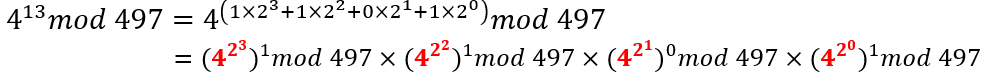
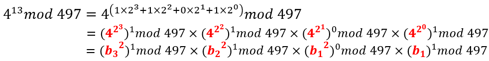
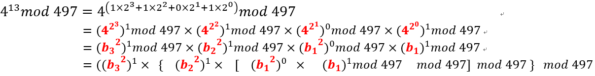
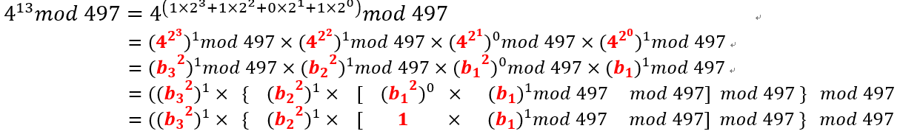
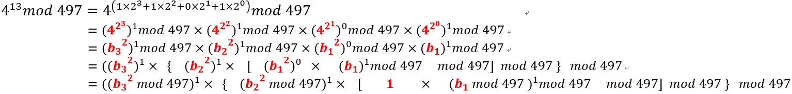

# What did you learn？

> Cryptographic Implementation Details'

## [Number 21: How does the CRT method improve performance of RSA?](https://bristolcrypto.blogspot.com/2015/02/52-things-number-21-how-does-crt-method.html)

**The Chinese Remainder Theorem (CRT) 中国剩余定理：**
当有俩等式 $x\equiv a\ (mod\ M),x\equiv b\ (mod\ N)$ 时，如果 $M,N$ 互质，那么可以通过 CRT 计算出 $x$ 的唯一解。

**一些题外话：**
RSA方案中的主要运算是模幂( modular exponentiation )$M=C^d(mod\ N)$。一次模幂云散在改进的状态下，可以使用 $(h - 1)$ 次乘法和 $(t - 1)$ 次平方操作（$t$ 是指数的位长度，$h$ 是汉明权重）。乘法和平方平均次数为 $t+t/2−1$。
进一步改进：我们可以使用 binary exponentiation algorithms 或者 window methods。对于后者，我们一次处理 $w$ 位指数，这种方法，我们仍然需要 $t$ 次平方，但乘法次数平均减少到 $t/w$。通过采用滑动窗口方法，乘法次数可以降到平均 $t/(w + 1)$ 次。

**开始正题：**
CRT 用于 RSA 解密的情况。因此，我们正在考虑私钥操作，这意味着我们可以访问私钥，从而可以访问模数 $N=pq$ 的因式分解。如果我们假设我们想要解密一条消息，那么我们的目标是计算 $M=C^d(mod\ N)$。
首先我们计算：
$$
M_p=C^d(mod\ p)=C^{d(mod\ p-1)}(mod\ p)\\
M_q=C^d(mod\ q)=C^{d(mod\ q-1)}(mod\ q)
$$
此计算需要对 512 位取模和 512 位指数求幂，因为 $p$ 和 $q$ 是 512 位。这比用 1024 位数字进行单次取模求幂要快。

使用 CRT 可以根据 $M_p,M_q$ 计算出 $M$：
$$
M=M_p+p\cdot(p^{-1}\ mod\ q)\cdot(M_q-M_p)\ (mod\ N)
$$
另一种表示方法：
$$
T = p^{-1}\ mod\ q\qquad 作为私钥\\
U = (M_q-M_p)T\ mod\ q\\
M = M_p+U\cdot p
$$
p.s.：$q^{-1}\ mod\ p\cdot q+p^{-1}\ mod\ q\cdot p=1\ mod \ N$

## [Number 22: How do you represent a number and multiply numbers in Montgomery arithmetic?](https://bristolcrypto.blogspot.com/2015/03/52-things-number-22-how-do-you.html)

这个连问题都看不懂了属于是

### 1. Secure and Efficient

虽然密码学的目标是设计高度安全的密码协议，但还必须能够有效地实现这些协议，以便可以一遍又一遍地执行这些协议，而不会减慢用户的速度，例如在线购物或转账通过网上银行。因此，需要采取措施最大限度地减少这些协议中使用的每种算法的计算成本。此类算法中使用的最昂贵的运算之一是对某些 $n>0$ 进行 reduction of integers modulo，因为它实际上是除法运算。

### 2. The Cost of Modular Reductions

假如我们知道 $a\ mod\ n,b\ mod\ n$，现在想计算 $ab\ mod\ n$。我们可以计算 $ab$，然后再对 $n$ 取模。一次乘法倒是还好，但是多次这样的计算成本会很高，比如 $c=m^e$ ,需要迭代 $e$ 次，每次都要取模，$e$ 可不是一个小数目。一个解决办法是先把乘法算完了最后模。但这样的话，我们必须得存储（并计算）非常非常大的数字。肿么办？

### 3. "Montgomery Space"

[Montgomery](https://blog.csdn.net/bjarnecpp/article/details/77644958) 提出了一种方法，可以在不进行模运算的情况下进行乘法。这种方法是通过引入一个称为 Montgomery 空间的新空间来实现的。在这个空间中，我们可以进行乘法，而不需要进行模运算。然后，我们可以将结果转换回普通的空间，而不需要进行模运算。这种方法的关键是选择一个称为 Montgomery 模数的特殊模数。这个模数是一个方便的模数，通常是 2 的幂。

为什么这个模数是方便的呢？因为我们可以通过移位来实现模运算。假设我们有一个数 $x$，与特殊模数 $r=2^k$，将 $x$ 变为二进制串

- 计算 $x\ mod\ r$，只需要保留 $x$ 最低的 $k$ 位
- 计算 $xr$，只需将 $x$ 左移动 $k$ 位
- 计算 $x/r$，只需将 $x$ 右移动 $k$ 位

### 4. Montgomery Algorithm

$a,b,n,r$，其中$gcd(n,r)=1$，且 $r>n$，我们可以计算 $ab\ mod\ n$：

1. 通过扩展欧几里得算法计算 $rr^{-1}=1+nn'$
   >这步很快的。而且因为 $r$ 是 2 的幂，$n$ 是奇数，所以 $gcd(n,r)=1$，所以肯定有解
2. 计算$\bar{a}=ar\ mod\ n$与$\bar{b}=br\ mod\ n$
   > $a\times r$这步也很快，因为 $r$ 是 2 的幂，所以只需要移位
   > $mod\ n$ 这步开销比较大，甚至比naive的算法还要大，所以本算法更适用于少数 multiplier 多次相乘的情况（e.g. $a^mb^{m'}$），这样结果可以多次重复使用步骤 2，3 的结果
3. 计算$u=abr\ mod\ n$
   > 每一步都很快
   - $t\leftarrow \bar{a}\bar{b}$
   - $u\leftarrow (t+(n't\ mod\ r)n)/r$
   - if $u\geq n$ then $u\leftarrow (u-n)$
   - output $u$
4. Multiply $u$ by $r^{−1}$ and reduce modulo $n$
   > 同 2

**正确性**：
$$
u = abr\ mod\ n\\
=arbrr^{-1}\ mod\ n\\
=tr^{-1}\ mod\ n\\
=trr^{-1}/r\ mod\ n\\
=t(1+nn')/r\ mod\ n\\
=((t+nn't)/r+mn)\ mod\ n\\
=(t+(n't+mr)n)/r\ mod\ n\quad for\ any\ m\\
(选择一个合适的 m)\overset{n't+mr=(n't\ mod\ r)}{=}(t+(n't\ mod\ r)n)/r\ mod\ n
$$
> 可以发现没有$\ mod\ n$ 的操作。

因为 $n>r>0$，可以得出 $n^2<rn\Rightarrow n^2+rn<2rn\Rightarrow(n^2+rn)/r<2n$
所以$(t+(n't\ mod\ r)n)/r<2n$，因此不需要$\ mod\ n$，只需要看情况减去 $n$ 即可。

## [Number 23: Write a C program to implement Montgomery arithmetic.](https://bristolcrypto.blogspot.com/2015/03/52-things-number-22-write-c-program-to.html)

自己写了一个

```c
#include <stdio.h>

// 求模逆
int mod_inverse(int a, int m) {
    int m0 = m, t, q;
    int x0 = 0, x1 = 1;
    if (m == 1) {
        return 0;
    }
    while (a > 1) {
        q = a / m;
        t = m;
        m = a % m, a = t;
        t = x0;
        x0 = x1 - q * x0;
        x1 = t;
    }
    if (x1 < 0) {
        x1 += m0;
    }
    return x1;
}

// 计算Montgomery reduction
int montgomery_reduction(int a, int b, int n, int r, int r_inv) {   
    int n_apo = (r*r_inv - 1)/n;
    
    int a_bar = a * r % n;
    int b_bar = b * r % n;
    int t = a_bar * b_bar;
    int m = t * n_apo % r;
    int u = (t + m * n) / r;
    
    if (u >= n) {
        return u - n;
    } else {
        return u;
    }
}

int main() {
    int a = 123; // 输入参数a
    int b = 456; // 输入参数b
    int n = 1009; // 模数n
    int r = 1 << 10; // 选择r为2的8次方，且r > n
    int r_inv = mod_inverse(r, n);

    int u = montgomery_reduction(a, b, n, r, r_inv);
    int result = u * r_inv % n;
    printf("Montgomery reduction of %d and %d modulo %d is: %d\n", a, b, n, result);

    return 0;
}
```

## [Number 24: Describe the binary, m-ary and sliding window exponentiation algorithms.](https://bristolcrypto.blogspot.com/2015/02/52-things-number-24-describe-binary-m.html)

> 继续考虑一些计算模幂（modular exponentiations）的不同方法，例如计算：$X^E\ mod\ N$。

### 1. Binary

[The binary modular exponentiation](https://blog.csdn.net/qq_42146775/article/details/102635980)
举例：

可以看出前一个基数的幂是后一个基数幂的平方，所以我们假设第一个基数为 $b_1$，第二个为 $b_2$，依次类推

现在我们合并一下，即每个先乘以低位mod的结构，再mod

我们再优化一下，指数等于 0是没有必要乘的，但是我们任然需要计算基数，方便下一个直接平方

其实上面每次算基数时，我们仍然可以mod 497


每一步都有两个操作

1. (假如幂是 1 执行，是 0 直接执行第二步)：基数(记为 $B$ ) 乘前一位的结果 (记为 $R$)
2. 基数 $B$ 平方且mod n为下一次作准备 $B^2\ mod\ n$

### 2. m-ary

$m$ 进制与 Binary 相似，后者是把每个元素看作一个bit，而前者是看作 $m$ 个bit，即一共 $M=2^m$ 个元素。Binary 可以认为是 $M=2$ 的 1-ary。

工作原理：首先我们为 $i=1\ to\ 2^m−1$ 的所有 $X^i$ 计算一个查找表。然后，我们将指数 $E$ 变为以 $M$ 为底。然后，对于 $E$ 中的每个“项”，我们只需从表中查找适当的值，然后我们不加倍，而是移 $m$ 位。
> 例如：$m=3,M=2^3=8,E=35=(43)_8,X^{(43)_8}=X^{4*8}\cdot X^{3}=X^{4*2^3}\cdot X^{3}$
> 没看懂为啥是移 $m$ 位, **我的理解是连续三次平方，Binary 是平方一次**
> 原文：Then, we work our way through the exponent E (in base M). Then, for each 'term' in E we simply look up the appropriate value from our table, and then instead of doubling we shift by m.

与 Binary 相比，这意味着更多的预计算（即计算更多的 $X$ 次幂），因此需要更多的空间，但作为回报，可以进行更少的乘法。

### 3. Sliding Window

是对 m-ary 的一次优化
> 但我连 m-ary 都没看懂...

假设 $m=4,E=22=(0,0,0,1,0,1,1,0)_2=(1,6)_{2^4}$

然后我们可以使用 4-ary，但如果我们“重新定位”窗口，也许可以做得更好：毕竟只有 3 个位置为了 1，并且它们都在范围为 4 的窗口内。如果我们提前知道这一点，我们就可以在该位置应用我们的查找表，因此只需要进行一次查找。
> $X^{22}=X^{16}\cdot X^{6}=X^{2^4}\cdot X^{6}=X^{11}\cdot X^{2}$
> 这样的话，我们需要利用预先计算的 $X^{11}$，$X^{2}$

所以我们首先将 $X$ 转为二进制，这样需要更多的预计算，但是如果 $X$ 足够稀疏，那么我们可以通过滑动窗口法可以节省不少时间。

## [Number 25: Methods for modular reduction using "special" primes that define $GF(p)$ and $GF(2^n)$](https://bristolcrypto.blogspot.com/2015/03/52-things-number-25-methods-for-modular.html)

modulo operation 使用量很大，但是不好操作，之前的 Montgomery representation （22 章）是一个优化方法，现在我们来看看另一个优化方法———— **Psudo-Mersenne Prime reduction**


