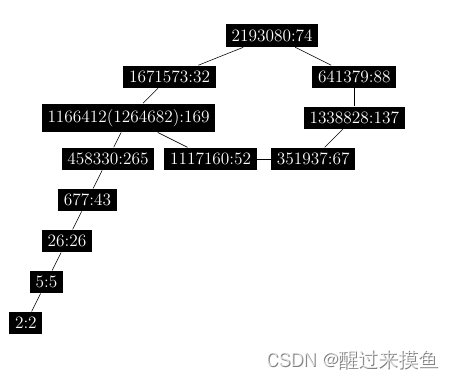

# What did you learn？

> Attacks

## [Number 33: How does the Bellcore attack work against RSA with CRT?](https://bristolcrypto.blogspot.com/2015/05/52-things-number-33-how-does-bellcore.html)

> 钟核攻击？🐷

RSA-CRT (#21) 是一种加速 RSA 加密和解密的方法，但是如果实现 RSA 的硬件（或软件）不时地产生错误或故障，那么就可以利用其来进行攻击。也就是我们接下来要介绍的。

RSA 是基于大整数分解问题的公钥密码算法，对其攻击往往涉及对模数的因式分解，但是 [Boneh、DeMillo 和 Lipton](https://link.springer.com/article/10.1007/s001450010016) 找到一种攻击，可以避免直接分解模数。他们表明，错误的密码值可以被攻击者利用，进而危害安全性。

首先回忆一下 RSA-CRT ：

本来是是计算 $S=x^d\ mod\ N$，现在首先计算 $S_1=x^{d}\ mod\ p$ 和 $S2=x^{d}\ mod\ q$，然后再通过 CRT 计算 $S$。

如果我们需要对同一消息 $x$ 的进行两次签名, 一次签名正确 $S=x^d\ mod\ N$，另一个签名 $\hat{S}$ 将错误。
首先需要计算 $S_1$ 和 $S2$，同样的，也需要计算 $\hat{S_1}$ 和 $\hat{S2}$。
假设仅在计算 $\hat{S_1}$ 时出现了错误，就会造成 $S_1 \neq \hat{S_1}\ mod\ p$，但是 $S_2 = \hat{S_2}$。也就意味着 $S \neq \hat{S}\ mod\ p,S = \hat{S}\ mod\ q$。也就有了：
$$
gcd(S-\hat{S},N) = q
$$
结果就是，仅用一个错误签名就成功分解了 $N$ 。

## [Number 34: Describe the Baby-Step/Giant-Step method for breaking DLPs](https://bristolcrypto.blogspot.com/2015/05/52-things-number-15-describe-baby.html)

[Baby-Step/Giant-Step](https://en.wikipedia.org/wiki/Baby-step_giant-step) 是由 [Daniel Shanks](https://en.wikipedia.org/wiki/Daniel_Shanks) 提出的一种方法，用于解决离散对数问题（Discrete Logarithm Problem，DLP）。

### DLP

给定一个 阶为 $n$ 循环群 $G$，一个生成元 $g$ 和一个元素 $h$，DLP 就是为了找到一个整数 $x$，使得 $g^x = h$。这个问题是一个困难问题。

### Baby-Step/Giant-Step

因为 $n$ 是群的 order，所以对于一个 $0\leq x\leq n$，我们可以将 $x$ 写为：
$$
x = i\lceil{\sqrt{n}}\rceil + j \tag{1}
$$
其中 $0\leq i,j\leq \lceil{\sqrt{n}}\rceil$。

因此 DLP 可以转化为：
$$
h=g^{i\lceil{\sqrt{n}}\rceil +j}\\
h(g^{-j})=g^{i\lceil{\sqrt{n}}\rceil}
$$
现在问题就找到一个满足等式的对儿 $(i,j)$。

一个方式就是预计算一张表 $\{g^{i\lceil{\sqrt{n}}\rceil}\},0\leq i \leq \sqrt{n}$ 与 $g^{-1}$
然后就是通过迭代 $j$ 计算 $h(g^{-1})^j$，直到找到一个匹配的值。
然后就可以通过 $(1)$ 计算出 $x$。

此方法的时间和空间复杂度均为 $O(\sqrt{n})$，但是目前还构不成威胁。

## [Number 35: Give the rough idea of Pollard rho, Pollard "kangaroo" and parallel Pollard rho attacks on ECDLP.](https://bristolcrypto.blogspot.com/2015/06/52-things-number-35-give-rough-idea-of.html)

本章将讨论空间开销更小的算法，但是复杂度还是 $O(\sqrt{n})$。

### 1. Pollard’s Rho Algorithm

> 这个算法本来是用于[因数分解](https://www.cnblogs.com/RioTian/p/13928916.html)的

令 $f:S\rightarrow S$ 为一个集合 $S$(大小为$n$) 到自身的随机映射，计算 $x_{i+1}=f(x_i)$ ，那么我们把 $x_0,x_1,x_2,\cdots$ 称为一个确定随机游走（deterministic random walk）
> 一般选 $f(x)=(x^2+C)\ mod\ n$

因为 $S$ 是有限的，所以必然会有 $x_i=x_j$，其中 $i<j$，也就形成了所谓的环。或者说，形成了一个碰撞
> 形状就跟符号 $\rho$ 一样，$x_0$ 看做左下角起点，总会形成一个环的
> e.g. $x_0=2,f(x)=(x^2+2)\ mod\ 2206637=317\times 6961$
> 

为了找到这样一个碰撞，我们可以使用 Floyd’s cycle-finding algorithm，也就是快慢指针，即计算：
$$
(x_{i+1},x_{2i+2})=(f(x_i),f(f(x_{i+1})))
$$
总会找到一个 $x_m=x_{2m}$，其中 $m=O(\sqrt{n})$。

对于 DLP，我们将 $S$ 分为三部分 $S_1,S_2,S_3$，其中 $1\in S_2$，并定义以下随机游走：
$$
x_{i+1}=f(x_i)=h\cdot x_i,x_i\in S_1\\
x_{i+1}=f(x_i)=x_i^2,x_i\in S_2\\
x_{i+1}=f(x_i)=g\cdot x_i,x_i\in S_3
$$
我们实际上跟踪的是 $(x_i,a_i,b_i)$，其中：
$$
\left\{
\begin{aligned}
a_{i+1}=a_i,x_i\in S_1\\
a_{i+1}=2a_i\ mod\ n, x_i\in S_2\\
a_{i+1}=a_i+1\ mod\ n,x_i\in S_3
\end{aligned}
\right.\\
\left\{
\begin{aligned}
b_{i+1}=b_i+1\ mod\ n,x_i\in S_1\\
b_{i+1}=2b_i\ mod\ n, x_i\in S_2\\
b_{i+1}=b_i,x_i\in S_3\\
\end{aligned}
\right.
$$
我们从一个三元组 $(x_0,a_0,b_0)=(1,0,0)$ 开始，对于所有 $i$, **总有**！！
$$
\log_g(x_i)=a_i+b_i\log_g(h)=a_i+b_ix
$$
> $\log_g(h\cdot x_i)=a_i+(b_i+1)\log_g(h)$
> $\log_g(x_i^2)=2a_i+2b_i\log_g(h)$
> $\log_g(g\cdot x_i)=a_i+1+b_i\log_g(h)$

通过利用 Floyd’s algorithm 我们可以找到一个碰撞，即 $x_m=x_{2m}$，也就是 $a_m+b_mx=a_{2m}+b_{2m}x$，也就有：$x=\frac{a_{2m}-a_m}{b_m-b_{2m}}\ mod\ n$
如果 $x_0,x_1,x_2,\cdots$ 是由随机映射产生的，那么上述算法将在期望时间 $O(\sqrt{n})$ 内找到离散对数，即：
$$
\log_g(h)=x
$$

### 2. Pollard’s Kangaroo Method

跟 Rho 算法很想，而且更适用于我们知道 $x$ 的范围的情况，i.e. $x\in[a,\cdots,b]$。

令 $w=b-a$ 为 $x$ 所在区间的跨度，并定义一个非递增的数列 $S=\{s_0,\cdots,s_{k-1}\}$，均值（mean）$m$ 大约为 $N=\sqrt{w}$

