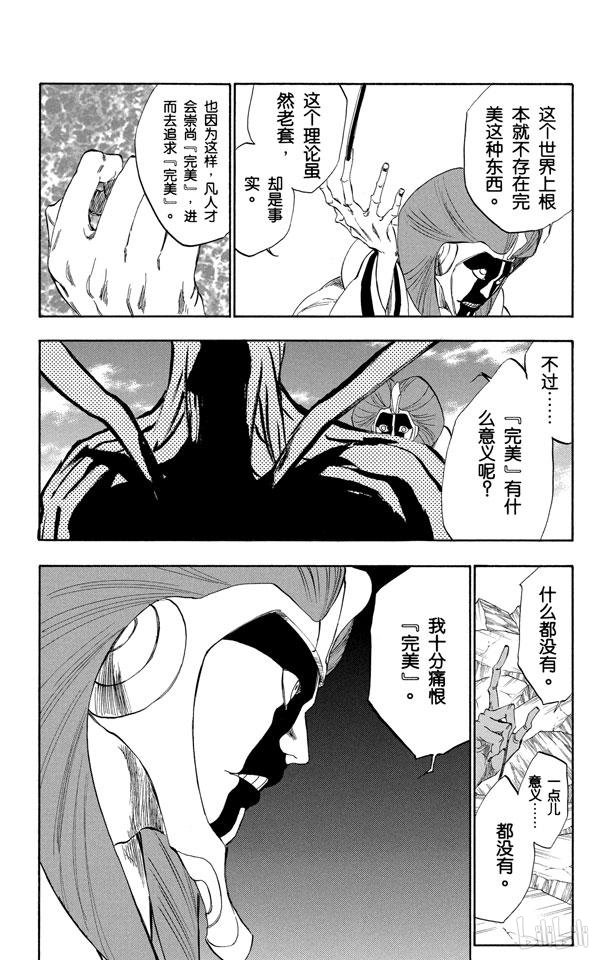
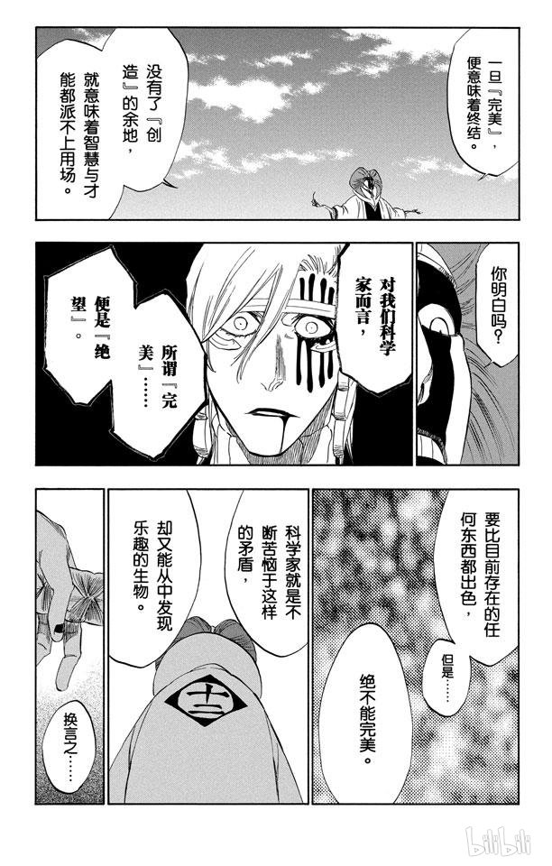
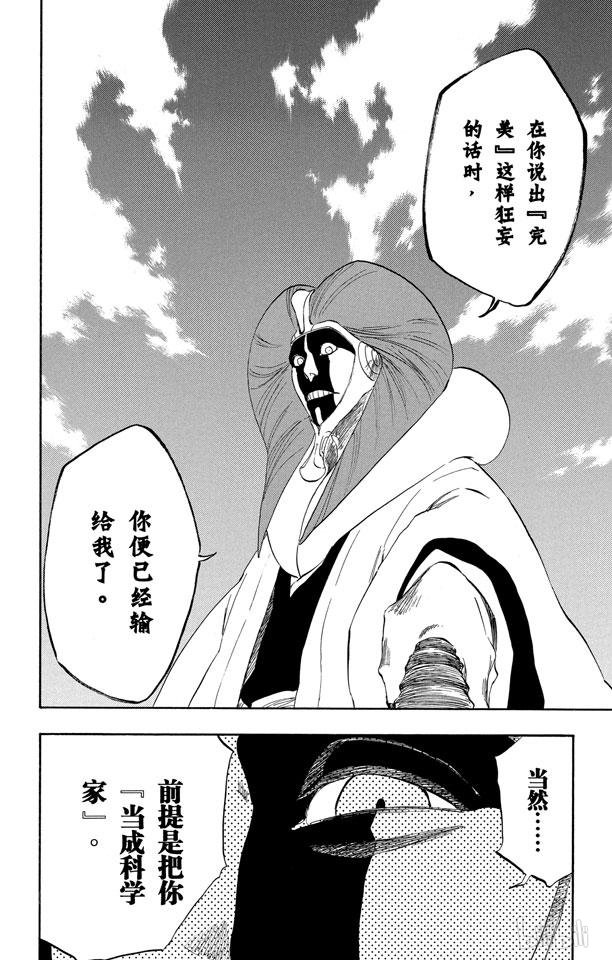

# What did you learn？

> side-channel attack

## [Number 38: What is the difference between a covert channel and a side-channel?](https://bristolcrypto.blogspot.com/2015/06/52-things-number-38-what-is-difference.html)

隐蔽信道和侧通道是信息泄漏通道的两种类型。

### Covert Channel

1. 隐蔽信道使用的机制并非用于通信
   > 例如：可以尝试写入一个文件，根据锁定与否可以传达信息 “1” 或 “0”
2. 在一个隐蔽信道中，一个内部程序会泄露信息给另一个外部程序（例如特洛伊木马）[1]

### Side Channel

1. 测信道攻击（side-channel attack）也叫被动非侵入式攻击（passive non-invasive attacks），即只有可直接访问的接口才会被利用。至于设备则不会被永久改变，因此不会留下任何攻击的证据。
   > 侧信道攻击的基本思想是通过测量加密设备的执行时间、功耗或电磁场等来确定其密钥 [2]
2. 在物理侧信道攻击中，经常使用一些非常规的技术手段
   > 买通保安十分钟拔一次网线
3. 传统的侧信道攻击涉及差分功率分析（differential power analysis）和时序分析（timing analysis）
   > 所需的实验次数可能比数学密码分析所需的少得多 [1]
4. 在软件侧信道攻击中，受害者进程**无意中**承担了发送进程的角色，而监听（攻击者）进程则承担了接收进程的角色。如果受害进程正在使用密钥执行加密操作，则软件侧信道攻击允许监听进程获取将导致部分或全部密钥恢复的信息 [1]

> 就像想知道老师在不在办公室。隐蔽信道就是让别人给老师打个电话问一下，侧信道就是看看办公室的门是不是开着

[1] Wang, Zhenghong, and Ruby B. Lee. "Covert and side channels due to processor architecture." Computer Security Applications Conference, 2006. ACSAC'06. 22nd Annual. IEEE, 2006.
[2] Mangard, Stefan, Elisabeth Oswald, and Thomas Popp. Power analysis attacks: Revealing the secrets of smart cards. Vol. 31. Springer Science & Business Media, 2008.

## [Number 39: What is the difference between a side-channel attack and a fault attack?](https://bristolcrypto.blogspot.com/2015/07/52-things-number-39-what-is-difference.html)

Side-channel attacks (SCA)
> 可利用泄露 [timing](https://www.rambus.com/timing-attacks-on-implementations-of-diffie-hellman-rsa-dss-and-other-systems/), [power consumption](https://www.rambus.com/differential-power-analysis/), electromagnetic emanations, [acoustic noise](https://www.tau.ac.il/~tromer/acoustic/) etc.

Fault attacks (FA) 故障攻击，利用的则是错误计算的结果。这个错误可能是程序或者设计上的 bug (例如因特尔的 FDIV bug)，也可能是敌手直接干预（例如电源故障(power **glitch**)、时钟故障(clock glitch)、温度变化(temperature variation)、离子束注入(ion-beam injection)等）造成的。
> 《魔法学徒故障攻击指南》（['The Sorcerer’s Apprentice Guide to Fault Attacks'](https://eprint.iacr.org/2004/100.pdf)）你值得拥有

听起来确实有点抽象，一个是 computation leakage，一个是 erroneous computation。不如看点实在的例子，从以下三个子类：
> 这种分类仅代表作者意见

### Non-Invasive

*An attack is classed as non-invasive if the adversary has no physical contact with the target.*

**SCA:**
Timing attacks. 这是个有争议，因为它是最适合但也是入侵最浅的 SCA 向量
> Timing attacks are arguable both the most applicable and the least invasive SCA vector.

时间攻击可以[远程执行](https://crypto.stanford.edu/~dabo/papers/ssl-timing.pdf)，也是最容易被引入的。拿 OpenSSL 这种大型库来说，它可以兼容大量平台与一整套密码学套件。确保每个敏感计算都被编程进一个恒定时间，这个工作非常繁琐且艰难
> constant time，我理解为不管输入是什么，程序的执行时间都是一样的，即恒定的意思，这样就不会因为输入的不同而导致时间的差异，从而避免了时间攻击（当然这样很难）。而不是翻译为常数时间。

**FA:**
非侵入式故障攻击并不常见，因为它需要错误行为来触发，但是靠人家主动暴露错误就太难太被动了。就像前面提到过的 FDIV，拿这个构建攻击，可以，它将在每 90 亿个随机输入中返回一个错误的除法结果，相当不现实。但是，这不代表这种攻击不可能，比较也没有不可能的证据。

### Semi-Invasive

*An attack is classed as semi-invasive if the adversary has limited physical contact with the target.*

**SCA:**
功耗分析（power analysis），如果敌手能够将能耗与操作联系起来，那么就可以通过监控能耗来分析正在执行的操作。说是半侵入式的，因为攻击者需要对目标设备进行电源连接，而目标设备并不总是可用，因此攻击者需要修改目标。

**FA:**
时钟和电源故障攻击（clock and power glitch attacks），这种攻击是通过改变目标设备所处的目标环境从而引发错误行为。就比如一个芯片的时钟输入，时钟控制着目标设备的运行速度。一个设备的时钟不能太大，要留给电路时间来稳定，也就是目标必须遵循一个“关键路径”（'critical path'）。一旦突破这个限制，就可以引发设备内部的竞争，会产生未定义行为，这种攻击非常[高效](http://www.eurasia.nu/wiki/index.php/Xbox_360_Reset_Glitch_Hack)
> 不过这种攻击造成的后果也是不可预测的，所以很难复刻

### Invasive

*An attack is classed as invasive if the adversary has unlimited resources and access the target.*

**SCA:**
探测型（Probing）的 SCAs 直接连接目标设备的数据总线（data bus），允许攻击者几乎直接通过总线读取任何信息。必须对目标进行完全解封装并仔细检查，以精确定位秘密数据。
> Probing SCAs use a direct tap on the data bus
> 这儿的tap最好不要翻译为“水龙头”或者“轻拍”，而是“利用”，”接触“，”窃听“等意思

**FA:**
探测型（Probing）的 FAs  允许攻击者完全改变目标设备的行为。再次强调，目标必须完全解封装并绘制出来，以准确影响行为，而一旦完成，对手就有能力重新连接目标，从而改变其操作。

总结：SCA 和 FA 都已在现实设备上被证明具有毁灭性的效果。当然，我们设计了几种对策来减轻这些攻击，这就是后续的话题了。

## [Number 40: What is normally considered the difference between SPA and DPA?](https://bristolcrypto.blogspot.com/2015/07/52-things-number-40-what-is-normally.html)

电磁(Electronmagnetic, EM)或功率分析攻击（Power **or** Electromagnetic analysis attacks）被划分成两种类型的攻击，简单功率分析(Simple Power Analysis, SPA)和差分功率分析(Differential Power Analysis, DPA)。这两种攻击都是要么使用电磁记录设备要么使用功率记录（power traces）设备，但是它们在使用功率记录数据的数量和分析这些记录的方法上有本质不同。
> Both of these types of attack work using either electromagnetic or power traces of a device but vary fundamentally in the number of power of traces they require and how these traces are analysed. Before examining the differences between these attacks, it is worth looking at what a po

首先说明一下 功率/电磁记录（power/EM trace）是什么？
> 以下的 power 翻译成 功率 或者 能量
> 以下的 switch 翻译成 开关 或者 电路转换

### Power Trace

> 这些我认为都是科普

CMOS（互补式金氧半导体，一种集成电路的设计工艺）的电路功率要么是静态的要么是动态的。静态功耗是指电路静止时损耗的功率（即没有发生电路转换），这时功率是非常小的。动态功耗是电路中 0和1 或 1和0 之间发生切换所消耗的功率。所以动态功耗是电路里能量消耗的最大贡献者，而消耗多少往往取决于正在处理的数据。
动态能量损耗却决于两个因素。第一个就是电容充电电流（capacitance charging current），第二个是短路电流（short-circuit current）。每个CMOS单元都有一个负载电容连接到单元的输出。该负载电容包括连接单元到后续单元的电线，以及单元的输入电容。

一个 CMOS 单元使得电压上升 $V_{dd}$ (电容充电) 需要消耗的能量是 $P=\alpha f C_l V_{dd}^2$，其中 $\alpha$ 是每个时钟内发生 $0\rightarrow 1$ 的电路的数量。当电路有一个从 $1\rightarrow 0$ 的变化时，电流通过 NMOS 从 $C_l$ 到 $gnd$ 而不是 $V_{dd}$。第二部分能量消耗的贡献就是短路电流。当 PMOS 和 NMOS 晶体管都传导时， $0\rightarrow 1$ 和 $1\rightarrow 0$ 都会发生短路电流，尽管这种情况很少见。此时能量消耗公式是 $P_{sc}=\alpha f V_{dd}I_{peak}t_{sc}$，其中 $I_{peak}$ 是当前转换的峰值，$t_{sc}$ 是短路存在的时间。[1]
> [1] Mangard, Stefan, Elisabeth Oswald, and Thomas Popp. Power analysis attacks: Revealing the secrets of smart cards. Vol. 31. Springer Science & Business Media, 2008.

理解动态功耗的这两点，我们可以看到所有 $1\rightarrow 0$ 和 $0\rightarrow 1$ 的转换都会通过短路电流消耗电能，而从  $0\rightarrow 1$ 的切换会因为给电容负载充电而消耗更多的电能。所以如果**我们能测量能量消耗**（或者测量电磁场，因为不同强度的电流将产生等方差的电磁场，所以测量电磁场也能够测量功率消耗），**那么我们就知道设备里面有多少次电路转换**。首先，如果允许我们确定一个特定的操作(例如，乘法器可能会比异或门需要更多的开关)，其次，更重要的是，该操作操作的数据可能会影响转换次数，所以确定操作和转换次数，就可以确定操作的数据。

### SPA and DPA Attacks

SPA 攻击和 DPA 攻击之间的主要区别在于所需的 Trace 数量。SPA 通常需要一条或者很少几条，而 DPA 需要很多。他们利用动态设备功耗的方式也不同，SPA 攻击可以识别一组操作序列，然而它们还可以利用数据依赖关系，例如在模板攻击的情况下。针对 RSA 中二进制展开的平方和乘法算法（模指数算法）的 SPA 攻击就说明了这一点。如果一个二进制指数是0，那么结果会进行平方；如果是1，结果就是平方之后再乘底数。在单条跟踪记录中查看它，可以看到平方操作的形状或者平方加上乘法操作的形状，从而将键的每个位读取为0或1。这个漂亮的攻击只需要一个记录来观察能量消耗，这就是SPA攻击。

另一方面，DPA 攻击通过使用多条跟踪和统计技术仅利用功耗的数据依赖性元素。攻击专注于功耗的数据依赖性，并通过创建给定数据将有多少切换（以及因此功耗的变化）的假设来工作。这些假设称为泄漏模型，通常是汉明权重或汉明距离。如果这个泄漏模型是正确的，那么功率轨迹应该可以根据它显示正在处理的信息，尽管在现实中，这总是与干扰 数据/功率 关系的噪声相结合。在DPA攻击中，**可以通过估计被操作的秘密数据值，并根据泄漏模型对这些值的表示查看是否与许多不同的功率跟踪相关，从而确定被操作的秘密数据值**。因此，DPA攻击根据噪声水平和测量精度的不同，需要跟踪的数量可以从50到数千不等。

## [Number 41: Are all side-channels related to power analysis?](https://bristolcrypto.blogspot.com/2015/07/52-things-number-41-are-all-side.html)

Of course not，所以这章其实是介绍几种测信道攻击。叙述原则遵循 KISS (["Keep it simple, stupid!"](https://en.wikipedia.org/wiki/KISS_principle)) 原则

SCA 利用的信息来源是密码算法的物理实现，而不是像传统攻击一样针对目标的理论弱点。功率分析是最常见的一种，但不代表只有这么一种。当然想穷举所有的侧信道攻击是不现实的，但是这里列举了几种最常见最聪明的：

- **Power consumption**：设备的瞬时功耗会泄露处理值的相关信息，例如其汉明权重。
  > 例子：[Mangard's attack on the AES key schedule](https://link.springer.com/chapter/10.1007/3-540-36552-4_24)
- **Execution time**：这类攻击利用了算法运行时间上与数据相关的差异。例如之前说过的[模幂](https://en.wikipedia.org/wiki/Modular_exponentiation)算法中的[平方和乘法](https://en.wikipedia.org/wiki/Exponentiation_by_squaring)操作。
  > 例子：[Kocher's timing attack on RSA](https://www.rambus.com/timing-attacks-on-implementations-of-diffie-hellman-rsa-dss-and-other-systems/)
  > 注意：即使是恒定时间的算法也可以被 [power attack](https://eprint.iacr.org/2011/236.pdf) 攻击
- **Electromagnetic radiation**：电磁辐射测量起来比较棘手，攻击手段和功率攻击类似。
  > 例子：引用量最大的 [EMR](https://link.springer.com/chapter/10.1007/3-540-44709-1_21)
- **Other**：SCA 的目标是不受限制的，以下是一些有趣的切入点：
  - 对 RSA 的声学攻击 ([acoustic attack](https://eprint.iacr.org/2013/857))
  - 利用计算机 LED 发出的可见光 ([visible light](http://www.applied-math.org/optical_tempest.pdf)) 的攻击
  - 对智能手机触摸屏上的污点攻击([smudge attack](https://dl.acm.org/doi/10.5555/1925004.1925009))
  - 利用[错误信息](http://archiv.infsec.ethz.ch/education/fs08/secsem/Manger01.pdf)发动的攻击，例如 padding oracle attack
      > 教材 98 页

这么多漏洞着实让人后怕，但是这也是密码学的魅力所在。SCA 很大程度上是一个猫捉老鼠的游戏（cat-and-mouse game），研究员通常会推荐一些方法来避免重大的泄露（当然能不能全防住就不清楚了）。
> 《[猫鼠游戏](https://www.bilibili.com/bangumi/play/ep251429?theme=movie&spm_id_from=333.337.0.0)》，汤姆汉克斯和小李子演的，很不错。

## [Number 42: Look at your C code for Montgomery multiplication above; can you determine where it could leak side channel information?](https://bristolcrypto.blogspot.com/2015/07/52-things-number-42-look-at-your-c-code.html)

Montgomery 算法 C 语言实现（#23）

在正式开始之前，作者讲了一段很抽象的话，关于 DPA，假设，泄露模型以及中间值的关系，大概意思是：
DPA 通过假设和泄露模型推导中间值，由中间值推秘密值，中间值可能直接就是秘密值（当然不可能表述的这么简单）
> 原文：You will remember from there that SPA attacks use a single or very few traces and work by spotting trends in the pattern (such as timing or instruction sequences) while DPA attacks use many traces and aim to derive intermediate vales of an algorithm and thus the secret information by using hypotheses of the secret data and a correct leakage model. Before looking at the Montgomery multiplication algorithm then it is worth stating from the outset that if hypotheses of secret data and corresponding leakage models can be derived for the algorithm, DPA style attacks can be used to derive intermediate values which will mean that the algorithm will leak data being processed. If this data is therefore secret, we can already say that this algorithm is going to leak through using DPA style attacks.

DPA 过于复杂，所以我们重点研究 SPA，根据算法流程分为四个步骤，重点关注条件语句和循环语句，因为这两个容易受时间攻击（timing attack）

1. **The GCD Operation**
   这步是使用二进制扩展 gcd 操作找到 $r^{-1}$ 与 $m'$ 使得 $rr^{-1}=1+mm'$，如果我们假设扩展 gcd 运算的算法在恒定时间内运行，那么我们就可以认为这种运算是安全的。（不就扩展欧几里得算法吗）
2. **Transform the Multipliers**
   这步是为了计算 $\bar{a}=ar\ mod\ m,\bar{b}=br\ mod\ m$，由于这是一个简单的运算，只要所需的运算和指令（如乘法器）在恒定时间内运行，就不太可能发生泄漏。
   > 原文这步写的有问题
3. **Montgomery Multiplication**
   这是算法主体部分，计算 $t=\bar{a}\bar{b}$ 可以认为同上
   第二阶段是计算 $u= (t+(m't\ mod\ r)m)/r$，我们会遇到两个条件语句：
   1. *if* (ulo < tlo) *then* uhi = uhi + 1;
      由于我们在 64 位架构上实现的是 128 位，因此允许有一个进位，因此，通过观察执行时间或功率跟踪，可以了解是否执行了这个条件，从而了解这些 ulo 是否高于 tlo。
   2. *if* (ov > 0 || ulo >= m) *then* ulo = ulo - m;
      根据这步执行与否可以判断 u 实际上是否大于 m
4. **The Inverse Transformation**
   计算 $ur^{-1}\ mod\ m$，同1，2

## [Number 43: Describe some basic (maybe ineffective) defences against side channel attacks proposed in the literature for AES](https://bristolcrypto.blogspot.com/2015/07/52-things-number-43-describe-some-basic.html)

> 同样适用于其它密码算法

### Sidechannel defences: Why?

对于一个现代的密码学系统，我们需要严肃对待，这意味着我们需要某种形式的安全证明（给我一个不能拒绝的理由）。就拿 AES 举例，如果对手不知道密钥，那么它的行为就与随机排列无异。但是如果从侧信道的角度去看，可能就没那么简单了。诚然，我们希望能够设计出一种完全不受侧信道攻击影响的实现方式，但是，这实际上就意味着实现过程必须是完全孤立的，即绝对没有输出流，这就会使实现变得毫无意义。
> 有点像《Bleach》里的“完美论”，追求完美，但不可能完美，因为完美=没有意义
> {: width="300px"}{: width="300px"}{: width="300px"}

那我们转换思路：也许我们可以确保，无论我们做什么，AES 实现是否通过侧信道泄漏信息都无关紧要?（it doesn't matter）
这就引出了一个新领域：泄露弹性密码学（leakage resilient cryptography），这确实是一个非常强的安全需求。在这些条件下(这种情况很少)确保安全的方案往往比那些避免(/忽略)问题的方案效率低得多。因此在设计时必须权衡利弊，在实践中，我们倾向于使用假定 AES 不会泄露任何信息的方案，并将其与包含对某些较简单的侧信道攻击具有防御功能的实现相结合。目的是使攻击成本超出保护信息的价值即可。

### Some Basic Defences

有鉴于此，让我们考虑几种基本防御手段，以抵御一些不太复杂的侧信道攻击：
> 有些技术可能很容易被忽略，所以请将本文视为解释一般概念，而不是提供任何明智的建议!

*Attack*: **Timing Attack**
*Weakness*:有些系统的运行时间会因输入而异。因此，通过观察系统响应所需的时间，我们可以了解到一些关于密钥/输入的信息。
*Defence*: **Constant time implementations.** 对抗时间攻击最好的方法就是确保运行需要花费常数时间，如今的大多数实现都是常数时间的。这可能在硬件上不是很难，但是在软件上却很难，因为微代码（内部处理器的程序）通常是商业机密。

*Attack*: **Power Analysis (DPA,SPA)**
*Weakness*: 某些实现方法的功耗与关键材料相关，通常是由于存储值时的汉明距离造成的。更多信息，请阅读前两周篇。
*Defence*: （1）**Masking**：不是直接使用 S 盒，而是先用掩码作用一遍再输入 S 盒，这样就算分析出来也不能直接将结果与实际值对应上，掩码方案越复杂，实现越难，当然抵抗力也越强 （2）**Shuffling**： 敌手可以攻击的前提肯定是知道了算法的实现细节，如果我们在实现过程中打乱 S 盒的顺序（通过某种秘密排列），对手就不会知道它们的读数与内部密钥材料的对应关系。这种方法的一个变种是故意使用非确定性，允许处理器自行对某些指令集合重新排序。（感觉这步有点不地道，没遵循算法公开原则）

*Attack*: **Cache-flooding**
*Weakness*: 如果处理器的高速缓存中已经存在相应的单元，那么使用查找表（例如 SBox）的实现方式或多或少都会提高效率。通过将大部分查找表推出缓存，攻击者可以观察到适当的单元是否被调用，从而泄露信息。如果可以观察到加载高速缓存的成本，还可以通过时序攻击或功耗分析进行观察。（怎么感觉攻击者在直接干预了？这还是侧信道吗）
*Defence*: **Dont use lookup tables on secret data!**。使用查找表的出发点是好的，但是建议不要出发。而且 AES 的 S 盒可以输入一个比特就能算，所以不用查找表影响其实不大，但是 DES 就没那么实用了。

## [Number 44: Describe some basic (maybe ineffective) defences against side channel attacks proposed in the literature for ECC.](https://bristolcrypto.blogspot.com/2015/08/52-things-number-44-describe-some-basic.html)
