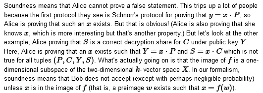

# What did you learn？

> Advanced Protocol

## [Number 46: What do correctness, soundness and zero-knowledge mean in the context of a Sigma protocol?](https://bristolcrypto.blogspot.com/2015/08/52-things-number-46-what-do-correctness.html)

### Sigma protocols

Alice 想要给 Bob 证明她知道一些信息（即她知道的秘密），Sigma 协议就是用来干这个事儿的一些协议，一般形式如下：
Alice 知道一个秘密；Alice 和 Bob 共享一些共同信息，then

1. Alice 给 Bob 发送一个值，称为承诺（commitment）；
2. Bob 随机选取一个挑战（challenge）并发送给 Alice；
3. Alice 计算一个响应（response）并发送给 Bob；
4. Bob 检查响应并决定接受（accept）或拒绝（reject）Alice 的声明。

> 传说中，如果把上面的过程画成一个图，这个图看起来像希腊大写字母 Sigma($\Sigma$)，所以这个协议就叫Sigma协议

而从密码学角度来看，我们希望 Sigma 协议满足三个性质：

1. Correctness：Alice 知道秘密，Bob 接受 Alice 的声明；
2. Soundness：Alice 不知道秘密，Bob 拒绝 Alice 的声明；
3. Zero-knowledge：Bob 不知道秘密，Alice 不泄露秘密。

> 其实还有更正式的[定义](https://www.cs.bris.ac.uk/~bernhard/thesis.pdf)，但是给的链接已经 404 了

### Defining a Sigma Protocol

令 $k$ 是一个域(field)。我们重点研究一个线性函数 $f:W\rightarrow X$，它从一个 $k$ 维空间（$k$ - vector space）映射到另一个，其中 Alice 和 Bob 都知道一些公共的 $x\in X$。同时Alice也知道一个秘密 $w\in W$，使得 $f(w)=x$。Alice想要给Bob证明她知道 $x$ 的原像。
> $f:W\rightarrow X$,Alice 知道 $(x,w)\in X\times W$ 使得 $f(w)=x$，而 Bob 知道 $x$。

针对这个结构的 Sigma 协议为：

1. Alice 选择一个随机数 $r$，令 $A=f(r)$，然后发送给 Bob（即 Alice 对 $r$ 的承诺）；
2. Bob 随机选取 $c\in k$，发送给 Alice（此为挑战）；
3. Alice 计算 $s=r+c\cdot w$，然后发送给 Bob（此为响应）；
4. 如果 $f(s)=A+c\cdot x$，则 Bob 接受 Alice 的声明。

#### Sigma Protocol in elliptic curve

> 这节是按照自己理解拆分出来的，和原文顺序不同

现在很多密码学都是在椭圆曲线上完成的。而椭圆曲线是由形如 $P=(x,y)$ 的点和一个“无穷远”的特殊点构成的一个群。这些点满足某些方程，而曲线上两个点相加可以得到另外一个点，这个加法就是定义群的加法。我们通常从一个大素数 $p$ 开始，在基域 $k=\mathbb{F}_p$ 上计算，并考虑 $E_p=E\cap \mathbb{F}_p\times\mathbb{F}_p$ 中的点 P。

许多椭圆曲线协议是从使用点乘法生成密钥对开始的：所有人协商一个公共基点 $P$，然后每个人都可以选择一个密钥 $x\in \mathbb{F}_p$，随之计算相关的公钥 $Y=x\cdot P$。如果 Alice 想要注册她的公钥，注册公司肯定需要她证明她知道 $x$（不然随随便便一个人就能注册了），但是 Alice 又不想透露密钥的信息，Sigma 协议就是用来干这个事儿的。

这样就一一对应起来了，$W=\mathbb{F}_p,X=E_p$，$f$ 就是点乘法，即 $f:W\rightarrow X,w\mapsto w\cdot P$（这个函数是线性函数，“矩阵乘法”也是如此）。
> 按理说到这步已经 over 了，下文应该是给出另外一种角度

假如 Alice 的私钥是 $x$，公钥是 $Y=x\cdot P$，同时有人给她发送用其加密的 EIGamal 密文 $(C,D)$，Alice 可以解密然后证明她解密成功。也就证明了其确实掌握秘密 $x$。
一种方法就是计算一个解密共享（decryption share）$S=x\cdot C$；解密后的明文就是 $D-S$，但是任何人都可以干这步，因此还不能结束。
所以 Alice 想要证明其确实掌握满足 $Y=x\cdot P,S=x\cdot C$ 的 $x$。于是乎，我们可以设置 $W=k,X=E_p\times E_p,f(x)=(x\cdot P,x\cdot C)$。

### Correctness

几乎所有协议中的正确性都意味着：如果每个人乖乖遵守协议，那么协议就会发挥作用。所以在 Sigma 协议中，正确性意味着：如果 Alice 知道 $w$ 使得 $f(w)=x$，并且双方乖乖按照协议办事，那么 Bob 会接受 Alice 的声明。

### Soundness

可靠性意味着 Alice 不能证明一个错误的声明。在 Sigma 协议中，Soundness 意味着：如果 Alice 不知道 $w$ 使得 $f(w)=x$，那么 Bob 会拒绝 Alice 的声明。
> 原文的描述让我明白了垃圾的叙述对一篇文章影响是多么大
> 

Sigma 协议还具有一种称为“special soundness”的性质。
非正式的说：如果 Alice 刚刚把她的承诺 $A$ 发送给 Bob，则对于 Bob 发送过来的 $c$，Alice 找到可以让 Bob 满足的 $r$ 值的概率有多大呢？假设只存在这么一个值，那么概率就是 $1/|k|$（小到可以忽略不计）。
特殊稳健性说的是，如果Alice即使只应对 $|k|$ 个可能的挑战中的两个，也能说服Bob，且前像 $w$ 一定存在：
假设在挑战 $c$ 时，爱丽丝会回答 $s$，而在挑战 $c'\neq c$ 时，爱丽丝会回答 $s'$，鲍勃会接受这两个挑战。然后设 $d=(c-c')^{-1}$，我们可以这样做，因为 $k$ 是一个域，而 $c\neq c'$，再用一下线性代数就可以知道 $w=d\cdot(s-s')$。
> 我认为这里有两层意思：一是 Alice 不要随便证明；二是如果一个攻击者能够在给定一组合法的证明之后生成出另一组合法的证明，那么该攻击者就能够有效地欺骗系统，从而破坏系统的安全性。这意味着系统中的证明必须是唯一的，且不能被伪造。

### Zero-knowledge

Bob 很高兴，因为协议是可靠稳健的。但是 Alice 想要 Bob 不能从协议中学到 $w$ 的任何信息，其实 Alice 想要的更多，比如在与 Bob 运行完协议后，Bob 也应该不能向 Charlie 证明 他知道 Alice 的秘密。
> 而零知识证明包含的东西就更多了

Sigma 协议是零知识的证明......并不存在！与人们在课本零知识一章中学习Sigma协议后可能会猜测的相反，Sigma协议通常不是零知识，而密码学的初学者在考试时最好记住这一点。
> 不过它满足了一个较弱的要求，称为诚实验证者零知识（honest-verifier zero-knowledge）。

然而，在零知识的背景下讨论 Sigma 协议并不是完全没有意义的:人们可以通过几种方式使它们成为零知识，其中最实用的方式就是使其成为非交互式协议。但这是下章的话题...

## [Number 47: What is the Fiat-Shamir transform?](https://bristolcrypto.blogspot.com/2015/08/52-things-number-47-what-is-fiat-shamir.html)

> 看看如何把 Sigma 协议变成零知识的
