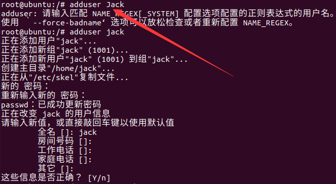
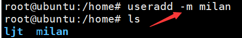
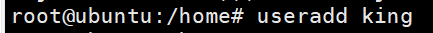
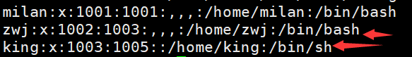
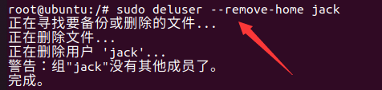
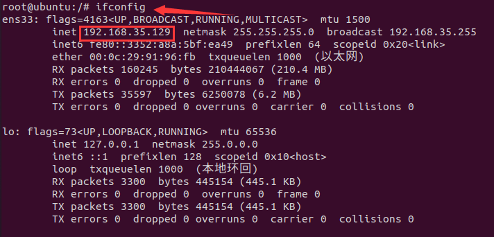
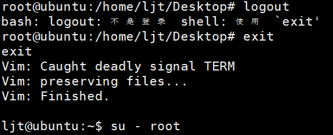
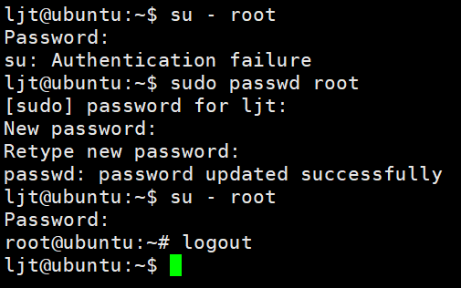
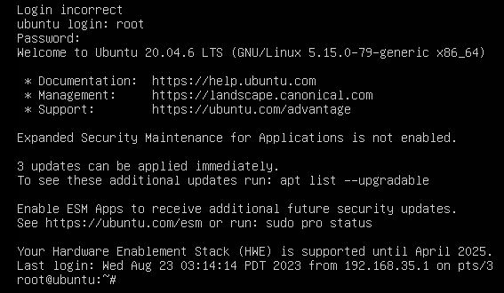

# Linux命令

## 一.用户管理

1. **adduser**

2. **useradd**

这两种方式的差别是登录shell会不同

3. **deluser**

4. **ifconfig**

5. **su**与**logout**
<https://blog.csdn.net/weixin_52280661/article/details/128202943>

6. ``Ctrl + D``可 以退出账户

7. [解决XShell无法连接Ubuntu中的root用户](https://blog.csdn.net/zhanshixiang/article/details/104348192)

## 二.常用指令
1. **init**
   ``init 0``直接关机
   ``init 3``
   
   ``init 5``
   
   ``init 6``直接重启
2. **systemctl get-default**
   获取当前运行级别
3. 找回root密码