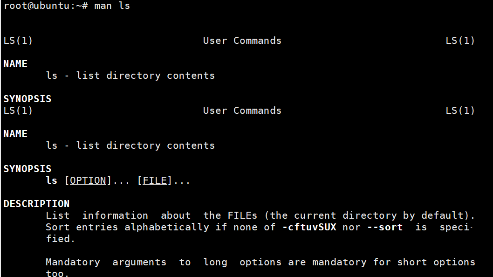

# Linux命令

## 一.用户管理

1. **adduser**

2. **useradd**

这两种方式的差别是登录shell会不同

3. **deluser**

4. **ifconfig**

5. **su**与**logout**
<https://blog.csdn.net/weixin_52280661/article/details/128202943>

6. ``Ctrl + D``可 以退出账户

7. [解决XShell无法连接Ubuntu中的root用户](https://blog.csdn.net/zhanshixiang/article/details/104348192)

## 二.常用指令

### 1. 系统

1. **init**

   ``init 0``直接关机
   ``init 3``
   
   ``init 5``
   
   ``init 6``直接重启
2. **systemctl get-default**
   获取当前运行级别

### 2. 帮助指令

   1. **man**
   
   2. **help**
   

### 3. 文档目录类

   1. **pwd**
   2. **ls**
   3. **cd**
   4. **mkdir**
   5. **rmdir**
    删除的是空目录
        >rm -rf /* 最恐怖的指令
   6. **touch**
    创建空文件
   7. **cp**
    拷贝文件到指定目录
    
   8. **rm**
        >-f 强制删除不提示
        >-r 递归删除整个文件夹
   9. **mv**
    移动文件与目录重命名
        >（同一个目录下就是重命名）
   10. **cat**
    查看文件内容，只能浏览不能修改，一般会带上 管道命令|more
        >-n 显示行号
   11. **more**
    方便进行交互
    
   12. **less**
    
   13. **echo**
    输出内容到控制台
    
   14. **head**
    用于显示文件的开头部分内容，默认情况下显示前10行
   15. **tail**
        > -f 可以实时监控文件变化
        > Ctrl + C 可以退出
   16. **>**
    输出重定向
    
   17. **>>**
    追加
    
   18. **ln**
    link 软链接/符号链接，类似快捷方式
    
    
   19. **cal**
    当前日历信息
    
   20. **history**
      
      

### 4. 时间日期类

   1. **data**
      
   2. **cal**
      

### 5. 搜索查找类

   1. **find**
   2. **locate**
      > 要先updatedb
   3. **which**
      
   4. **grep**
      > 经常和管道符号“|”一起使用

      

### 6. 压缩和解压缩类

   1. **gzip/gunzip**
      > （解）压缩文件

      
   2. **zip/unzip**
      > （解）压缩文件夹

      
   3. **tar**
      

## s三.组管理和权限管理
