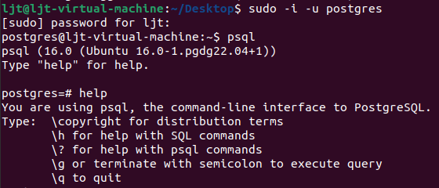
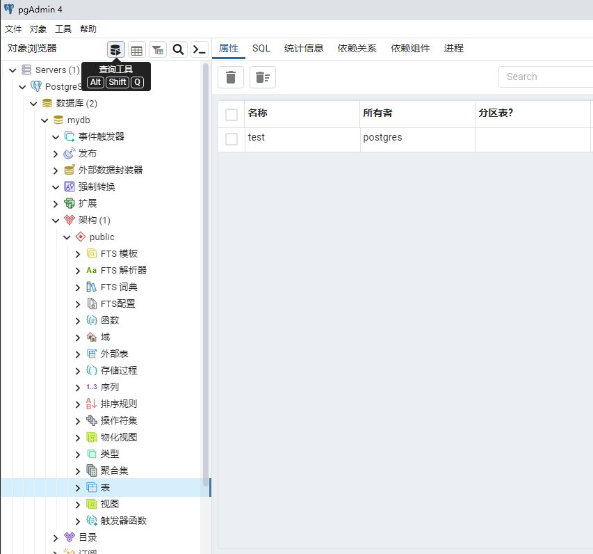
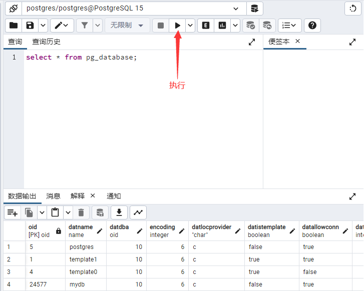
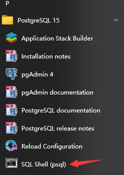
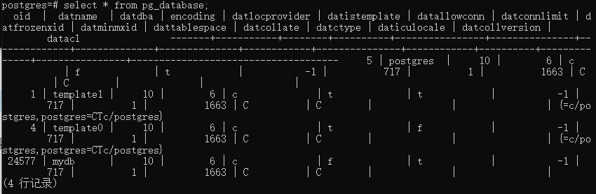
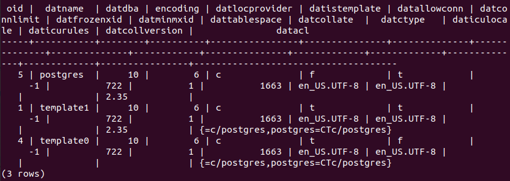
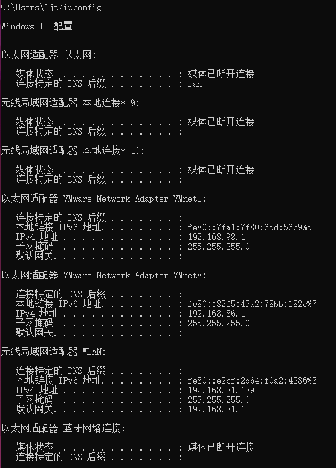
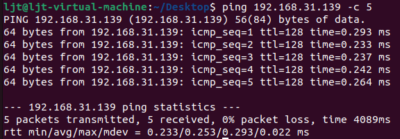
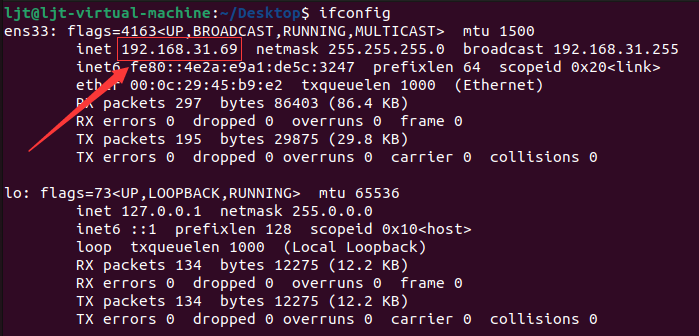
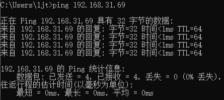

# PostgreSQL 学习笔记

## 一、介绍

PostgreSQL 是一种开源的关系型数据库管理系统，它具有高度的可扩展性、稳定性和安全性。

Linux安装成功

## 二、 查询

### 1. 图形化SQL查询入口

如图所示：
{width=500}
查询实例：
{width=500}

### 2. 命令行SQL查询入口

如图所示：

查询实例：

linux下的命令行查询入口：

## 三、 远程访问

### 1. 查看主机ip地址

如图所示：

- 主机ip
{height=500}
- 虚拟机ping主机ip（-c 限定数量，不然会ping不停）
{width=500}
- 虚拟机ping
{width=500}
- 主机ping虚拟机ip

### 2. 

在 PostgreSQL 中，我们可以使用 SQL 语句来创建、修改和删除数据库。以下是一些常用的 SQL 命令：

- `CREATE DATABASE dbname;`：创建一个名为 `dbname` 的数据库。
- `DROP DATABASE dbname;`：删除一个名为 `dbname` 的数据库。
- `ALTER DATABASE dbname RENAME TO new_dbname;`：将一个名为 `dbname` 的数据库重命名为 `new_dbname`。

## 表

在 PostgreSQL 中，我们可以使用 SQL 语句来创建、修改和删除表。以下是一些常用的 SQL 命令：

- `CREATE TABLE tablename (column1 datatype1, column2 datatype2, ...);`：创建一个名为 `tablename` 的表。
- `ALTER TABLE tablename ADD COLUMN column datatype;`：向一个名为 `tablename` 的表中添加一个名为 `column` 的列。
- `DROP TABLE tablename;`：删除一个名为 `tablename` 的表。

## 查询

在 PostgreSQL 中，我们可以使用 SQL 语句来查询数据。以下是一些常用的 SQL 命令：

- `SELECT column1, column2, ... FROM tablename;`：查询一个名为 `tablename` 的表中的所有列。
- `SELECT column1, column2, ... FROM tablename WHERE condition;`：查询一个名为 `tablename` 的表中符合条件 `condition` 的所有列。
- `SELECT column1, column2, ... FROM tablename ORDER BY column ASC/DESC;`：查询一个名为 `tablename` 的表中的所有列，并按照 `column` 列进行升序或降序排序。

## 索引

在 PostgreSQL 中，我们可以使用索引来提高查询效率。以下是一些常用的 SQL 命令：

- `CREATE INDEX indexname ON tablename (column);`：在一个名为 `tablename` 的表的 `column` 列上创建一个名为 `indexname` 的索引。
- `DROP INDEX indexname;`：删除一个名为 `indexname` 的索引。

## 总结

在本文中，我们介绍了 PostgreSQL 的基础知识和一些高级概念，包括安装、数据库、表、查询和索引。希望这些内容能够帮助你更好地理解和使用 PostgreSQL。
