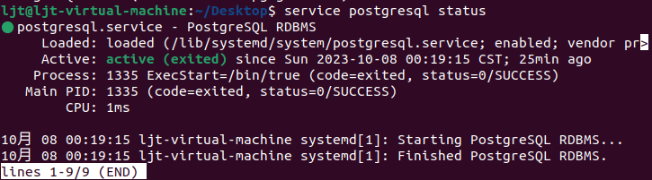
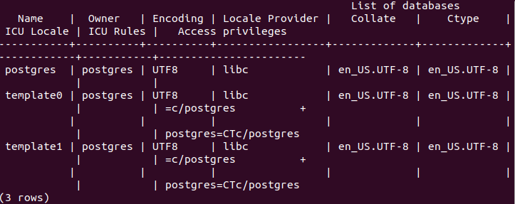
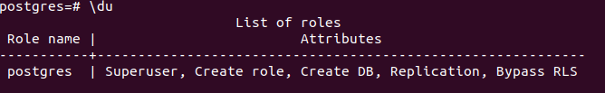
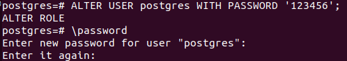
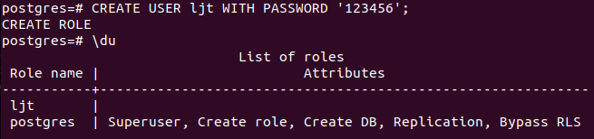
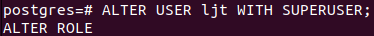
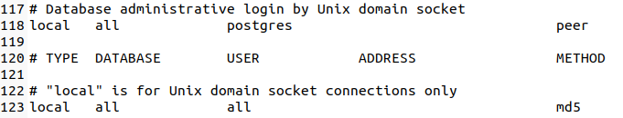
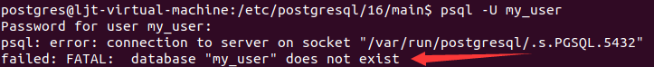
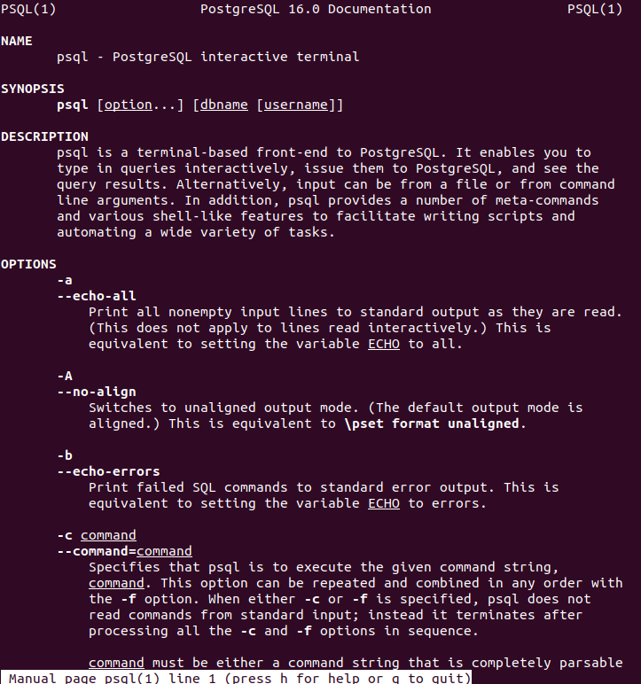
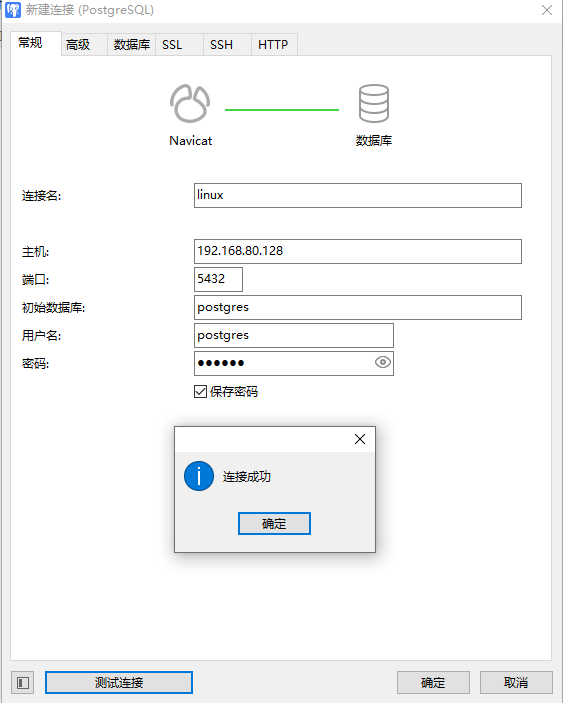

# PostgreSQL 学习笔记

## 一、介绍

PostgreSQL是一种开源的关系型数据库管理系统，它具有高度的可扩展性、稳定性和安全性。它支持大部分的SQL标准，并且被设计成可以被用户在许多方面进行扩展。它支持ACID事务、外键、视图、序列、子查询、触发器、用户定义类型和函数、外连接、多版本并发控制等特性。此外，PostgreSQL还提供了许多图形用户界面和多种编程语言的绑定。它是一个功能齐全的面向对象的关系型数据库管理系统，适用于各种规模的应用程序。

**Linux安装成功：**

```shell
ljt@ljt-virtual-machine:~/Desktop$ apt show postgresql
Package: postgresql
Version: 16+255.pgdg22.04+1
Priority: optional
Section: database
Source: postgresql-common (255.pgdg22.04+1)
Maintainer: Debian PostgreSQL Maintainers <team+postgresql@tracker.debian.org>
Installed-Size: 73.7 kB
Depends: postgresql-16
Suggests: postgresql-doc
Download-Size: 68.7 kB
APT-Manual-Installed: yes
APT-Sources: https://apt.postgresql.org/pub/repos/apt jammy-pgdg/main amd64 Packages
Description: object-relational SQL database (supported version)
 This metapackage always depends on the currently supported PostgreSQL
 database server version.
 .
 PostgreSQL is a fully featured object-relational database management
 system.  It supports a large part of the SQL standard and is designed
 to be extensible by users in many aspects.  Some of the features are:
 ACID transactions, foreign keys, views, sequences, subqueries,
 triggers, user-defined types and functions, outer joins, multiversion
 concurrency control.  Graphical user interfaces and bindings for many
 programming languages are available as well.

N: There is 1 additional record. Please use the '-a' switch to see it
```

- 配置文件路径: `/etc/postgresql-common/createcluster.conf`
- systemd的服务软连接: `/etc/systemd/system/multi-user.target.wants/postgresql.service → /lib/systemd/system/postgresql.service`
- 数据目录: `/var/lib/postgresql/16/main`
- 日志文件: `/var/log/postgresql/postgresql-16-main.log`
- 特殊的数据库用户: `postgres`

使用 `psql` 工具通过连接 PostgreSQL 数据库并且打印它的版本来验证安装：

```text
sudo -u postgres psql -c "SELECT version();"
```

## 二、使用技巧

### 1. Linux下的使用技巧（Ubuntu）

1. 通过执行以下命令来检查 PostgreSQL 是否正在运行：

    ```text
    service postgresql status
    ```

    
    可以看到服务处于`active`状态，也就是可以登陆。另外，也可以看到主服务进程的PID。
2. 默认情况下，PostgreSQL 会创建一个拥有所权限的特殊用户`postgres`。要实际使用 PostgreSQL，你必须先登录该账户：

   ```text
   sudo su postgres
    ```

3. 使用 `psql` 来启动 PostgreSQL Shell：
4. 查看现有的所有表

    ```text
    \l
     ```

    按 `q` 键退出
    
5. 使用 \du 命令，可以查看 PostgreSQL 用户：

    ```text
   \du
    ```

    
6. 你可以使用以下命令更改任何用户（包括 `postgres`）的密码：

    ```text
    ALTER USER postgres WITH PASSWORD 'my_password';
    ```

    psql包含了一个命令`\password`，他可以用来修改密码而不暴露明文口令
    
    **注意**：将 `postgres` 替换为你要更改的用户名，`my_password` 替换为所需要的密码。另外，不要忘记每条命令后面的 ;（分号）。
7. 建议另外创建一个用户（不建议使用默认的 postgres 用户）。为此，请使用以下命令：

    ```text
    CREATE USER my_user WITH PASSWORD 'my_password';
    ```

    
    **注意**：将 `my_user` 替换为所需的用户名，`my_password` 替换为所需的密码。另外，不要忘记每条命令后面的 ;（分号）。
    可以使用以下命令删除用户：

    ```text
    DROP USER my_user;
    ```

8. 但是，`my_user` 用户没有任何的属性。来让我们给它添加超级用户权限：

    ```text
    ALTER USER my_user WITH SUPERUSER;
    ```

     
    **注意**：将 `my_user` 替换为所需的用户名。另外，不要忘记每条命令后面的 ;（分号）。
9. 要使用其他用户登录，使用 `\q` 命令退出，然后使用以下命令登录：

    ```text
    psql -U my_user
    ```

    如果遇到如下错误：

    ```text
    psql: FATAL: Peer authentication failed for user "my_user"
    ```

    原因：安装完 PostgresQL 后， PostgresQL 连接时的默认认证方式为 peer。官方的解释：
    > The peer authentication method works by obtaining the client’s operating system user name from the kernel and using it as the allowed database user name (with optional user name mapping). This method is only supported on local connections.

    简单翻译：
    > Peer认证方法的工作原理是：从内核中获取客户的操作系统用户名，并将其作为允许的数据库用户名（可选择用户名映射）。这种方法只支持本地连接。

    由于我们登录的Linux系统用户名（即postgres）并不是等于登录PG数据库的用户名（my_user）， 因此出现了以上认证失败的信息。

    **解决方法**：更改配置文件,修改认证方式为md5，即密码认证方式。

    ```text
    sudo vim /etc/postgresql/16/main/pg_hba.conf
    ```

    对于第一条local配置信息，为了意外操作导致默认用户不能登录，所以不建议更换。建议第二个local的认证为md5,替换后的内容如下：
    
    然后重启 PostgreSQL：

    ```text
    sudo service postgresql restart
    ```

10. 重新尝试登录

    直接指定用户名进行登录
    
    会提示数据库不存在
    **注意**：我们必须指定一个数据库（默认情况下，它将尝试将你连接到与登录的用户名相同的数据库）。
    因此我们就用`-d`参数指定数据库，如下：

    ```shell
    postgres@ljt-virtual-machine:/etc/postgresql/16/main$ psql -U my_user -d postgres
    Password for user my_user: 
    psql (16.0 (Ubuntu 16.0-1.pgdg22.04+1))
    Type "help" for help.

    postgres=# 
    ```

    也可在linux下的命令行中直接输入`psql -U my_user -d postgres`，如下：

    ```shell
    postgres=# \q
    postgres@ljt-virtual-machine:/etc/postgresql/16/main$ exit
    exit
    ljt@ljt-virtual-machine:/etc/postgresql/16/main$ psql -U my_user -d postgres
    Password for user my_user: 
    psql (16.0 (Ubuntu 16.0-1.pgdg22.04+1))
    Type "help" for help.

    postgres=# 
    ```

11. 尝试登录其他数据库

    1. 先尝试登录初始化的数据库`template1`：

        ```shell
        ljt@ljt-virtual-machine:~/Desktop$ psql -U my_user -d template1
        Password for user my_user: 
        psql (16.0 (Ubuntu 16.0-1.pgdg22.04+1))
        Type "help" for help.

        template1=# \q
        ljt@ljt-virtual-machine:~/Desktop$ 
        ```

        可以看到，登录成功。
        也可以使用`-h`参数指定主机地址，如下：

        ```shell
        ljt@ljt-virtual-machine:~/Desktop$ psql -U my_user -h 127.0.0.1 -d template1
        Password for user my_user: 
        psql (16.0 (Ubuntu 16.0-1.pgdg22.04+1))
        SSL connection (protocol: TLSv1.3, cipher: TLS_AES_256_GCM_SHA384, compression: off)
        Type "help" for help.

        template1=# 
        ```

    2. **但是要注意：初始化的数据库template0是不允许登录的：**

        ```shell
        ljt@ljt-virtual-machine:~/Desktop$ psql -U my_user -h 127.0.0.1 -d template0
        Password for user my_user: 
        psql: error: connection to server at "127.0.0.1", port 5432 failed: FATAL:  database "template0" is not currently accepting connections
        ljt@ljt-virtual-machine:~/Desktop$ psql -U my_user -d template0
        Password for user my_user: 
        psql: error: connection to server on socket "/var/run/postgresql/.s.PGSQL.5432" failed: FATAL:  database "template0" is not currently accepting connections
        ```

12. 手册（`man psql`）和 [文档](https://www.postgresql.org/docs/) 也非常有用
    {width=500}

## 三、 远程访问

### 1. 查看主机ip地址

如图所示：

- 主机ip
{height=500}
- 虚拟机ping主机ip（-c 限定数量，不然会ping不停）
{width=500}
- 虚拟机ping
{width=500}
- 主机ping虚拟机ip


### 2. Linux下的配置

#### 1. 查看配置文件路径

在上面我们介绍了配置文件`pg_hba.conf`, 这个文件的具体位置，可以在登录数据库后，通过下面命令来查看：

```shell
postgres=# show hba_file;
              hba_file               
-------------------------------------
 /etc/postgresql/16/main/pg_hba.conf
(1 row)

postgres=# 
```

后面还会用到配置文件`postgresql.conf`, 我们可以通过下面的方式来查看具体路径：

```shell
postgres=# show config_file;
               config_file               
-----------------------------------------
 /etc/postgresql/16/main/postgresql.conf
(1 row)

postgres=# 
```

#### 2. 认证方式

PostgreSQL 支持多种身份认证方式。最常用的方法如下：

- Trust: 只要满足pg_hba.conf定义的条件，一个角色就可以不使用密码就能连接服务器
- Password: 通过密码，一个角色可以连接服务器。密码可以被存储为 scram-sha-256, md5, 和 password(明文)。
- Ident: 仅仅支持 TCP/IP 连接。它通常通过一个可选的用户名映射表，获取客户端操作系统用户名。
- Peer: 和 Ident 一样，仅仅支持本地连接。
PostgreSQL 客户端身份验证通常被定义在pg_hba.conf文件中。默认情况下，对于本地连接，PostgreSQL 被设置成身份认证防范 peer。

#### 3. 修改配置文件

##### 1.修改配置文件`pg_hba.conf`

配置文件路径： `/etc/postgresql/16/main/pg_hba.conf`
注意：这个路径中的“16”是PostgreSQL主版本号，请与实际情况保持一致

可以看到默认的配置文件中有一条关于IPv4的规则

```shell
# IPv4 local connections:
host    all             all             127.0.0.1/32            scram-sha-256
```

如果想要允许192.168.31网段的所有主机通过md5的形式进行连接，请增加下面的这句：

```shell
# Allow 192.168.31.XXX hosts to connect via md5
host    all             all             192.168.31.0/24          md5
```

如果想要允许所有的主机通过md5的形式进行连接，请增加下面的这句：

```shell
# Allow all hosts to connect via md5
host    all             all             0.0.0.0/0               md5
```

##### 2.修改配置文件`postgresql.conf`

配置文件路径： `/etc/postgresql/16/main/postgresql.conf`
注意：这个路径中的“16”是PostgreSQL主版本号，请与实际情况保持一致

在这个配置文件中，可以看到下面的内容：

```shell
# - Connection Settings -

#listen_addresses = 'localhost'		# what IP address(es) to listen on;
					# comma-separated list of addresses;
					# defaults to 'localhost'; use '*' for all
					# (change requires restart)
port = 5432    # (change requires restart)
max_connections = 100			# (change requires restart)
```

根据提示信息，我们在#listen_addresses = 'localhost'行后，在port行前增加一行:

```shell
listen_addresses = '*'
port = 5432				# (change requires restart)
max_connections = 100			# (change requires restart)
```

##### 3.修改防火墙，允许端口连接

从上一小节可以看到访问数据库的默认端口是5432，请[修改防火墙允许访问](https://zhuanlan.zhihu.com/p/571124400#:~:text=1.%E6%89%A7%E8%A1%8C%20ufw%20allow%2022%20%E5%91%BD%E4%BB%A4%E5%BC%80%E6%94%BE%E6%8C%87%E5%AE%9A%E7%AB%AF%E5%8F%A3%EF%BC%8C%E8%BF%99%E9%87%8C%E4%BB%A5SSH%E4%B8%BA%E4%BE%8B%E3%80%82%20root%40zq-virtual-machine%3A%2Fhome%2Fzq%23%20ufw,allow%2022%20Rule%20added%20Rule%20added%20%28v6%29%202.%E4%B9%9F%E5%8F%AF%E4%BB%A5%E5%85%81%E8%AE%B8%E4%BB%8E%E7%89%B9%E5%AE%9A%E4%B8%BB%E6%9C%BA%E6%88%96%E7%BD%91%E7%BB%9C%E8%AE%BF%E9%97%AE%E7%AB%AF%E5%8F%A3%EF%BC%8C%E7%B1%BB%E4%BC%BC%E4%BA%8E%E7%BD%91%E7%BB%9C%E4%B8%8A%E7%9A%84%E9%AB%98%E7%BA%A7ACL%E4%B8%AD%E7%9A%84rule%E3%80%82)（我自己没改）。

修改完配置文件，修改完防火墙，**重启**PostGreSQL服务后，检查服务与端口是否启动成功：

```shell
ljt@ljt-virtual-machine:/etc/postgresql/16/main$ service postgresql status
● postgresql.service - PostgreSQL RDBMS
     Loaded: loaded (/lib/systemd/system/postgresql.service; enabled; vendor preset: ena>
     Active: active (exited) since Wed 2023-10-11 01:12:11 CST; 13s ago
    Process: 7005 ExecStart=/bin/true (code=exited, status=0/SUCCESS)
   Main PID: 7005 (code=exited, status=0/SUCCESS)
        CPU: 1ms
10月 11 01:12:11 ljt-virtual-machine systemd[1]: Starting PostgreSQL RDBMS...
10月 11 01:12:11 ljt-virtual-machine systemd[1]: Finished PostgreSQL RDBMS.

ljt@ljt-virtual-machine:/etc/postgresql/16/main$ sudo lsof -i :5432
COMMAND   PID     USER   FD   TYPE DEVICE SIZE/OFF NODE NAME
postgres 6988 postgres    6u  IPv4  87515      0t0  TCP *:postgresql (LISTEN)
postgres 6988 postgres    7u  IPv6  87516      0t0  TCP *:postgresql (LISTEN)
ljt@ljt-virtual-machine:/etc/postgresql/16/main$ 
```

##### 4.尝试远程连接

{width=350}

连接成功！！！

### 3. Windows下的配置

下载中文网站不要下载英文网站，会显示没有学生权益


## 二、 查询

### 1. 图形化SQL查询入口

如图所示：
{width=500}
查询实例：
{width=500}

### 2. 命令行SQL查询入口

如图所示：

查询实例：


linux下的命令行查询入口：

在 PostgreSQL 中，我们可以使用 SQL 语句来创建、修改和删除数据库。以下是一些常用的 SQL 命令：

- `CREATE DATABASE dbname;`：创建一个名为 `dbname` 的数据库。
- `DROP DATABASE dbname;`：删除一个名为 `dbname` 的数据库。
- `ALTER DATABASE dbname RENAME TO new_dbname;`：将一个名为 `dbname` 的数据库重命名为 `new_dbname`。

## 表

在 PostgreSQL 中，我们可以使用 SQL 语句来创建、修改和删除表。以下是一些常用的 SQL 命令：

- `CREATE TABLE tablename (column1 datatype1, column2 datatype2, ...);`：创建一个名为 `tablename` 的表。
- `ALTER TABLE tablename ADD COLUMN column datatype;`：向一个名为 `tablename` 的表中添加一个名为 `column` 的列。
- `DROP TABLE tablename;`：删除一个名为 `tablename` 的表。

## 查询

在 PostgreSQL 中，我们可以使用 SQL 语句来查询数据。以下是一些常用的 SQL 命令：

- `SELECT column1, column2, ... FROM tablename;`：查询一个名为 `tablename` 的表中的所有列。
- `SELECT column1, column2, ... FROM tablename WHERE condition;`：查询一个名为 `tablename` 的表中符合条件 `condition` 的所有列。
- `SELECT column1, column2, ... FROM tablename ORDER BY column ASC/DESC;`：查询一个名为 `tablename` 的表中的所有列，并按照 `column` 列进行升序或降序排序。

## 索引

在 PostgreSQL 中，我们可以使用索引来提高查询效率。以下是一些常用的 SQL 命令：

- `CREATE INDEX indexname ON tablename (column);`：在一个名为 `tablename` 的表的 `column` 列上创建一个名为 `indexname` 的索引。
- `DROP INDEX indexname;`：删除一个名为 `indexname` 的索引。

## 总结

在本文中，我们介绍了 PostgreSQL 的基础知识和一些高级概念，包括安装、数据库、表、查询和索引。希望这些内容能够帮助你更好地理解和使用 PostgreSQL。
