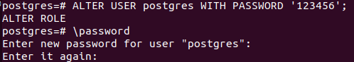

# PostgreSQL 学习笔记

## 一、介绍

PostgreSQL是一种开源的关系型数据库管理系统，它具有高度的可扩展性、稳定性和安全性。它支持大部分的SQL标准，并且被设计成可以被用户在许多方面进行扩展。它支持ACID事务、外键、视图、序列、子查询、触发器、用户定义类型和函数、外连接、多版本并发控制等特性。此外，PostgreSQL还提供了许多图形用户界面和多种编程语言的绑定。它是一个功能齐全的面向对象的关系型数据库管理系统，适用于各种规模的应用程序。

**安装：**

上[官网](https://www.postgresql.org/download/linux/ubuntu/)挨着运行

```shell
# Create the file repository configuration:
sudo sh -c 'echo "deb https://apt.postgresql.org/pub/repos/apt $(lsb_release -cs)-pgdg main" > /etc/apt/sources.list.d/pgdg.list'

# Import the repository signing key:
wget --quiet -O - https://www.postgresql.org/media/keys/ACCC4CF8.asc | sudo apt-key add -

# Update the package lists:
sudo apt-get update

# Install the latest version of PostgreSQL.
# If you want a specific version, use 'postgresql-12' or similar instead of 'postgresql':
sudo apt-get -y install postgresql

# 有兴趣也可以装个这个，包含一些不属于 PostgreSQL 核心包的实用工具和功能
sudo apt install postgresql-contrib
```

**Linux安装成功：**

```shell
ljt@ljt-virtual-machine:~/Desktop$ apt show postgresql
Package: postgresql
Version: 16+255.pgdg22.04+1
Priority: optional
Section: database
Source: postgresql-common (255.pgdg22.04+1)
Maintainer: Debian PostgreSQL Maintainers <team+postgresql@tracker.debian.org>
Installed-Size: 73.7 kB
Depends: postgresql-16
Suggests: postgresql-doc
Download-Size: 68.7 kB
APT-Manual-Installed: yes
APT-Sources: https://apt.postgresql.org/pub/repos/apt jammy-pgdg/main amd64 Packages
Description: object-relational SQL database (supported version)
 This metapackage always depends on the currently supported PostgreSQL
 database server version.
 .
 PostgreSQL is a fully featured object-relational database management
 system.  It supports a large part of the SQL standard and is designed
 to be extensible by users in many aspects.  Some of the features are:
 ACID transactions, foreign keys, views, sequences, subqueries,
 triggers, user-defined types and functions, outer joins, multiversion
 concurrency control.  Graphical user interfaces and bindings for many
 programming languages are available as well.

N: There is 1 additional record. Please use the '-a' switch to see it
```

- 配置文件路径: `/etc/postgresql-common/createcluster.conf`
- systemd的服务软连接: `/etc/systemd/system/multi-user.target.wants/postgresql.service → /lib/systemd/system/postgresql.service`
- 数据目录: `/var/lib/postgresql/16/main`
- 日志文件: `/var/log/postgresql/postgresql-16-main.log`
- 特殊的数据库用户: `postgres`

使用 `psql` 工具通过连接 PostgreSQL 数据库并且打印它的版本来验证安装：

```text
sudo -u postgres psql -c "SELECT version();
```

## 二、使用技巧

### 1. Windows下的使用技巧

#### 1. 图形化SQL查询入口

如图所示：
{width=500}
查询实例：
{width=500}

#### 2. 命令行SQL查询入口

如图所示：

查询实例：


### 2. Linux下的使用技巧（Ubuntu）

1. 通过执行以下命令来检查 PostgreSQL 是否正在运行：

    ```shell
    service postgresql status
    ```

    ```shell
    ljt@ubuntu:~/Desktop$ service postgresql status
    ● postgresql.service - PostgreSQL RDBMS
        Loaded: loaded (/lib/systemd/system/postgresql.service; enabled; vendor pr>
        Active: active (exited) since Mon 2023-10-16 04:47:59 PDT; 14h ago
    Main PID: 5963 (code=exited, status=0/SUCCESS)
        Tasks: 0 (limit: 4556)
        Memory: 0B
        CGroup: /system.slice/postgresql.service

    Oct 16 04:47:59 ubuntu systemd[1]: Starting PostgreSQL RDBMS...
    Oct 16 04:47:59 ubuntu systemd[1]: Finished PostgreSQL RDBMS.
    ```

    可以看到服务处于`active`状态，也就是可以登陆。另外，也可以看到主服务进程的PID。
2. 默认情况下，PostgreSQL 会创建一个拥有所权限的特殊用户`postgres`。要实际使用 PostgreSQL，你必须先登录该账户：

   ```shell
   sudo su postgres
    ```

3. 使用 `psql` 来启动 PostgreSQL Shell：
4. 查看现有的所有表

    ```shell
    \l
    ```

    按 `q` 键退出
    

5. 使用 \du 命令，可以查看 PostgreSQL 用户：

    ```shell
    \du
    ```

    ``` shell
    postgres=# \du
                                List of roles
    Role name |                         Attributes                         
    -----------+------------------------------------------------------------
    postgres  | Superuser, Create role, Create DB, Replication, Bypass RLS

    postgres=# 
    ```

6. 你可以使用以下命令更改任何用户（包括 `postgres`）的密码：

    ```shell
    ALTER USER postgres WITH PASSWORD 'my_password';
    ```

    psql包含了一个命令`\password`，他可以用来修改密码而不暴露明文口令
    
    **注意**：将 `postgres` 替换为你要更改的用户名，`my_password` 替换为所需要的密码。另外，不要忘记每条命令后面的 ;（分号）。
7. 建议另外创建一个用户（不建议使用默认的 postgres 用户）。为此，请使用以下命令：

    ```shell
    CREATE USER my_user WITH PASSWORD 'my_password';
    ```

    ```shell
    postgres=# CREATE USER my_user WITH PASSWORD '123456';
    CREATE ROLE

    postgres=# \du
                                List of roles
    Role name |                         Attributes                         
    -----------+------------------------------------------------------------
    my_user   | 
    postgres  | Superuser, Create role, Create DB, Replication, Bypass RLS
    ```

    **注意**：将 `my_user` 替换为所需的用户名，`my_password` 替换为所需的密码。另外，不要忘记每条命令后面的 ;（分号）。
    可以使用以下命令删除用户：

    ```shell
    DROP USER my_user;
    ```

8. 但是，`my_user` 用户没有任何的属性。来让我们给它添加超级用户权限：

    ```shell
    ALTER USER my_user WITH SUPERUSER;
    ```

    ```shell
    postgres=# ALTER USER my_user WITH SUPERUSER;
    ALTER ROLE
    postgres=# \du
                                List of roles
    Role name |                         Attributes                         
    -----------+------------------------------------------------------------
    my_user   | Superuser
    postgres  | Superuser, Create role, Create DB, Replication, Bypass RLS
    ```

    **注意**：将 `my_user` 替换为所需的用户名。另外，不要忘记每条命令后面的 ;（分号）。
9. 要使用其他用户登录，使用 `\q` 命令退出，然后使用以下命令登录：

    ```shell
    psql -U my_user
    ```

    如果遇到如下错误：

    ```text
    psql: FATAL: Peer authentication failed for user "my_user"
    ```

    原因：安装完 PostgresQL 后， PostgresQL 连接时的默认认证方式为 peer。官方的解释：
    > The peer authentication method works by obtaining the client’s operating system user name from the kernel and using it as the allowed database user name (with optional user name mapping). This method is only supported on local connections.

    简单翻译：
    > Peer认证方法的工作原理是：从内核中获取客户的操作系统用户名，并将其作为允许的数据库用户名（可选择用户名映射）。这种方法只支持本地连接。

    由于我们登录的Linux系统用户名（即postgres）并不是等于登录PG数据库的用户名（my_user）， 因此出现了以上认证失败的信息。

    **解决方法**：更改配置文件,修改认证方式为md5，即密码认证方式。

    ```text
    sudo gedit /etc/postgresql/16/main/pg_hba.conf
    ```

    对于第一条local配置信息，为了意外操作导致默认用户不能登录，所以不建议更换。建议第二个local的认证为md5,替换后的内容如下：
    
    然后重启 PostgreSQL：

    ```text
    sudo service postgresql restart
    ```

10. 重新尝试登录

    直接指定用户名进行登录
    

    会提示数据库不存在
    **注意**：我们必须指定一个数据库（默认情况下，它将尝试将你连接到与登录的用户名相同的数据库）。
    因此我们就用`-d`参数指定数据库，如下：

    ```shell
    postgres@ljt-virtual-machine:/etc/postgresql/16/main$ psql -U my_user -d postgres
    Password for user my_user: 
    psql (16.0 (Ubuntu 16.0-1.pgdg22.04+1))
    Type "help" for help.

    postgres=# 
    ```

    也可在linux下的命令行中直接输入`psql -U my_user -d postgres`，如下：

    ```shell
    postgres=# \q
    postgres@ljt-virtual-machine:/etc/postgresql/16/main$ exit
    exit
    ljt@ljt-virtual-machine:/etc/postgresql/16/main$ psql -U my_user -d postgres
    Password for user my_user: 
    psql (16.0 (Ubuntu 16.0-1.pgdg22.04+1))
    Type "help" for help.

    postgres=# 
    ```

11. 尝试登录其他数据库

    1. 先尝试登录初始化的数据库`template1`：

        ```shell
        ljt@ljt-virtual-machine:~/Desktop$ psql -U my_user -d template1
        Password for user my_user: 
        psql (16.0 (Ubuntu 16.0-1.pgdg22.04+1))
        Type "help" for help.

        template1=# \q
        ljt@ljt-virtual-machine:~/Desktop$ 
        ```

        可以看到，登录成功。
        也可以使用`-h`参数指定主机地址，如下：

        ```shell
        ljt@ljt-virtual-machine:~/Desktop$ psql -U my_user -h 127.0.0.1 -d template1
        Password for user my_user: 
        psql (16.0 (Ubuntu 16.0-1.pgdg22.04+1))
        SSL connection (protocol: TLSv1.3, cipher: TLS_AES_256_GCM_SHA384, compression: off)
        Type "help" for help.

        template1=# 
        ```

    2. **但是要注意：初始化的数据库template0是不允许登录的：**

        ```shell
        ljt@ljt-virtual-machine:~/Desktop$ psql -U my_user -h 127.0.0.1 -d template0
        Password for user my_user: 
        psql: error: connection to server at "127.0.0.1", port 5432 failed: FATAL:  database "template0" is not currently accepting connections
        ljt@ljt-virtual-machine:~/Desktop$ psql -U my_user -d template0
        Password for user my_user: 
        psql: error: connection to server on socket "/var/run/postgresql/.s.PGSQL.5432" failed: FATAL:  database "template0" is not currently accepting connections
        ```

12. 手册（`man psql`）和 [文档](https://www.postgresql.org/docs/) 也非常有用
    {width=500}

## 三、 远程访问

### 1. 查看主机ip地址

如图所示：

- 主机ip
{height=500}
- 虚拟机ping主机ip（`-c` 限定数量，不然会ping不停）
{width=500}
- 虚拟机ping
{width=500}
- 主机ping虚拟机ip


### 2. Linux下的配置

#### 1. 查看配置文件路径

在上面我们介绍了配置文件`pg_hba.conf`, 这个文件的具体位置，可以在登录数据库后，通过下面命令来查看：

```shell
postgres=# show hba_file;
              hba_file               
-------------------------------------
 /etc/postgresql/16/main/pg_hba.conf
(1 row)

postgres=# 
```

后面还会用到配置文件`postgresql.conf`, 我们可以通过下面的方式来查看具体路径：

```shell
postgres=# show config_file;
               config_file               
-----------------------------------------
 /etc/postgresql/16/main/postgresql.conf
(1 row)

postgres=# 
```

#### 2. 认证方式

PostgreSQL 支持多种身份认证方式。最常用的方法如下：

- Trust: 只要满足pg_hba.conf定义的条件，一个角色就可以不使用密码就能连接服务器
- Password: 通过密码，一个角色可以连接服务器。密码可以被存储为 scram-sha-256, md5, 和 password(明文)。
- Ident: 仅仅支持 TCP/IP 连接。它通常通过一个可选的用户名映射表，获取客户端操作系统用户名。
- Peer: 和 Ident 一样，仅仅支持本地连接。
PostgreSQL 客户端身份验证通常被定义在pg_hba.conf文件中。默认情况下，对于本地连接，PostgreSQL 被设置成身份认证防范 peer。

#### 3. 修改配置文件

##### 1.修改配置文件`pg_hba.conf`

配置文件路径： `/etc/postgresql/16/main/pg_hba.conf`
注意：这个路径中的“16”是PostgreSQL主版本号，请与实际情况保持一致

可以看到默认的配置文件中有一条关于IPv4的规则

```shell
# IPv4 local connections:
host    all             all             127.0.0.1/32            scram-sha-256
```

如果想要允许192.168.31网段的所有主机通过md5的形式进行连接，请增加下面的这句：

```shell
# Allow 192.168.31.XXX hosts to connect via md5
host    all             all             192.168.31.0/24          md5
```

如果想要允许所有的主机通过md5的形式进行连接，请增加下面的这句：

```shell
# Allow all hosts to connect via md5
host    all             all             0.0.0.0/0               md5
```

##### 2.修改配置文件`postgresql.conf`

配置文件路径： `/etc/postgresql/16/main/postgresql.conf`
注意：这个路径中的“16”是PostgreSQL主版本号，请与实际情况保持一致

在这个配置文件中，可以看到下面的内容：
修改监听地址

```shell
# - Connection Settings -

#listen_addresses = 'localhost'     # what IP address(es) to listen on;
                    # comma-separated list of addresses;
                    # defaults to 'localhost'; use '*' for all
                    # (change requires restart)
port = 5432    # (change requires restart)
max_connections = 100           # (change requires restart)
```

根据提示信息，我们在#listen_addresses = 'localhost'行后，在port行前增加一行:

```shell
listen_addresses = '*'
port = 5432             # (change requires restart)
max_connections = 100   # (change requires restart)
```

##### 3.修改防火墙，允许端口连接

从上一小节可以看到访问数据库的默认端口是5432，请[修改防火墙允许访问](https://zhuanlan.zhihu.com/p/571124400#:~:text=1.%E6%89%A7%E8%A1%8C%20ufw%20allow%2022%20%E5%91%BD%E4%BB%A4%E5%BC%80%E6%94%BE%E6%8C%87%E5%AE%9A%E7%AB%AF%E5%8F%A3%EF%BC%8C%E8%BF%99%E9%87%8C%E4%BB%A5SSH%E4%B8%BA%E4%BE%8B%E3%80%82%20root%40zq-virtual-machine%3A%2Fhome%2Fzq%23%20ufw,allow%2022%20Rule%20added%20Rule%20added%20%28v6%29%202.%E4%B9%9F%E5%8F%AF%E4%BB%A5%E5%85%81%E8%AE%B8%E4%BB%8E%E7%89%B9%E5%AE%9A%E4%B8%BB%E6%9C%BA%E6%88%96%E7%BD%91%E7%BB%9C%E8%AE%BF%E9%97%AE%E7%AB%AF%E5%8F%A3%EF%BC%8C%E7%B1%BB%E4%BC%BC%E4%BA%8E%E7%BD%91%E7%BB%9C%E4%B8%8A%E7%9A%84%E9%AB%98%E7%BA%A7ACL%E4%B8%AD%E7%9A%84rule%E3%80%82)（我自己没改）。

```shell
sudo firewall-cmd --add-port=5432/tcp --permanent
sudo firewall-cmd --reload
```

修改完配置文件，修改完防火墙，**重启**PostGreSQL服务后，检查服务与端口是否启动成功：

```shell
ljt@ljt-virtual-machine:/etc/postgresql/16/main$ service postgresql status
● postgresql.service - PostgreSQL RDBMS
     Loaded: loaded (/lib/systemd/system/postgresql.service; enabled; vendor preset: ena>
     Active: active (exited) since Wed 2023-10-11 01:12:11 CST; 13s ago
    Process: 7005 ExecStart=/bin/true (code=exited, status=0/SUCCESS)
   Main PID: 7005 (code=exited, status=0/SUCCESS)
        CPU: 1ms
10月 11 01:12:11 ljt-virtual-machine systemd[1]: Starting PostgreSQL RDBMS...
10月 11 01:12:11 ljt-virtual-machine systemd[1]: Finished PostgreSQL RDBMS.

ljt@ljt-virtual-machine:/etc/postgresql/16/main$ sudo lsof -i :5432
COMMAND   PID     USER   FD   TYPE DEVICE SIZE/OFF NODE NAME
postgres 6988 postgres    6u  IPv4  87515      0t0  TCP *:postgresql (LISTEN)
postgres 6988 postgres    7u  IPv6  87516      0t0  TCP *:postgresql (LISTEN)
ljt@ljt-virtual-machine:/etc/postgresql/16/main$ 
```

##### 4.尝试远程连接

{width=350}

连接成功！！！

### 3. Windows下的配置

#### 1.打开postgresql安装目录的data子目录

找到`pg_hba.conf`文件

{width=500}

#### 2.修改配置文件

在IPV4 local connections下面添加一行

```shell
host    all             all             0.0.0.0/0                 md5
```


#### 3.重启服务

(虽然亲测不重启也可以)


#### 4.设置防火墙

亲测不设置或者不关闭也没事

{width=500}

#### 5.尝试重新连接

{width=350}

**注意**：Linux的Navicat下载中文网站不要下载英文网站，会显示没有学生权益

## 四、基本使用

### 1.数据库的操作（和使用技巧类似）

#### 1.登录

```shell
#psql -h 服务器 -U 用户名 -d 数据库 -p 端口地址 // -U是大写 
```

#### 2.数据库操作

```shell
# 创建数据库
CREATE DATABASE mydb;

# 查看所有数据库
\l

# 切换数据库
\c mydb

# 删除数据库
DROP DATABASE mydb;
```

### 2.数据库表操作

#### 1.创建表

创建表格时每列都必须使用数据类型。PostgreSQL中主要有三类数据类型：

- 数值类型：整数、浮点数、定点数等
- 字符串类型：字符、文本、二进制等
- 日期/时间类型：日期、时间、时间戳等

**数值：**

| 名字 | 存储长度 | 描述 | 范围 |
| -------- | -------- | -------- | -------- |
| smallint | 2字节 | 小范围整数 | -32768 ~ 32767 |
| integer | 4字节 | 常用整数 | -2147483648 ~ 2147483647 |
| bigint | 8字节 | 大范围整数 | -9223372036854775808 ~ 9223372036854775807 |
| decimal | 可变 | 用户指定精度的定点数 | 小数点前131072位；小数点后16383位 |
| numeric | 可变 | 用户指定精度的定点数 | 小数点前131072位；小数点后16383位 |
| real | 4字节 | 可变精度的浮点数 | 6位十进制数字精度 |
| double precision | 8字节 | 可变精度的浮点数 | 15位十进制数字精度 |

**字符串：**

- char(size),character(size)：固定长度的字符串，size是字符串的长度，如果字符串长度小于size，会在右边补空格，如果大于size，会报错。
- varchar(size),character varying(size)：可变长度的字符串，size是字符串的最大长度。
- text：可变长度的字符串，和varchar一样，但是没有长度限制。
  
**日期/时间：**

表示日期或时间的数据类型有：

- timestamp：时间戳，包含日期和时间，格式为YYYY-MM-DD HH:MM:SS。
- date：日期，格式为YYYY-MM-DD。
- time：时间，格式为HH:MM:SS。
  
**其他：**

- boolean：布尔值，true或false。
- money：货币金额。
- inet：IPV4或IPV6地址。
- 几何数据等

```shell
# 创建表
CREATE TABLE test(id int, name varchar(20));

# 在表中插入数据
INSERT INTO test(id,body) VALUES(1, 'test1');

# 查看所有表
\d

# 查看表结构
\d test

# 删除表
DROP TABLE test;
```

PostgreSQL使用序列来标识字段的自增长，数据类型有serial、smallserial、bigserial，分别对应int、smallint、bigint。这些类型都是自增长的，但是不能手动插入值，如果手动插入值，会报错。这些属性类似于MySQL中的auto_increment。

示例：

```shell
postgres=# \c mydb 
You are now connected to database "mydb" as user "postgres".
mydb=# create table test(id serial primary key,name varchar(255));// 有了serial没必要int了，primary key表示主键
CREATE TABLE

mydb=# insert into test(name) values('ljt');// into 不能省略
INSERT 0 1
mydb=# select * from test;
 id | name 
----+------
  1 | ljt
(1 row)

mydb=# \d
             List of relations
 Schema |    Name     |   Type   |  Owner   
--------+-------------+----------+----------
 public | test        | table    | postgres
 public | test_id_seq | sequence | postgres
(2 rows)

mydb=# \d test
                                   Table "public.test"
 Column |          Type          | Collation | Nullable |             Default              
--------+------------------------+-----------+----------+----------------------------------
 id     | integer                |           | not null | nextval('test_id_seq'::regclass)
 name   | character varying(255) |           |          | 
Indexes:
    "test_pkey" PRIMARY KEY, btree (id)

```

当然也支持MySQL的语法，例如：

```shell
mydb=# update test set name = 'bbx' where id = 1;
UPDATE 1
mydb=# select * from test;
 id | name 
----+------
  1 | bbx
(1 row)
```

### 3.Schema

Schema是PostgreSQL中的一个重要概念，它类似于MySQL中的database，但是又有所不同。Schema是一个命名空间，它包含了一组表、视图、函数、索引、数据类型等。Schema可以用来对数据库中的对象进行分组和授权，它可以被认为是数据库中的一个目录。

相同的对象名可以在不同的Schema中存在，例如，可以在public Schema中创建一个test表，在test Schema中也可以创建一个test表，这两个表是不同的，它们的完整名称分别是public.test和test.test。

使用模式的优势：

- 允许多个用户使用同一个数据库并且不会互相干扰
- 将数据库对象组织成逻辑组以便于管理
- 第三方应用程序可以使用模式来隔离它们的对象，以免与其他应用程序的对象冲突

模式类似于操作系统的目录，但是模式不能嵌套，一个模式不能包含另一个模式。

```shell
# 创建模式
CREATE SCHEMA myschema;

# 删除模式
DROP SCHEMA myschema;

# 删除模式及其包含的对象
DROP SCHEMA myschema CASCADE;
```

例如：

```shell
mydb=# CREATE SCHEMA myschema;
CREATE SCHEMA
mydb=# create table myschema.test(id int,name varchar(255));
CREATE TABLE
```

### 4.[备份数据库](https://zhuanlan.zhihu.com/p/269874791)

**单数据库：**

PostgreSQL提供了[pg_dump](https://www.cnblogs.com/BillyYoung/p/11057854.html)工具来备份单个数据库，pg_dump可以将数据库备份到一个文件中，这个文件可以用来恢复数据库。必须以对要备份的数据库有读权限的用户身份运行pg_dump。

要演示恢复丢失的数据库，请删除示例数据库并在**其位置创建一个空数据库**

```shell
# 备份数据库
pg_dump dbname > dbname.bak -f 指定路径 -U 用户名 -t 指定表

# 恢复数据库
psql dbname < dbname.bak -U 用户名
```

生成的备份文件可以使用`scp`传输到另一台主机，也可以存储在本地以供以后使用。

```shell
# 示例
ljt@ljt-virtual-machine:~/Desktop$ pg_dump mydb > mydb.bak -U postgres
Password: 

postgres@ljt-virtual-machine:/home/ljt/Desktop$ psql mydb < mydb.bak 
Password for user postgres: 
SET
SET
SET
SET
SET
 set_config 
------------
 
(1 row)

SET
SET
SET
SET
CREATE SCHEMA
ALTER SCHEMA
SET
SET
CREATE TABLE
ALTER TABLE
CREATE TABLE
ALTER TABLE
CREATE SEQUENCE
ALTER SEQUENCE
ALTER SEQUENCE
ALTER TABLE
COPY 0
COPY 1
 setval 
--------
      1
(1 row)

ALTER TABLE
```

备份格式有几种选择：

- `*.bak`: 压缩二进制格式，可以用来恢复数据库，但是不能直接查看。
- `*.sql`: 文本格式，可以用来恢复数据库，也可以直接查看。
- `*.tar`: tarball，压缩二进制格式，可以用来恢复数据库，也可以直接查看。

> 注意：在默认情况下，PostgreSQL将忽略备份过程中发生的任何错误。这可能导致备份文件中的数据不完整。要确保备份过程中发生错误时停止备份，可以使用`-l`选项运行pg_dump。这将导致整个备份过程视为单个事务，pg_dump在遇到错误时退出，并且不会生成任何输出文件。

**所有数据库：**

由于pg_dump只能备份单个数据库，因此如果要备份所有数据库，可以使用pg_dumpall工具。pg_dumpall可以备份所有数据库，包括模板数据库，它还可以备份集群的全局对象，例如用户和组。

```shell
# 创建备份文件
pg_dumpall > pgbackup.bak

# 恢复备份文件
psql -f pgbackup.bak postgres
```

```shell
# 不知道为啥输好几次密码
ljt@ljt-virtual-machine:~/Desktop$ pg_dumpall > pgbackup.bak -U postgres
Password: 
Password: 
Password: 
Password: 
```

### 5.用户操作

```shell
# 创建用户并设置密码
CREATE USER myuser WITH PASSWORD 'mypassword';

# 修改用户密码
ALTER USER myuser WITH PASSWORD 'mypassword';

# 数据库授权，赋予指定用户对指定数据库的权限
GRANT ALL PRIVILEGES ON DATABASE mydb TO myuser;

# 但是此时用户还是没有读写权限，需要继续表授权，赋予指定用户对指定表的权限，必须是在所要操作的数据库里执行！！！
GRANT ALL PRIVILEGES ON ALL TABLES IN SCHEMA public TO xxx;
GRANT ALL PRIVILEGES ON TABLE mytable TO myuser;

# 撤销数据库授权
REVOKE ALL PRIVILEGES ON DATABASE mydb FROM myuser;

# 撤销表授权
REVOKE ALL PRIVILEGES ON TABLE mytable FROM myuser;

# 超级用户权限
ALTER USER myuser WITH SUPERUSER;

# 删除用户
DROP USER myuser;
```

### 6.角色管理

在PostgreSQL中里没有严格区分用户和角色的概念，"CREATE USER"为"CREATE ROLE"的别名，唯一的区别是"CREATE USER"创建的角色具有LOGIN属性，而"CREATE ROLE"创建的角色没有LOGIN属性。

```shell
postgres=# CREATE ROLE David; // 默认不带LOGIN属性
CREATE ROLE
postgres=# CREATE USER Sandy; // 默认具有LOGIN属性
CREATE ROLE
postgres=# \du
                             List of roles
 Role name |                         Attributes                         
-----------+------------------------------------------------------------
 david     | Cannot login
 my_user   | Superuser
 postgres  | Superuser, Create role, Create DB, Replication, Bypass RLS
 sandy     | 

postgres=# select * from pg_roles;
           rolname           | rolsuper | rolinherit | rolcreaterole | rolcreatedb | rolcanlogin | rolreplication | rolconnlimit | rolpassword | rolvaliduntil | rolbypassrls | rolconfig |  oid  
-----------------------------+----------+------------+---------------+-------------+-------------+----------------+--------------+-------------+---------------+--------------+-----------+-------
 pg_database_owner           | f        | t          | f             | f           | f           | f              |           -1 | ********    |               | f            |           |  6171
 pg_read_all_data            | f        | t          | f             | f           | f           | f              |           -1 | ********    |               | f            |           |  6181
 pg_write_all_data           | f        | t          | f             | f           | f           | f              |           -1 | ********    |               | f            |           |  6182
 pg_monitor                  | f        | t          | f             | f           | f           | f              |           -1 | ********    |               | f            |           |  3373
 pg_read_all_settings        | f        | t          | f             | f           | f           | f              |           -1 | ********    |               | f            |           |  3374
 pg_read_all_stats           | f        | t          | f             | f           | f           | f              |           -1 | ********    |               | f            |           |  3375
 pg_stat_scan_tables         | f        | t          | f             | f           | f           | f              |           -1 | ********    |               | f            |           |  3377
 pg_read_server_files        | f        | t          | f             | f           | f           | f              |           -1 | ********    |               | f            |           |  4569
 pg_write_server_files       | f        | t          | f             | f           | f           | f              |           -1 | ********    |               | f            |           |  4570
 pg_execute_server_program   | f        | t          | f             | f           | f           | f              |           -1 | ********    |               | f            |           |  4571
 pg_signal_backend           | f        | t          | f             | f           | f           | f              |           -1 | ********    |               | f            |           |  4200
 pg_checkpoint               | f        | t          | f             | f           | f           | f              |           -1 | ********    |               | f            |           |  4544
 pg_use_reserved_connections | f        | t          | f             | f           | f           | f              |           -1 | ********    |               | f            |           |  4550
 pg_create_subscription      | f        | t          | f             | f           | f           | f              |           -1 | ********    |               | f            |           |  6304
 postgres                    | t        | t          | t             | t           | t           | t              |           -1 | ********    |               | t            |           |    10
 my_user                     | t        | t          | f             | f           | t           | f              |           -1 | ********    |               | f            |           | 24577
 david                       | f        | t          | f             | f           | f           | f              |           -1 | ********    |               | f            |           | 40982
 sandy                       | f        | t          | f             | f           | t           | f              |           -1 | ********    |               | f            |           | 40983
(18 rows)


postgres=# select * from pg_user;
 usename  | usesysid | usecreatedb | usesuper | userepl | usebypassrls |  passwd  | valuntil | useconfig 
----------+----------+-------------+----------+---------+--------------+----------+----------+-----------
 postgres |       10 | t           | t        | t       | t            | ******** |          | 
 my_user  |    24577 | f           | t        | f       | f            | ******** |          | 
 sandy    |    40983 | f           | f        | f       | f            | ******** |          | 
(3 rows)
```

**角色属性:**

| 属性 | 说明 |
|----------|----------|
| login   | 只有具有LOGIN属性的角色可以用作数据库连接的初始角色名|
| superuser | 可以执行任何操作，而不受任何限制|
| createdb | 创建数据库权限|
| createrole | 允许创建或删除其他普通的用户角色（超级用户除外）|
| inherit | 用户组对组员的一个继承标志，成员可以继承用户组的权限特性|
| replication | 做流复制的时候用到的一个用户属性，一般单独设定|
| password | 在登录时要求指定密码时才会起作用，比如md5或者password模式，跟用户端的连接认证方式有关|

```shell
# 赋予用户登录权限
ALTER ROLE myuser WITH LOGIN;
```

### 7.常用命令总结

```shell
# 查看SQL命令的解释，例如\h select。
\h
# 查看所有内部命令
\?
# 查看所有数据库
\l
# 切换数据库
\c mydb
# 列出当前数据库的所有表格
\d
# 查看某一张表格的表结构
\d [table_name]
# 查看所有用户
\du
# 查看所有角色
\du+
# 查看所有模式
\dn
# 设置密码
\password
# 退出
\q
```

## 表

在 PostgreSQL 中，我们可以使用 SQL 语句来创建、修改和删除表。以下是一些常用的 SQL 命令：

- `CREATE TABLE tablename (column1 datatype1, column2 datatype2, ...);`：创建一个名为 `tablename` 的表。
- `ALTER TABLE tablename ADD COLUMN column datatype;`：向一个名为 `tablename` 的表中添加一个名为 `column` 的列。
- `DROP TABLE tablename;`：删除一个名为 `tablename` 的表。

## 查询

在 PostgreSQL 中，我们可以使用 SQL 语句来查询数据。以下是一些常用的 SQL 命令：

- `SELECT column1, column2, ... FROM tablename;`：查询一个名为 `tablename` 的表中的所有列。
- `SELECT column1, column2, ... FROM tablename WHERE condition;`：查询一个名为 `tablename` 的表中符合条件 `condition` 的所有列。
- `SELECT column1, column2, ... FROM tablename ORDER BY column ASC/DESC;`：查询一个名为 `tablename` 的表中的所有列，并按照 `column` 列进行升序或降序排序。

## 索引

在 PostgreSQL 中，我们可以使用索引来提高查询效率。以下是一些常用的 SQL 命令：

- `CREATE INDEX indexname ON tablename (column);`：在一个名为 `tablename` 的表的 `column` 列上创建一个名为 `indexname` 的索引。
- `DROP INDEX indexname;`：删除一个名为 `indexname` 的索引。

## 总结

在本文中，我们介绍了 PostgreSQL 的基础知识和一些高级概念，包括安装、数据库、表、查询和索引。希望这些内容能够帮助你更好地理解和使用 PostgreSQL。


CREATE FUNCTION c_overpaid(record, integer) RETURNS boolean  AS '/usr/lib/postgresql/16/lib/c_overpaid', 'c_overpaid' LANGUAGE C STRICT;


```


dellruiyun@dellruiyun:~/ljt/Xor$ vim Xor_DB.cpp 
"

dellruiyun@dellruiyun:~/ljt/Xor$ vim Xor_DB.cpp 
dellruiyun@dellruiyun:~/ljt/Xor$ make test 
g++  Xor_DB.cpp -lssl -lcrypto -lpq -o test
dellruiyun@dellruiyun:~/ljt/Xor$ ./test 
连接到数据库失败: FATAL:  password authentication failed for user "postgres"
FATAL:  password authentication failed for user "postgres"

dellruiyun@dellruiyun:~/ljt/Xor$ sudo su postgres
postgres@dellruiyun:/home/dellruiyun/ljt/Xor$ psql
psql (12.16 (Ubuntu 12.16-0ubuntu0.20.04.1))
Type "help" for help.


dellruiyun@dellruiyun:~/ljt/Xor$ vim Xor_DB.cpp 
dellruiyun@dellruiyun:~/ljt/Xor$ make test 
g++  Xor_DB.cpp -lssl -lcrypto -lpq -o test
dellruiyun@dellruiyun:~/ljt/Xor$ ./test 
*********************word_300w_10.txt*********************************
 rate of progress: 3000%total_bytes: 0
dellruiyun@dellruiyun:~/ljt/Xor$ 

sudo sysdig -c topprocs_cpu

sudo kill -9 (id)

```

