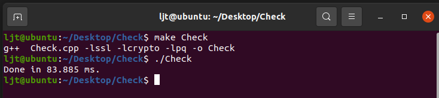

# 使用说明书

1. 首先需要建立一个数据库，再建立一张表

```shell
postgres=# CREATE DATABASE xor;
CREATE DATABASE
postgres=# \c xor 
You are now connected to database "xor" as user "postgres".
xor=# CREATE TABLE x_300w_10(column1 varchar, column2 bytea);
CREATE TABLE
xor=# 
```

2. 为了保险起见，再弄一个超级用户

```shell
postgres=# CREATE USER my_user WITH PASSWORD '123456';
CREATE ROLE
postgres=# ALTER USER my_user WITH SUPERUSER;
ALTER ROLE
postgres=# \du
                                   List of roles
 Role name |                         Attributes                         | Member of 
-----------+------------------------------------------------------------+-----------
 my_user   | Superuser                                                  | {}
 postgres  | Superuser, Create role, Create DB, Replication, Bypass RLS | {}

postgres=# \q
postgres@dellruiyun:/home/dellruiyun/ljt/Xor$ exit
```

3. 去把数据填进数据库里

```shell
dell@dell-Precision-7920-Tower:~/ljt$ ./test 
*********************word_300w_10.txt*********************************
 rate of progress: 3000%total_bytes: 0
```

4. 生成so文件然后部署到lib目录下

```shell
dell@dell-Precision-7920-Tower:~/ljt/UDF$ vim makefile 
dell@dell-Precision-7920-Tower:~/ljt/UDF$ make
/usr/bin/clang-10 -Wno-ignored-attributes -fno-strict-aliasing -fwrapv -Wno-unused-command-line-argument -O2  -I. -I./ -I/usr/include/postgresql/12/server -I/usr/include/postgresql/internal  -Wdate-time -D_FORTIFY_SOURCE=2 -D_GNU_SOURCE -I/usr/include/libxml2  -I/usr/include/mit-krb5 -flto=thin -emit-llvm -c -o checkxor_compare.bc checkxor_compare.c
dell@dell-Precision-7920-Tower:~/ljt/UDF$ sudo make install
[sudo] password for dell: 
/bin/mkdir -p '/usr/lib/postgresql/12/lib'
/usr/bin/install -c -m 755  checkxor_compare.so '/usr/lib/postgresql/12/lib/'
/bin/mkdir -p '/usr/lib/postgresql/12/lib/bitcode/checkxor_compare'
/bin/mkdir -p '/usr/lib/postgresql/12/lib/bitcode'/checkxor_compare/
/usr/bin/install -c -m 644 checkxor_compare.bc '/usr/lib/postgresql/12/lib/bitcode'/checkxor_compare/./
cd '/usr/lib/postgresql/12/lib/bitcode' && /usr/lib/llvm-10/bin/llvm-lto -thinlto -thinlto-action=thinlink -o checkxor_compare.index.bc checkxor_compare/checkxor_compare.bc

# 需要切换一下checkxor和checkxor_compare
dell@dell-Precision-7920-Tower:~/ljt/UDF$ vim makefile 
dell@dell-Precision-7920-Tower:~/ljt/UDF$ make
/usr/bin/clang-10 -Wno-ignored-attributes -fno-strict-aliasing -fwrapv -Wno-unused-command-line-argument -O2  -I. -I./ -I/usr/include/postgresql/12/server -I/usr/include/postgresql/internal  -Wdate-time -D_FORTIFY_SOURCE=2 -D_GNU_SOURCE -I/usr/include/libxml2  -I/usr/include/mit-krb5 -flto=thin -emit-llvm -c -o checkxor.bc checkxor.c
dell@dell-Precision-7920-Tower:~/ljt/UDF$ sudo make install
/bin/mkdir -p '/usr/lib/postgresql/12/lib'
/usr/bin/install -c -m 755  checkxor.so '/usr/lib/postgresql/12/lib/'
/bin/mkdir -p '/usr/lib/postgresql/12/lib/bitcode/checkxor'
/bin/mkdir -p '/usr/lib/postgresql/12/lib/bitcode'/checkxor/
/usr/bin/install -c -m 644 checkxor.bc '/usr/lib/postgresql/12/lib/bitcode'/checkxor/./
cd '/usr/lib/postgresql/12/lib/bitcode' && /usr/lib/llvm-10/bin/llvm-lto -thinlto -thinlto-action=thinlink -o checkxor.index.bc checkxor/checkxor.bc
dell@dell-Precision-7920-Tower:~/ljt/UDF$ 
```

5. 去生成函数（切记切换在xor数据库下）

```shell
xor=# CREATE FUNCTION checkxor(bytea, anyarray) RETURNS boolean  AS '/usr/lib/postgresql/12/lib/checkxor', 'checkxor' LANGUAGE C STRICT;
CREATE FUNCTION
xor=# CREATE FUNCTION checkxor_compare(bytea, anyarray) RETURNS boolean  AS '/usr/lib/postgresql/12/lib/checkxor_compare', 'checkxor_compare' LANGUAGE C STRICT;
CREATE FUNCTION
xor=# 
```

6. 去用Check测试一下

```shell
dell@dell-Precision-7920-Tower:~/ljt/Check$ make Check 
g++  Check.cpp -lssl -lcrypto -lpq -o Check
dell@dell-Precision-7920-Tower:~/ljt/Check$ ./Check 
rows: 173
Done in 114.105 ms
```

## 测试结果

先跑二十遍让数据稳定，再跑100遍测试平均时间，其中，checkxor与checkxor_compare的区别是没有写真正用于判断的contain函数，这样可以去掉类似于传参等无关时间的开销，从而更好的测试出函数本身的性能。

测试结果如下：

- 自己虚拟机的测试结果：

- dellruiyun的测试结果：

- 704的测试结果：
