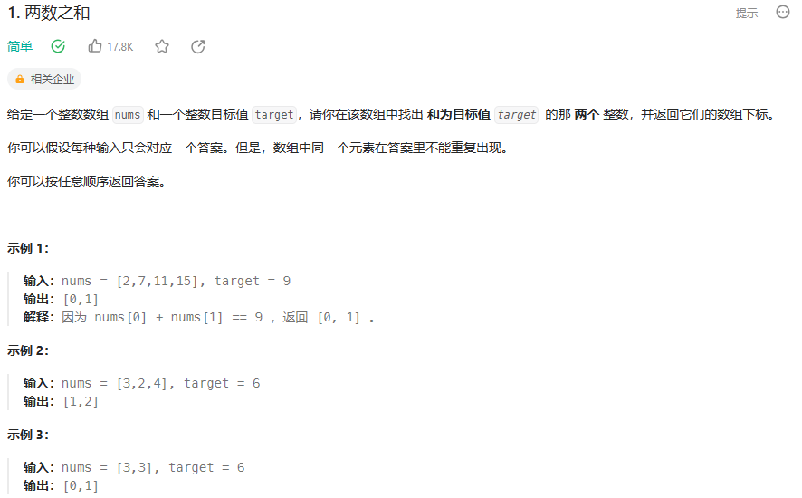
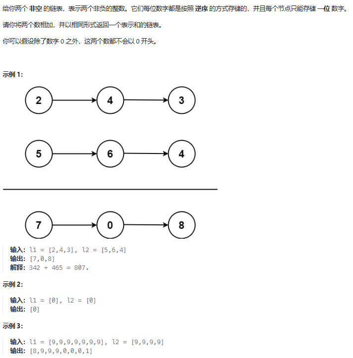

# 力扣记录

## 1. 两数之和

### 题目描述



### 解题代码

```java
class Solution {
    public int[] twoSum(int[] nums, int target) {
        int i = 0;
        int j = 0;
        Loop:for(i = 0;i < nums.length - 1;i++){
            int sub = target - nums[i];
            for(j = i + 1; j < nums.length;j++){
                if(nums[j] == sub){
                    break Loop;
                }
            }
        }
        return new int[]{i,j};
    }
}
```

### 大佬解法

时间显著降低

- 标签：哈希映射
- 这道题本身如果通过暴力遍历的话也是很容易解决的，时间复杂度在 $O(n^2)$
- 由于哈希查找的时间复杂度为 $O(1)$，所以可以利用哈希容器 map 降低时间复杂度
- 遍历数组 nums，i 为当前下标，每个值都判断map中是否存在 target-nums[i] 的 key 值
- 如果存在则找到了两个值，如果不存在则将当前的 (nums[i],i) 存入 map 中，继续遍历直到找到为止
- 如果最终都没有结果则抛出异常

```java
class Solution {
    public int[] twoSum(int[] nums, int target) {
        Map<Integer, Integer> map = new HashMap<>();
        for(int i = 0; i< nums.length; i++) {
            if(map.containsKey(target - nums[i])) {
                return new int[] {map.get(target-nums[i]),i};
            }
            map.put(nums[i], i);
        }
        throw new IllegalArgumentException("No two sum solution");
    }
}
```

```cpp
//::value_type 是 std::map 中的一个嵌套类型，它表示 map 中的键值对类型。对于 std::map<int, int>，::value_type 表示的就是 std::pair<int, int>，其中 int 是键的类型，另一个 int 是值的类型。
//例如  a.insert(map<int,int>::value_type(nums[i],i));
class Solution {
public:
    vector<int> twoSum(vector<int>& nums, int target) {
        map<int,int> a;//提供一对一的hash
        vector<int> b(2,-1);//用来承载结果，初始化一个大小为2，值为-1的容器b
        for(int i=0;i<nums.size();i++)
        {
            if(a.count(target-nums[i])>0)
            {
                b[0]=a[target-nums[i]];
                b[1]=i;
                break;
            }
            a[nums[i]]=i;//反过来放入map中，用来获取结果下标
        }
        return b;
    };
};
```

## 2. 两数相加

### 题目描述



### 解题代码

```java
/**
 * Definition for singly-linked list.
 * public class ListNode {
 *     int val;
 *     ListNode next;
 *     ListNode() {}
 *     ListNode(int val) { this.val = val; }
 *     ListNode(int val, ListNode next) { this.val = val; this.next = next; }
 * }
 */
class Solution {
    public ListNode addTwoNumbers(ListNode l1, ListNode l2) {
        ListNode result = new ListNode();
        ListNode tmp = result;
        int val = (l1.val + l2.val)%10;
        int carry = (l1.val + l2.val)/10;
        result.val = val;
        l1 = l1.next;
        l2 = l2.next;// 奠基
        while(l1 != null && l2 != null){
            val = (l1.val + l2.val + carry)%10;
            carry = (l1.val + l2.val + carry)/10;
            tmp.next = new ListNode(val);
            tmp = tmp.next;
            l1 = l1.next;
            l2 = l2.next;
        }
        while(l1!= null){
            val = (l1.val + carry)%10;
            carry = (l1.val + carry)/10;
            tmp.next = new ListNode(val);
            tmp = tmp.next;
            l1 = l1.next;
        }
        while(l2!= null){
            val = (l2.val + carry)%10;
            carry = (l2.val + carry)/10;
            tmp.next = new ListNode(val);
            tmp = tmp.next;
            l2 = l2.next;
        }
        if(carry == 1){
            tmp.next = new ListNode(carry);
        }
        return result;
    }
}
```

### 大佬解法

内存显著降低

```java
/**
 * Definition for singly-linked list.
 * public class ListNode {
 *     int val;
 *     ListNode next;
 *     ListNode(int x) { val = x; }
 * }
 */
class Solution {
    public ListNode addTwoNumbers(ListNode l1, ListNode l2) {
      return getSum(l1, l2, 0);
    }
    public ListNode getSum(ListNode node1, ListNode node2, int carry){
        if(node1 == null && node2 == null){
            if(carry != 0){
               ListNode tempNode = new ListNode(carry);
               return tempNode;
            }
            return null;
        }
        int temp = 0;
        if(node1 != null){
            temp += node1.val;
            node1 = node1.next;
        }
        if(node2 != null){
            temp+=node2.val;
            node2 = node2.next;
        }
        temp += carry; 
        int val = temp%10;
        ListNode node = new ListNode(val);
        carry = temp/10;
        node.next = getSum(node1, node2, carry);
        return node;
    }
}
```
