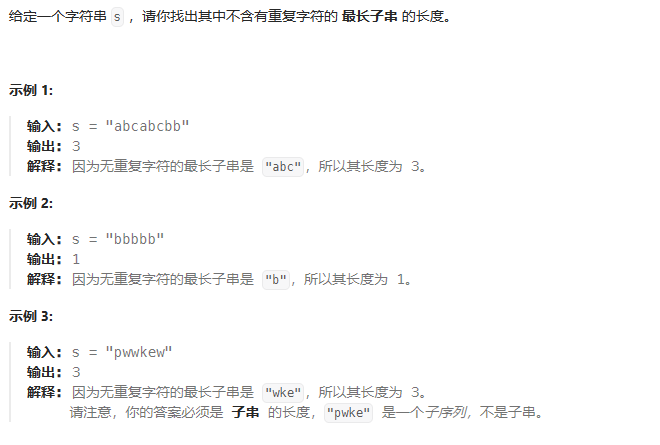
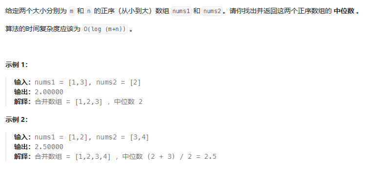
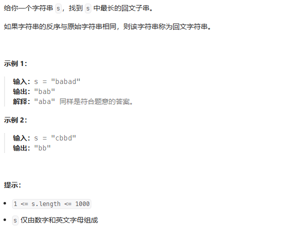
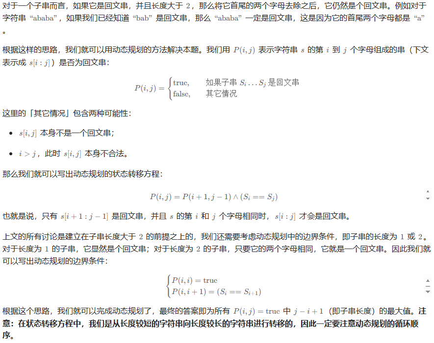
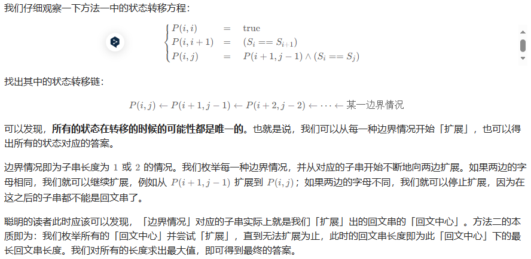
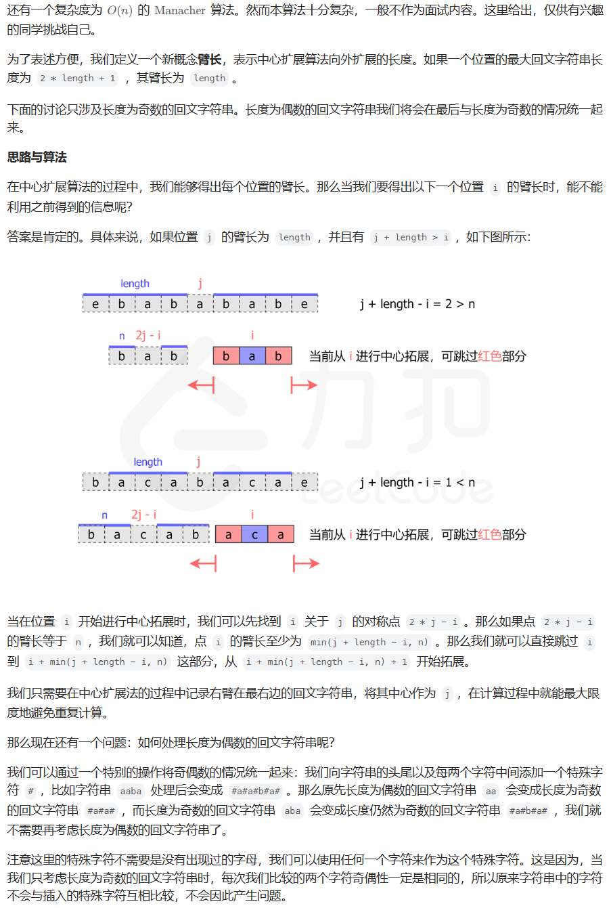
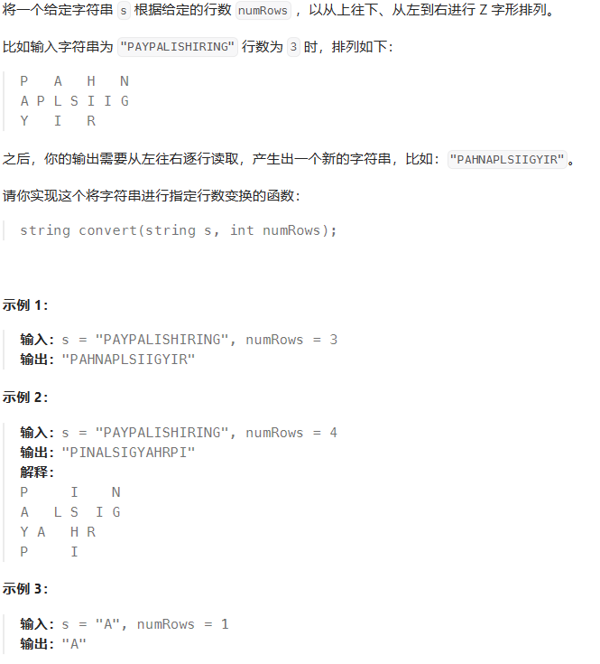
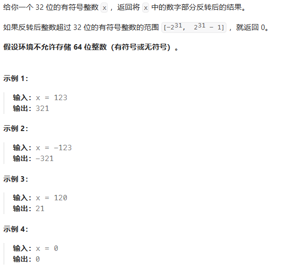

# 力扣记录

## 1. 两数之和

**题目描述：**


**解题代码：**

```java
class Solution {
    public int[] twoSum(int[] nums, int target) {
        int i = 0;
        int j = 0;
        Loop:for(i = 0;i < nums.length - 1;i++){
            int sub = target - nums[i];
            for(j = i + 1; j < nums.length;j++){
                if(nums[j] == sub){
                    break Loop;
                }
            }
        }
        return new int[]{i,j};
    }
}
```

**大佬解法：**

时间显著降低

- 标签：哈希映射
- 这道题本身如果通过暴力遍历的话也是很容易解决的，时间复杂度在 $O(n^2)$
- 由于哈希查找的时间复杂度为 $O(1)$，所以可以利用哈希容器 map 降低时间复杂度
- 遍历数组 nums，i 为当前下标，每个值都判断map中是否存在 target-nums[i] 的 key 值
- 如果存在则找到了两个值，如果不存在则将当前的 (nums[i],i) 存入 map 中，继续遍历直到找到为止
- 如果最终都没有结果则抛出异常

```java
class Solution {
    public int[] twoSum(int[] nums, int target) {
        Map<Integer, Integer> map = new HashMap<>();
        for(int i = 0; i< nums.length; i++) {
            if(map.containsKey(target - nums[i])) {
                return new int[] {map.get(target-nums[i]),i};
            }
            map.put(nums[i], i);
        }
        throw new IllegalArgumentException("No two sum solution");
    }
}
```

```cpp
//::value_type 是 std::map 中的一个嵌套类型，它表示 map 中的键值对类型。对于 std::map<int, int>，::value_type 表示的就是 std::pair<int, int>，其中 int 是键的类型，另一个 int 是值的类型。
//例如  a.insert(map<int,int>::value_type(nums[i],i));
class Solution {
public:
    vector<int> twoSum(vector<int>& nums, int target) {
        map<int,int> a;//提供一对一的hash
        vector<int> b(2,-1);//用来承载结果，初始化一个大小为2，值为-1的容器b
        for(int i=0;i<nums.size();i++)
        {
            if(a.count(target-nums[i])>0)
            {
                b[0]=a[target-nums[i]];
                b[1]=i;
                break;
            }
            a[nums[i]]=i;//反过来放入map中，用来获取结果下标
        }
        return b;
    };
};
```

## 2. 两数相加

**题目描述：**


**解题代码：**

```java
/**
 * Definition for singly-linked list.
 * public class ListNode {
 *     int val;
 *     ListNode next;
 *     ListNode() {}
 *     ListNode(int val) { this.val = val; }
 *     ListNode(int val, ListNode next) { this.val = val; this.next = next; }
 * }
 */
class Solution {
    public ListNode addTwoNumbers(ListNode l1, ListNode l2) {
        ListNode result = new ListNode();
        ListNode tmp = result;
        int val = (l1.val + l2.val)%10;
        int carry = (l1.val + l2.val)/10;
        result.val = val;
        l1 = l1.next;
        l2 = l2.next;// 奠基
        while(l1 != null && l2 != null){
            val = (l1.val + l2.val + carry)%10;
            carry = (l1.val + l2.val + carry)/10;
            tmp.next = new ListNode(val);
            tmp = tmp.next;
            l1 = l1.next;
            l2 = l2.next;
        }
        while(l1!= null){
            val = (l1.val + carry)%10;
            carry = (l1.val + carry)/10;
            tmp.next = new ListNode(val);
            tmp = tmp.next;
            l1 = l1.next;
        }
        while(l2!= null){
            val = (l2.val + carry)%10;
            carry = (l2.val + carry)/10;
            tmp.next = new ListNode(val);
            tmp = tmp.next;
            l2 = l2.next;
        }
        if(carry == 1){
            tmp.next = new ListNode(carry);
        }
        return result;
    }
}
```

**大佬解法：**

内存显著降低

```java
/**
 * Definition for singly-linked list.
 * public class ListNode {
 *     int val;
 *     ListNode next;
 *     ListNode(int x) { val = x; }
 * }
 */
class Solution {
    public ListNode addTwoNumbers(ListNode l1, ListNode l2) {
      return getSum(l1, l2, 0);
    }
    public ListNode getSum(ListNode node1, ListNode node2, int carry){
        if(node1 == null && node2 == null){
            if(carry != 0){
               ListNode tempNode = new ListNode(carry);
               return tempNode;
            }
            return null;
        }
        int temp = 0;
        if(node1 != null){
            temp += node1.val;
            node1 = node1.next;
        }
        if(node2 != null){
            temp+=node2.val;
            node2 = node2.next;
        }
        temp += carry; 
        int val = temp%10;
        ListNode node = new ListNode(val);
        carry = temp/10;
        node.next = getSum(node1, node2, carry);
        return node;
    }
}
```

## 3.无重复字符的最长子串

**题目描述：**



**解题代码：**

内存其实已经很好了

```java
class Solution {
    public int lengthOfLongestSubstring(String s) {
        ArrayList<Character> list = new ArrayList<>();
        int length=0;
        int max=0;

        for(char character : s.toCharArray()){
            if(list.contains(character)){
                int loc = -1;
                while(loc!=list.indexOf(character)){
                    list.remove(0);
                    length--;
                }
            }
            list.add(character);
            length++;           
            if(length>max){
                max = length;
            }
        }
        return max;
    }
}
```

**大佬解法：**

消耗更少的时间

```java
class Solution {
    public int lengthOfLongestSubstring(String s) {
// String s=new String();
//         Scanner sc=new Scanner(System.in);
//         s=sc.nextLine();
       char []a= s.toCharArray();
        int []exist=new int[256];
        for (int i = 0; i < exist.length; i++) {
            exist[i]=0;
        }

        int r=0,l=0;

        int max=0;

        while(r<a.length)
        {
            if(exist[a[r]]==1)
            {
                exist[a[l]]=0;
                l++;
            }
            else {
                exist[a[r]]=1;
                r++;
                int t=r-l;
                if(t>max)max=t;
            }
        }
        //System.out.println(max);
    return max;
 }
}
```

消耗更少的内存（实测其实也没有）

```java
class Solution {
    public int lengthOfLongestSubstring(String s) {
        int start = 0;
        int end = 0;
        Map<Character, Integer> indices = new HashMap<>();
        int result = 0;
        while (end < s.length()) {
            char c = s.charAt(end);
            if (!indices.containsKey(c) || indices.get(c) < start) {
                indices.put(c, end);
            } else {
                result = Math.max(result, end - start);
                start = indices.get(c) + 1;
                indices.put(c, end);
            }
            end++;
        }
        result = Math.max(result, end - start);
        return result;
    }
}
```

## 4. 寻找两个正序数组的中位数

**题目描述：**



**解题代码：**

时间100%，内存74.39%

```java
class Solution {
    public double findMedianSortedArrays(int[] nums1, int[] nums2) {
        if(nums1.length == 0){//如果一个为空
            if(nums2.length%2 == 1){
                return nums2[nums2.length/2];
            }else{
                return ((double)nums2[nums2.length/2] + (double)nums2[nums2.length/2-1])/2;
            }
        }else if(nums2.length == 0){
            if(nums1.length%2 == 1){
                return nums1[nums1.length/2];
            }else{
                return ((double)nums1[nums1.length/2] + (double)nums1[nums1.length/2-1])/2;
            }
        }
        double num = (nums1[0] <= nums2[0])?nums1[0]:nums2[0];
        int i,j;
        if(num==nums1[0]){
            i = 1;
            j = 0;
        }else{
            i = 0;
            j = 1;
        }
        int round = 1;
        if((nums1.length + nums2.length)%2 == 1){
            for(;i<=nums1.length && j <= nums2.length;){
                if(i == nums1.length){
                    num = nums2[j];
                    j++;
                }else if(j == nums2.length){
                    num = nums1[i];
                    i++;
                }
                else if(nums1[i] < nums2[j]){
                    num = nums1[i];
                    i++;
                }else{
                    num = nums2[j];
                    j++;
                }
                if(++round == (nums1.length + nums2.length)/2 + 1){
                    return num;
                }
            }
        }else{
            for(;i <= nums1.length && j <= nums2.length;){
                if(++round == (nums1.length + nums2.length)/2 + 1){
                    double next;
                    if(i == nums1.length){
                        next = nums2[j];
                    }else if(j==nums2.length){
                        next=nums1[i];
                    }else{
                        next = (nums1[i] <= nums2[j])?nums1[i]:nums2[j];
                    }
                
                    return (num + next)/2;
                }
                if(i == nums1.length){
                    num = nums2[j];
                    j++;
                }else if(j == nums2.length){
                    num = nums1[i];
                    i++;
                }else if(nums1[i] < nums2[j]){
                    num = nums1[i];
                    i++;
                }else{
                    num = nums2[j];
                    j++;
                }
            }
        }
        return 0;
    }
}
```

**大佬解法：**

```java
import java.util.ArrayList;

class Solution {
    public double findMedianSortedArrays(int[] nums1, int[] nums2) {
        int m = nums1.length, n = nums2.length, left = (m + n + 1) / 2, right = (m + n + 2) / 2;
        return (findKth(nums1, nums2, left) + findKth(nums1, nums2, right)) / 2.0;
    }
    int findKth(int[] nums1, int[] nums2, int k) {
        int m = nums1.length, n = nums2.length;
        if (m == 0) return nums2[k - 1];
        if (n == 0) return nums1[k - 1];
        if (k == 1) return Math.min(nums1[0], nums2[0]);
        int i = Math.min(m, k / 2), j = Math.min(n, k / 2);
        if (nums1[i - 1] > nums2[j - 1]) {
            return findKth(nums1, Arrays.copyOfRange(nums2, j, n), k - j);
        } else {
            return findKth(Arrays.copyOfRange(nums1, i, m), nums2, k - i);
        }
    }
}
```

## 5. 最长回文子串

**题目描述：**



**大佬解法：**

**动态规划:**



- 时间复杂度：$O(n^2)$，其中$n$是字符串的长度。动态规划的状态总数为$O(n^2)$，对于每个状态，我们需要转移的时间为$O(1)$。

- 空间复杂度：$O(n^2)$，即存储动态规划状态需要的空间。

```cpp
#include <iostream>
#include <string>
#include <vector>

using namespace std;

class Solution {
public:
    string longestPalindrome(string s) {
        int n = s.size();
        if (n < 2) {
            return s;
        }

        int maxLen = 1;
        int begin = 0;
        // dp[i][j] 表示 s[i..j] 是否是回文串
        vector<vector<int>> dp(n, vector<int>(n));
        // 初始化：所有长度为 1 的子串都是回文串
        for (int i = 0; i < n; i++) {
            dp[i][i] = true;
        }
        // 递推开始
        // 先枚举子串长度
        for (int L = 2; L <= n; L++) {
            // 枚举左边界，左边界的上限设置可以宽松一些
            for (int i = 0; i < n; i++) {
                // 由 L 和 i 可以确定右边界，即 j - i + 1 = L 得
                int j = L + i - 1;
                // 如果右边界越界，就可以退出当前循环
                if (j >= n) {
                    break;
                }

                if (s[i] != s[j]) {
                    dp[i][j] = false;
                } else {
                    if (j - i < 3) {
                        dp[i][j] = true;
                    } else {
                        dp[i][j] = dp[i + 1][j - 1];
                    }
                }

                // 只要 dp[i][L] == true 成立，就表示子串 s[i..L] 是回文，此时记录回文长度和起始位置
                if (dp[i][j] && j - i + 1 > maxLen) {
                    maxLen = j - i + 1;
                    begin = i;
                }
            }
        }
        return s.substr(begin, maxLen);
    }
};
```

**中心扩展算法:**



- 时间复杂度：$O(n^2)$，其中$n$是字符串的长度。长度为$1$和$2$的回文中心分别有$n$和$n-1$个，每个回文中心最多会向外扩展$O(n)$次。
- 空间复杂度：$O(1)$。

```cpp
class Solution {
public:
    pair<int, int> expandAroundCenter(const string& s, int left, int right) {
        while (left >= 0 && right < s.size() && s[left] == s[right]) {
            --left;
            ++right;
        }
        return {left + 1, right - 1};
    }

    string longestPalindrome(string s) {
        int start = 0, end = 0;
        for (int i = 0; i < s.size(); ++i) {
            auto [left1, right1] = expandAroundCenter(s, i, i);
            auto [left2, right2] = expandAroundCenter(s, i, i + 1);
            if (right1 - left1 > end - start) {
                start = left1;
                end = right1;
            }
            if (right2 - left2 > end - start) {
                start = left2;
                end = right2;
            }
        }
        return s.substr(start, end - start + 1);
    }
};
```

**Manacher 算法(没看懂):**



- 时间复杂度：$O(n)$，其中$n$是字符串的长度。由于对于每个位置，扩展要么从当前已知的回文子串扩展，要么从起始位置扩展，而不会重复，因此算法复杂度为$O(n)$。
- 空间复杂度：$O(n)$，我们需要$O(n)$的空间记录每个位置的回文长度。

```cpp
class Solution {
public:
    int expand(const string& s, int left, int right) {
        while (left >= 0 && right < s.size() && s[left] == s[right]) {
            --left;
            ++right;
        }
        return (right - left - 2) / 2;
    }

    string longestPalindrome(string s) {
        int start = 0, end = -1;
        string t = "#";
        for (char c: s) {
            t += c;
            t += '#';
        }
        t += '#';
        s = t;

        vector<int> arm_len;
        int right = -1, j = -1;
        for (int i = 0; i < s.size(); ++i) {
            int cur_arm_len;
            if (right >= i) {
                int i_sym = j * 2 - i;
                int min_arm_len = min(arm_len[i_sym], right - i);
                cur_arm_len = expand(s, i - min_arm_len, i + min_arm_len);
            } else {
                cur_arm_len = expand(s, i, i);
            }
            arm_len.push_back(cur_arm_len);
            if (i + cur_arm_len > right) {
                j = i;
                right = i + cur_arm_len;
            }
            if (cur_arm_len * 2 + 1 > end - start) {
                start = i - cur_arm_len;
                end = i + cur_arm_len;
            }
        }

        string ans;
        for (int i = start; i <= end; ++i) {
            if (s[i] != '#') {
                ans += s[i];
            }
        }
        return ans;
    }
};
```

## 6.N 字形变换

**题目描述：**



**解题代码：**

时间27.46%，内存34.24%

```java
class Solution {
    public String convert(String s, int numRows) {
        if(numRows == 1){
            return s;
        }
        
        String result ="";
        for(int i=0;i < numRows; i++){
            boolean first_flag = true;
            for(int loc = i;loc < s.length();loc+=(2*(numRows-i-1))){
                if(first_flag){
                    result=result + s.charAt(loc);
                    first_flag = false;
                }else{
                    if((numRows-i-1)!=0 )
                    result=result + s.charAt(loc);
                    if(i!=0){
                    loc+=(2*i);
                    if(loc < s.length())
                        result=result + s.charAt(loc);
                    }
                }
            }
        }
        return result;
    }
}
```

**大佬解法：**

更少的时间

```java
class Solution {
    public String convert(String s, int numRows) {
        
        if (numRows == 1) return s;

        char[] string = s.toCharArray();
        char[] ans = new char[string.length];
        int add = (numRows - 1) * 2;//add: 每个 V 字形的长度
        int i = 1;//i: 第一个 V 字形的起始位置
        int j = add;//j: 第一个 V 字形的结束位置
        int k = i;//k: 下一个 V 字形的起始位置
        int l = j;//l: 下一个 V 字形的结束位置
        int n = 1;//n: 存储字符数组 ans 中下一个要填充的位置
        ans[0] = string[0];
        // 第一行
        while (l < string.length) {
            ans[n] = string[l];
            l += add;
            n++;
        }
        j--;
        l = j;

        // 第i行和倒数第i行
        while (i < j) {
            while (l < string.length) {
                ans[n++] = string[k];
                ans[n++] = string[l];
                k += add;
                l += add;
            }
            if (k < string.length) ans[n++] = string[k];
            i++;
            j--;
            k = i;
            l = j;
        }
        // 最后一行
        while (l < string.length) {
            ans[n] = string[l];
            l += add;
            n++;
        }

        return String.valueOf(ans);
    }
}
```

## 7. 整数反转

**题目描述：**



**解题代码：**

时间17.61%，内存52.49%

```java
class Solution {
    public int reverse(int x) {
        boolean flag = true;
        if(x == 0){
            return x;
        }else if(x<0){
            x = Math.abs(x);
            flag = false;
        }
        ArrayList<Integer> list = new ArrayList<>();
        while(x >= 10){
            list.add(x%10);
            x = x/10;
        }
        if(x>0)
            list.add(x);
        int ans = 0;
        int i = (int)Math.pow(10,list.size()-1);
        
        for(int ele:list){
            int tmp = ans;
            ans = ans + ele*i;
            i = i/10;
        }
        if(list.size()== 10){
            if(ans < 2000000000){// 这儿判断超阈值其实有问题
                return 0;
            }
        }

        if(flag)
            return ans;
        else
            return -ans;
    }
}
```

**大佬解法：**

```java
class Solution {
    public int reverse(int x) {
        long ans = 0;
        while (x != 0) {
            ans = ans * 10 + x % 10;
            x /= 10;
        }
        return ans < Integer.MIN_VALUE || ans > Integer.MAX_VALUE ? 0 : (int) ans;
    }
}
```
