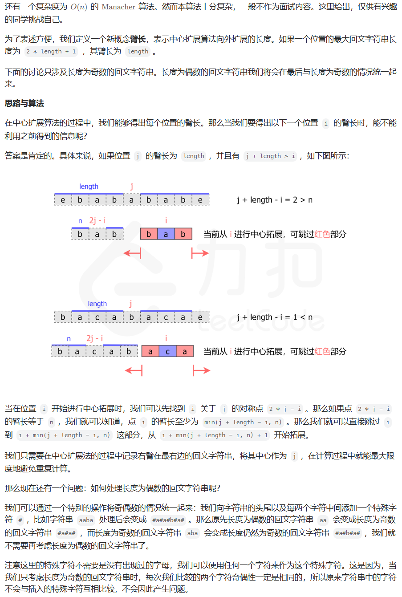
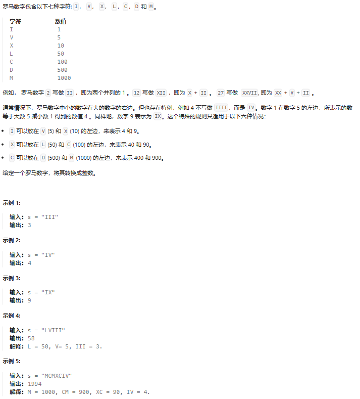

# 力扣记录

## 1. 两数之和

**题目描述：**


**解题代码：**

```java
class Solution {
    public int[] twoSum(int[] nums, int target) {
        int i = 0;
        int j = 0;
        Loop:for(i = 0;i < nums.length - 1;i++){
            int sub = target - nums[i];
            for(j = i + 1; j < nums.length;j++){
                if(nums[j] == sub){
                    break Loop;
                }
            }
        }
        return new int[]{i,j};
    }
}
```

**大佬解法：**

时间显著降低

- 标签：哈希映射
- 这道题本身如果通过暴力遍历的话也是很容易解决的，时间复杂度在 $O(n^2)$
- 由于哈希查找的时间复杂度为 $O(1)$，所以可以利用哈希容器 map 降低时间复杂度
- 遍历数组 nums，i 为当前下标，每个值都判断map中是否存在 target-nums[i] 的 key 值
- 如果存在则找到了两个值，如果不存在则将当前的 (nums[i],i) 存入 map 中，继续遍历直到找到为止
- 如果最终都没有结果则抛出异常

```java
class Solution {
    public int[] twoSum(int[] nums, int target) {
        Map<Integer, Integer> map = new HashMap<>();
        for(int i = 0; i< nums.length; i++) {
            if(map.containsKey(target - nums[i])) {
                return new int[] {map.get(target-nums[i]),i};
            }
            map.put(nums[i], i);
        }
        throw new IllegalArgumentException("No two sum solution");
    }
}
```

```cpp
//::value_type 是 std::map 中的一个嵌套类型，它表示 map 中的键值对类型。对于 std::map<int, int>，::value_type 表示的就是 std::pair<int, int>，其中 int 是键的类型，另一个 int 是值的类型。
//例如  a.insert(map<int,int>::value_type(nums[i],i));
class Solution {
public:
    vector<int> twoSum(vector<int>& nums, int target) {
        map<int,int> a;//提供一对一的hash
        vector<int> b(2,-1);//用来承载结果，初始化一个大小为2，值为-1的容器b
        for(int i=0;i<nums.size();i++)
        {
            if(a.count(target-nums[i])>0)
            {
                b[0]=a[target-nums[i]];
                b[1]=i;
                break;
            }
            a[nums[i]]=i;//反过来放入map中，用来获取结果下标
        }
        return b;
    };
};
```

## 2. 两数相加

**题目描述：**


**解题代码：**

```java
/**
 * Definition for singly-linked list.
 * public class ListNode {
 *     int val;
 *     ListNode next;
 *     ListNode() {}
 *     ListNode(int val) { this.val = val; }
 *     ListNode(int val, ListNode next) { this.val = val; this.next = next; }
 * }
 */
class Solution {
    public ListNode addTwoNumbers(ListNode l1, ListNode l2) {
        ListNode result = new ListNode();
        ListNode tmp = result;
        int val = (l1.val + l2.val)%10;
        int carry = (l1.val + l2.val)/10;
        result.val = val;
        l1 = l1.next;
        l2 = l2.next;// 奠基
        while(l1 != null && l2 != null){
            val = (l1.val + l2.val + carry)%10;
            carry = (l1.val + l2.val + carry)/10;
            tmp.next = new ListNode(val);
            tmp = tmp.next;
            l1 = l1.next;
            l2 = l2.next;
        }
        while(l1!= null){
            val = (l1.val + carry)%10;
            carry = (l1.val + carry)/10;
            tmp.next = new ListNode(val);
            tmp = tmp.next;
            l1 = l1.next;
        }
        while(l2!= null){
            val = (l2.val + carry)%10;
            carry = (l2.val + carry)/10;
            tmp.next = new ListNode(val);
            tmp = tmp.next;
            l2 = l2.next;
        }
        if(carry == 1){
            tmp.next = new ListNode(carry);
        }
        return result;
    }
}
```

**大佬解法：**

内存显著降低

```java
/**
 * Definition for singly-linked list.
 * public class ListNode {
 *     int val;
 *     ListNode next;
 *     ListNode(int x) { val = x; }
 * }
 */
class Solution {
    public ListNode addTwoNumbers(ListNode l1, ListNode l2) {
      return getSum(l1, l2, 0);
    }
    public ListNode getSum(ListNode node1, ListNode node2, int carry){
        if(node1 == null && node2 == null){
            if(carry != 0){
               ListNode tempNode = new ListNode(carry);
               return tempNode;
            }
            return null;
        }
        int temp = 0;
        if(node1 != null){
            temp += node1.val;
            node1 = node1.next;
        }
        if(node2 != null){
            temp+=node2.val;
            node2 = node2.next;
        }
        temp += carry; 
        int val = temp%10;
        ListNode node = new ListNode(val);
        carry = temp/10;
        node.next = getSum(node1, node2, carry);
        return node;
    }
}
```

## 3.无重复字符的最长子串

**题目描述：**


**解题代码：**

内存其实已经很好了

```java
class Solution {
    public int lengthOfLongestSubstring(String s) {
        ArrayList<Character> list = new ArrayList<>();
        int length=0;
        int max=0;

        for(char character : s.toCharArray()){
            if(list.contains(character)){
                int loc = -1;
                while(loc!=list.indexOf(character)){
                    list.remove(0);
                    length--;
                }
            }
            list.add(character);
            length++;           
            if(length>max){
                max = length;
            }
        }
        return max;
    }
}
```

**大佬解法：**

消耗更少的时间

```java
class Solution {
    public int lengthOfLongestSubstring(String s) {
// String s=new String();
//         Scanner sc=new Scanner(System.in);
//         s=sc.nextLine();
       char []a= s.toCharArray();
        int []exist=new int[256];
        for (int i = 0; i < exist.length; i++) {
            exist[i]=0;
        }

        int r=0,l=0;

        int max=0;

        while(r<a.length)
        {
            if(exist[a[r]]==1)
            {
                exist[a[l]]=0;
                l++;
            }
            else {
                exist[a[r]]=1;
                r++;
                int t=r-l;
                if(t>max)max=t;
            }
        }
        //System.out.println(max);
    return max;
 }
}
```

消耗更少的内存（实测其实也没有）

```java
class Solution {
    public int lengthOfLongestSubstring(String s) {
        int start = 0;
        int end = 0;
        Map<Character, Integer> indices = new HashMap<>();
        int result = 0;
        while (end < s.length()) {
            char c = s.charAt(end);
            if (!indices.containsKey(c) || indices.get(c) < start) {
                indices.put(c, end);
            } else {
                result = Math.max(result, end - start);
                start = indices.get(c) + 1;
                indices.put(c, end);
            }
            end++;
        }
        result = Math.max(result, end - start);
        return result;
    }
}
```

## 4. 寻找两个正序数组的中位数

**题目描述：**


**解题代码：**

时间100%，内存74.39%

```java
class Solution {
    public double findMedianSortedArrays(int[] nums1, int[] nums2) {
        if(nums1.length == 0){//如果一个为空
            if(nums2.length%2 == 1){
                return nums2[nums2.length/2];
            }else{
                return ((double)nums2[nums2.length/2] + (double)nums2[nums2.length/2-1])/2;
            }
        }else if(nums2.length == 0){
            if(nums1.length%2 == 1){
                return nums1[nums1.length/2];
            }else{
                return ((double)nums1[nums1.length/2] + (double)nums1[nums1.length/2-1])/2;
            }
        }
        double num = (nums1[0] <= nums2[0])?nums1[0]:nums2[0];
        int i,j;
        if(num==nums1[0]){
            i = 1;
            j = 0;
        }else{
            i = 0;
            j = 1;
        }
        int round = 1;
        if((nums1.length + nums2.length)%2 == 1){
            for(;i<=nums1.length && j <= nums2.length;){
                if(i == nums1.length){
                    num = nums2[j];
                    j++;
                }else if(j == nums2.length){
                    num = nums1[i];
                    i++;
                }
                else if(nums1[i] < nums2[j]){
                    num = nums1[i];
                    i++;
                }else{
                    num = nums2[j];
                    j++;
                }
                if(++round == (nums1.length + nums2.length)/2 + 1){
                    return num;
                }
            }
        }else{
            for(;i <= nums1.length && j <= nums2.length;){
                if(++round == (nums1.length + nums2.length)/2 + 1){
                    double next;
                    if(i == nums1.length){
                        next = nums2[j];
                    }else if(j==nums2.length){
                        next=nums1[i];
                    }else{
                        next = (nums1[i] <= nums2[j])?nums1[i]:nums2[j];
                    }
                
                    return (num + next)/2;
                }
                if(i == nums1.length){
                    num = nums2[j];
                    j++;
                }else if(j == nums2.length){
                    num = nums1[i];
                    i++;
                }else if(nums1[i] < nums2[j]){
                    num = nums1[i];
                    i++;
                }else{
                    num = nums2[j];
                    j++;
                }
            }
        }
        return 0;
    }
}
```

**大佬解法：**

```java
import java.util.ArrayList;

class Solution {
    public double findMedianSortedArrays(int[] nums1, int[] nums2) {
        int m = nums1.length, n = nums2.length, left = (m + n + 1) / 2, right = (m + n + 2) / 2;
        return (findKth(nums1, nums2, left) + findKth(nums1, nums2, right)) / 2.0;
    }
    int findKth(int[] nums1, int[] nums2, int k) {
        int m = nums1.length, n = nums2.length;
        if (m == 0) return nums2[k - 1];
        if (n == 0) return nums1[k - 1];
        if (k == 1) return Math.min(nums1[0], nums2[0]);
        int i = Math.min(m, k / 2), j = Math.min(n, k / 2);
        if (nums1[i - 1] > nums2[j - 1]) {
            return findKth(nums1, Arrays.copyOfRange(nums2, j, n), k - j);
        } else {
            return findKth(Arrays.copyOfRange(nums1, i, m), nums2, k - i);
        }
    }
}
```

## 5. 最长回文子串

**题目描述：**


**大佬解法：**

**动态规划:**


- 时间复杂度：$O(n^2)$，其中$n$是字符串的长度。动态规划的状态总数为$O(n^2)$，对于每个状态，我们需要转移的时间为$O(1)$。

- 空间复杂度：$O(n^2)$，即存储动态规划状态需要的空间。

```cpp
#include <iostream>
#include <string>
#include <vector>

using namespace std;

class Solution {
public:
    string longestPalindrome(string s) {
        int n = s.size();
        if (n < 2) {
            return s;
        }

        int maxLen = 1;
        int begin = 0;
        // dp[i][j] 表示 s[i..j] 是否是回文串
        vector<vector<int>> dp(n, vector<int>(n));
        // 初始化：所有长度为 1 的子串都是回文串
        for (int i = 0; i < n; i++) {
            dp[i][i] = true;
        }
        // 递推开始
        // 先枚举子串长度
        for (int L = 2; L <= n; L++) {
            // 枚举左边界，左边界的上限设置可以宽松一些
            for (int i = 0; i < n; i++) {
                // 由 L 和 i 可以确定右边界，即 j - i + 1 = L 得
                int j = L + i - 1;
                // 如果右边界越界，就可以退出当前循环
                if (j >= n) {
                    break;
                }

                if (s[i] != s[j]) {
                    dp[i][j] = false;
                } else {
                    if (j - i < 3) {
                        dp[i][j] = true;
                    } else {
                        dp[i][j] = dp[i + 1][j - 1];
                    }
                }

                // 只要 dp[i][L] == true 成立，就表示子串 s[i..L] 是回文，此时记录回文长度和起始位置
                if (dp[i][j] && j - i + 1 > maxLen) {
                    maxLen = j - i + 1;
                    begin = i;
                }
            }
        }
        return s.substr(begin, maxLen);
    }
};
```

**中心扩展算法:**


- 时间复杂度：$O(n^2)$，其中$n$是字符串的长度。长度为$1$和$2$的回文中心分别有$n$和$n-1$个，每个回文中心最多会向外扩展$O(n)$次。
- 空间复杂度：$O(1)$。

```cpp
class Solution {
public:
    pair<int, int> expandAroundCenter(const string& s, int left, int right) {
        while (left >= 0 && right < s.size() && s[left] == s[right]) {
            --left;
            ++right;
        }
        return {left + 1, right - 1};
    }

    string longestPalindrome(string s) {
        int start = 0, end = 0;
        for (int i = 0; i < s.size(); ++i) {
            auto [left1, right1] = expandAroundCenter(s, i, i);
            auto [left2, right2] = expandAroundCenter(s, i, i + 1);
            if (right1 - left1 > end - start) {
                start = left1;
                end = right1;
            }
            if (right2 - left2 > end - start) {
                start = left2;
                end = right2;
            }
        }
        return s.substr(start, end - start + 1);
    }
};
```

**Manacher 算法(没看懂):**



- 时间复杂度：$O(n)$，其中$n$是字符串的长度。由于对于每个位置，扩展要么从当前已知的回文子串扩展，要么从起始位置扩展，而不会重复，因此算法复杂度为$O(n)$。
- 空间复杂度：$O(n)$，我们需要$O(n)$的空间记录每个位置的回文长度。

```cpp
class Solution {
public:
    int expand(const string& s, int left, int right) {
        while (left >= 0 && right < s.size() && s[left] == s[right]) {
            --left;
            ++right;
        }
        return (right - left - 2) / 2;
    }

    string longestPalindrome(string s) {
        int start = 0, end = -1;
        string t = "#";
        for (char c: s) {
            t += c;
            t += '#';
        }
        t += '#';
        s = t;

        vector<int> arm_len;
        int right = -1, j = -1;
        for (int i = 0; i < s.size(); ++i) {
            int cur_arm_len;
            if (right >= i) {
                int i_sym = j * 2 - i;
                int min_arm_len = min(arm_len[i_sym], right - i);
                cur_arm_len = expand(s, i - min_arm_len, i + min_arm_len);
            } else {
                cur_arm_len = expand(s, i, i);
            }
            arm_len.push_back(cur_arm_len);
            if (i + cur_arm_len > right) {
                j = i;
                right = i + cur_arm_len;
            }
            if (cur_arm_len * 2 + 1 > end - start) {
                start = i - cur_arm_len;
                end = i + cur_arm_len;
            }
        }

        string ans;
        for (int i = start; i <= end; ++i) {
            if (s[i] != '#') {
                ans += s[i];
            }
        }
        return ans;
    }
};
```

## 6.N 字形变换

**题目描述：**


**解题代码：**

时间27.46%，内存34.24%

```java
class Solution {
    public String convert(String s, int numRows) {
        if(numRows == 1){
            return s;
        }
        
        String result ="";
        for(int i=0;i < numRows; i++){
            boolean first_flag = true;
            for(int loc = i;loc < s.length();loc+=(2*(numRows-i-1))){
                if(first_flag){
                    result=result + s.charAt(loc);
                    first_flag = false;
                }else{
                    if((numRows-i-1)!=0 )
                    result=result + s.charAt(loc);
                    if(i!=0){
                    loc+=(2*i);
                    if(loc < s.length())
                        result=result + s.charAt(loc);
                    }
                }
            }
        }
        return result;
    }
}
```

**大佬解法：**

更少的时间

```java
class Solution {
    public String convert(String s, int numRows) {
        
        if (numRows == 1) return s;

        char[] string = s.toCharArray();
        char[] ans = new char[string.length];
        int add = (numRows - 1) * 2;//add: 每个 V 字形的长度
        int i = 1;//i: 第一个 V 字形的起始位置
        int j = add;//j: 第一个 V 字形的结束位置
        int k = i;//k: 下一个 V 字形的起始位置
        int l = j;//l: 下一个 V 字形的结束位置
        int n = 1;//n: 存储字符数组 ans 中下一个要填充的位置
        ans[0] = string[0];
        // 第一行
        while (l < string.length) {
            ans[n] = string[l];
            l += add;
            n++;
        }
        j--;
        l = j;

        // 第i行和倒数第i行
        while (i < j) {
            while (l < string.length) {
                ans[n++] = string[k];
                ans[n++] = string[l];
                k += add;
                l += add;
            }
            if (k < string.length) ans[n++] = string[k];
            i++;
            j--;
            k = i;
            l = j;
        }
        // 最后一行
        while (l < string.length) {
            ans[n] = string[l];
            l += add;
            n++;
        }

        return String.valueOf(ans);
    }
}
```

## 7. 整数反转

**题目描述：**


**解题代码：**

时间17.61%，内存52.49%

```java
class Solution {
    public int reverse(int x) {
        boolean flag = true;
        if(x == 0){
            return x;
        }else if(x<0){
            x = Math.abs(x);
            flag = false;
        }
        ArrayList<Integer> list = new ArrayList<>();
        while(x >= 10){
            list.add(x%10);
            x = x/10;
        }
        if(x>0)
            list.add(x);
        int ans = 0;
        int i = (int)Math.pow(10,list.size()-1);
        
        for(int ele:list){
            int tmp = ans;
            ans = ans + ele*i;
            i = i/10;
        }
        if(list.size()== 10){
            if(ans < 2000000000){// 这儿判断超阈值其实有问题
                return 0;
            }
        }

        if(flag)
            return ans;
        else
            return -ans;
    }
}
```

**大佬解法：**

```java
class Solution {
    public int reverse(int x) {
        long ans = 0;
        while (x != 0) {
            ans = ans * 10 + x % 10;
            x /= 10;
        }
        return ans < Integer.MIN_VALUE || ans > Integer.MAX_VALUE ? 0 : (int) ans;
    }
}
```

## 8. 字符串转换整数 (atoi)

**题目描述：**


**解题代码：**

时间6.67%，内存8.60%

```java
class Solution {
    public int myAtoi(String s) {
        char[] string = s.toCharArray();
        String ans = "";
        boolean flag = true;
        boolean flag_symbol = true;
        boolean flag_space = true;
        for(char c:string){
            if(c == ' ' && flag_space){
                continue;
            }else if((c == '+'||c == '-') && ans =="" && flag_symbol){
                if(c == '-'){
                    flag = false;
                }
                flag_symbol = false;
            }else if(c >= '0' && c <= '9'){
                ans = ans + c;
                if(ans.equals("0")){
                    ans = "";
                }
            }else{
                break;
            }
            flag_space = false;
            flag_symbol = false;
        }
        if(ans ==""){
            return 0;
        }
        if(ans.length()>10){
            if(flag)
                return Integer.MAX_VALUE;
            else
                return Integer.MIN_VALUE;
        }
        if(flag){
            if(Long.parseLong(ans) > Integer.MAX_VALUE){
                return Integer.MAX_VALUE;
            }else{
                return Integer.parseInt(ans);
            }
        }else{
            if(-Long.parseLong(ans) <= Integer.MIN_VALUE){
                return Integer.MIN_VALUE;
            }else{
                return -Integer.parseInt(ans);
            }
        }
    }
}
```

**大佬解法：**

```java
class Solution {
    public int myAtoi(String s) {
        long sum=0;
        s=s.trim();//它调用了字符串的 trim 方法，将字符串两端的空格去除
        int f=1;
       
        for(int i=0;i<s.length();i++){
          
        
           if(i==0 && s.charAt(0)=='-')f=-1;
            else if (i==0 && s.charAt(0)=='+')f=1;
            else if(s.charAt(i)<'0' ||s.charAt(i)>'9')break;
            else{
                sum=sum*10+(s.charAt(i)-'0');
           } 
           if(sum>Integer.MAX_VALUE && f>0)return Integer.MAX_VALUE;
           if(f*sum<Integer.MIN_VALUE && f<0)return Integer.MIN_VALUE;
        }     
        return (int)sum*f;
    }
}
```

## 9. 回文数

**题目描述：**


**解题代码：**

时间98.39%，内存58.12%

```java
class Solution {
    public boolean isPalindrome(int x) {
        if(x < 0){
            return false;
        }
        if(x == reverse(x))
            return true;
        else
            return false;
    }
    public int reverse(int x) {
        long ans = 0;
        while (x != 0) {
            ans = ans * 10 + x % 10;
            x /= 10;
        }
        return ans < Integer.MIN_VALUE || ans > Integer.MAX_VALUE ? 0 : (int) ans;
    }
}
```

**大佬解法：**

更小的内存

```java
class Solution {
    public boolean isPalindrome(int x) {
        if(x < 0) {
            return false;
        }
        List<Integer> list = new ArrayList<>();
        while(x > 0) {
            list.add(x % 10);
            x = x / 10;
        }
        int left = 0, right = list.size() - 1;
        while(left < right) {
            if(list.get(left) != list.get(right)) {
                return false;
            }
            left++;
            right--;
        }
        return true;
    }
}
```

## 10. 正则表达式匹配（还不会）

**题目描述：**


**官方解题代码：**

动态规划


- 时间复杂度：$O(mn)$，其中$m$和$n$分别是字符串$s$和$p$的长度。我们需要计算出所有的状态，并且每个状态在进行转移时的时间复杂度为$O(1)$。
- 空间复杂度：$O(mn)$，即为存储所有状态使用的空间。

```java
class Solution {
    public boolean isMatch(String s, String p) {
        int m = s.length();
        int n = p.length();

        boolean[][] f = new boolean[m + 1][n + 1];
        f[0][0] = true;
        for (int i = 0; i <= m; ++i) {
            for (int j = 1; j <= n; ++j) {
                if (p.charAt(j - 1) == '*') {
                    f[i][j] = f[i][j - 2];
                    if (matches(s, p, i, j - 1)) {
                        f[i][j] = f[i][j] || f[i - 1][j];
                    }
                } else {
                    if (matches(s, p, i, j)) {
                        f[i][j] = f[i - 1][j - 1];
                    }
                }
            }
        }
        return f[m][n];
    }

    public boolean matches(String s, String p, int i, int j) {
        if (i == 0) {
            return false;
        }
        if (p.charAt(j - 1) == '.') {
            return true;
        }
        return s.charAt(i - 1) == p.charAt(j - 1);
    }
}
```

```cpp
class Solution {
public:
    bool isMatch(string s, string p) {
        int m = s.size();
        int n = p.size();

        auto matches = [&](int i, int j) {
            if (i == 0) {
                return false;
            }
            if (p[j - 1] == '.') {
                return true;
            }
            return s[i - 1] == p[j - 1];
        };

        vector<vector<int>> f(m + 1, vector<int>(n + 1));
        f[0][0] = true;
        for (int i = 0; i <= m; ++i) {
            for (int j = 1; j <= n; ++j) {
                if (p[j - 1] == '*') {
                    f[i][j] |= f[i][j - 2];
                    if (matches(i, j - 1)) {
                        f[i][j] |= f[i - 1][j];
                    }
                }
                else {
                    if (matches(i, j)) {
                        f[i][j] |= f[i - 1][j - 1];
                    }
                }
            }
        }
        return f[m][n];
    }
};
```

## 11. 盛最多水的容器

**题目描述：**


**解题代码：**

时间91.47%，内存81.38%

```java
class Solution {
    public int maxArea(int[] height) {
        int max = 0;
        int i = 0;
        int j = height.length-1;
        while(i < j){
            int tmp = (j-i)*Math.min(height[i],height[j]);
            if(tmp > max){
                max = tmp;
            }
            if(height[i] < height[j]){
                i++;
            }else{
                j--;
            }
        }
        return max;
    }
}
```

## 12. 整数转罗马数字

**题目描述：**


**解题代码：**

时间43.84%，内存11.00%

```java
class Solution {
    public String intToRoman(int num) {
        String ans="";
        while(num >= 1000){
            ans = ans + "M";
            num = num - 1000;
        }
        while(num >= 900){
            ans = ans + "CM";
            num = num - 900;
        }
        while(num >= 500){
            ans = ans + "D";
            num = num - 500;
        }
        while(num >= 400){
            ans = ans + "CD";
            num = num - 400;
        }
        while(num >= 100){
            ans = ans + "C";
            num = num - 100;
        }
        while(num >= 90){
            ans = ans + "XC";
            num = num - 90;
        }
        while(num >= 50){
            ans = ans + "L";
            num = num - 50;
        }
        while(num >= 40){
            ans = ans + "XL";
            num = num - 40;
        }
        while(num >= 10){
            ans = ans + "X";
            num = num - 10;
        }
        while(num >= 9){
            ans = ans + "IX";
            num = num - 9;
        }
        while(num >= 5){
            ans = ans + "V";
            num = num - 5;
        }
        while(num >= 4){
            ans = ans + "IV";
            num = num - 4;
        }
        while(num >= 1){
            ans = ans + "I";
            num = num - 1;
        }
        return ans;
    }
}
```

**大佬解法：**

本质一样

```java
class Solution {
    public String intToRoman(int num) {
            StringBuilder res=new StringBuilder();
            if(num>=1000){for(int i=num/1000;i>0;i--){res.append('M');}num%=1000;}
            if(num>=500){
                if(num>=900){res.append("CM");num%=100;}
                else{res.append('D');num-=500;}
            }
            if(num>=100){
                if(num>=400){res.append("CD");num%=100;}
                else{for(int i=num/100;i>0;i--){res.append('C');}num%=100;}
            }
            if(num>=50){
                if(num>=90){res.append("XC");num%=10;}
                else{res.append('L');num-=50;}
            }
            if(num>=10){
                if(num>=40){res.append("XL");num%=10;}
                else{for(int i=num/10;i>0;i--){res.append('X');}num%=10;}
            }
            if(num>=5){
                if(num>=9){res.append("IX");num%=1;}
                else{res.append('V');num-=5;}
            }
            if(num>=1){
                if(num>=4){res.append("IV");num%=1;}
                else{for(int i=num;i>0;i--){res.append('I');}num%=1;}
            }
            return res.toString();
    }
}
```

## 13. 罗马数字转整数

**题目描述：**



**解题代码：**

时间70.36%，内存73.22%

```java
class Solution {
    public int romanToInt(String s) {
        int num = 0;
        s = s + "I";
        for(int i = 0;i<s.length()-1;i++){
            if(s.charAt(i) == 'M'){
                num+=1000;continue;
            }
            if(s.charAt(i) == 'D'){
                num+=500;continue;
            }
            if(s.charAt(i) == 'C'){
                if(s.charAt(i + 1) == 'M'){
                    i++;num+=900;continue;
                }
                if(s.charAt(i + 1) == 'D'){
                    i++;num+=400;continue;
                }
                num+=100;continue;
            }
            if(s.charAt(i) == 'L'){
                num+=50;continue;
            }
            if(s.charAt(i) == 'X'){
                if(s.charAt(i + 1) == 'C'){
                    i++;num+=90;continue;
                }
                if(s.charAt(i + 1) == 'L'){
                    i++;num+=40;continue;
                }
                num+=10;continue;
            }
            if(s.charAt(i) == 'V'){
                num+=5;continue;
            }
            if(s.charAt(i) == 'I'){
                if(s.charAt(i + 1) == 'X'){
                    i++;num+=9;continue;
                }
                if(s.charAt(i + 1) == 'V'){
                    i++;num+=4;continue;
                }
                num+=1;continue;
            }
        }
        return num;
    }
}
```

**大佬解法：**

```java
class Solution {
    public int romanToInt(String s) {
        int sum = 0;
        int preNum = getValue(s.charAt(0));
        for(int i = 1;i < s.length(); i ++) {
            int num = getValue(s.charAt(i));
            if(preNum < num) {
                sum -= preNum;
            } else {
                sum += preNum;
            }
            preNum = num;
        }
        sum += preNum;
        return sum;
    }
    
    private int getValue(char ch) {
        switch(ch) {
            case 'I': return 1;
            case 'V': return 5;
            case 'X': return 10;
            case 'L': return 50;
            case 'C': return 100;
            case 'D': return 500;
            case 'M': return 1000;
            default: return 0;
        }
    }
}
```

## 14. 最长公共前缀

**题目描述：**


**解题代码：**

时间9.54%，内存10.22%

```java
class Solution {
    public String longestCommonPrefix(String[] strs) {
        String prefix = "";
        Loop:for(int i = 0;;i++){
            if(i >= strs[0].length()){
                break;
            }
            char c = strs[0].charAt(i);
            for(String s:strs){
                if(i >= s.length()){
                    break Loop;
                }
                if(s.charAt(i)!=c){
                    break Loop;
                }
            }
            prefix = prefix + c;
        }
        return prefix;
    }
}
```

**大佬解法：**

更小内存

```java
class Solution {

    public String longestCommonPrefix(String[] strs) {
        // 3 ptrs O(N)
        // 10^2 => n^3
        StringBuilder sb = new StringBuilder();
        for (int i = 0; i < strs[0].length(); i++) {
            char curr = strs[0].charAt(i);

            // 同层比较 arr[] 其他人的, 类BFS
            for (int j = 1; j < strs.length; j++) {
                if (i >= strs[j].length() || strs[j].charAt(i) != curr) {
                    return sb.toString();
                }
            }
            sb.append(curr);
        }

        return sb.toString();
    }
}
```

更快时间

```java
class Solution {
    public String longestCommonPrefix(String[] strs) {

        if(strs == null||strs.length == 0){
            return"";
        }
        String prefix = strs[0];
        int count = strs.length;
        for(int i =1;i<count;i++){
            prefix = longestCommonPrefix(prefix,strs[i]);
        
        }
        return prefix;
}
        public String longestCommonPrefix(String str1,String str2){
            int length=Math.min(str1.length(),str2.length());
            int index = 0;
            while(index<length&&str1.charAt(index)==str2.charAt(index)){
                index++;
            }
            return str1.substring(0,index);
    }
}
```

## 15. 三数之和

**题目描述：**


**大佬思路：**

- 首先对数组进行排序，排序后固定一个数nums[i]，再使用左右指针指向nums[i]后面的两端，数字分别为nums[L]和nums[R]，计算三个数的和sum判断是否满足为0，满足则添加进结果集
- 如果nums[i]大于0，则三数之和必然无法等于0，结束循环
- 如果nums[i] == nums[i−1]，则说明该数字重复，会导致结果重复，所以应该跳过
- 当sum == 0时，nums[L] == nums[L+1]则会导致结果重复，应该跳过，L++
- 当sum == 0时，nums[R] == nums[R−1]则会导致结果重复，应该跳过，R−−
- 时间复杂度：$O(n^2)$，n为数组长度

```java
class Solution {
    public List<List<Integer>> threeSum(int[] nums) {
        int n = nums.length;
        Arrays.sort(nums);
        List<List<Integer>> ans = new ArrayList<List<Integer>>();
        // 枚举 a
        for (int first = 0; first < n; ++first) {
            // 需要和上一次枚举的数不相同
            if (first > 0 && nums[first] == nums[first - 1]) {
                continue;
            }
            // c 对应的指针初始指向数组的最右端
            int third = n - 1;
            int target = -nums[first];
            // 枚举 b
            for (int second = first + 1; second < n; ++second) {
                // 需要和上一次枚举的数不相同
                if (second > first + 1 && nums[second] == nums[second - 1]) {
                    continue;
                }
                // 需要保证 b 的指针在 c 的指针的左侧
                while (second < third && nums[second] + nums[third] > target) {
                    --third;
                }
                // 如果指针重合，随着 b 后续的增加
                // 就不会有满足 a+b+c=0 并且 b<c 的 c 了，可以退出循环
                if (second == third) {
                    break;
                }
                if (nums[second] + nums[third] == target) {
                    List<Integer> list = new ArrayList<Integer>();
                    list.add(nums[first]);
                    list.add(nums[second]);
                    list.add(nums[third]);
                    ans.add(list);
                }
            }
        }
        return ans;
    }
}
```

## 16. 最接近的三数之和

**题目描述：**


**解题代码：**

时间47.90%，内存30.32%

```java
class Solution {
    public int threeSumClosest(int[] nums, int target) {
        Arrays.sort(nums);
        int result = nums[0] + nums[1] + nums[2];
        for(int i=0;i<nums.length-2;i++){
            int left = i+1;
            int right = nums.length - 1;
            while(left != right){
                int sum = nums[i] + nums[left] + nums[right];
                if(Math.abs(sum - target) < Math.abs(result - target))
                    result = sum;
                if(sum > target){
                    right--;
                }
                else{
                    left++;
                }
            }
        }
        return result;
    }
}
```

**大佬思路：**

- 可以添加去重的操作
- 如果 target 的值比 nums[i] + nums[left] + nums[left + 1] 的值还小，那么双指针无论怎么取，最后都会取到nums[i] + nums[left] + nums[left + 1]。同理可证 target 的值比nums[i] + nums[right] + nums[right - 1] 的值还大的情况。所以可以增加一个判断，满足条件的情况下就可以直接取值，而不需要双指针一步步的判断来进行取值，减少了双指针的移动。
- 有些时候，可能会直接找到三数之和等于 target 的情况，此时直接返回结果即可，不需要在进行之后的循环，因为不可能有数比他自己更接近自己了。

```java
class Solution {
    public int threeSumClosest(int[] nums, int target) {
        Arrays.sort(nums);
        int result = nums[0] + nums[1] + nums[2];
        for(int i=0;i<nums.length-2;i++){
            int left = i+1;
            int right = nums.length - 1;
            while(left != right){
                int min = nums[i] + nums[left] + nums[left + 1];
                if(target < min){
                    if(Math.abs(result - target) > Math.abs(min - target))
                        result = min;
                    break;
                }
                int max = nums[i] + nums[right] + nums[right - 1];
                if(target > max){
                    if(Math.abs(result - target) > Math.abs(max - target))
                        result = max;
                    break;  
                }
                int sum = nums[i] + nums[left] + nums[right];
                // 判断三数之和是否等于target
                if(sum == target)
                    return sum;
                if(Math.abs(sum - target) < Math.abs(result - target))
                    result = sum;
                if(sum > target){
                    right--;
                    while(left != right && nums[right] == nums[right+1])
                        right--;
                }
                else{
                    left++;
                    while(left != right && nums[left] == nums[left-1])
                        left++;
                }
            }
            while(i<nums.length-2 && nums[i] == nums[i+1])
                i++;
        }
        return result;
    }
}
```

## 17. 电话号码的字母组合

**题目描述：**


**解题代码：**

时间15.05%，内存7.79%

```java
class Solution {
    public List<String> letterCombinations(String digits) {
        List<String> ans = new ArrayList<>();
        if(digits.length() == 0){
            return ans;
        }
        String[] map = {"","","abc","def","ghi","jkl","mno","pqrs","tuv","wxyz"};
        ans.add("");
        for(int i = 0;i<digits.length();i++){
            String tmp = map[digits.charAt(i) - '0'];
            List<String> tmp_ans = new ArrayList<>();
            for(int j = 0;j<tmp.length();j++){
                for(String s:ans){
                    tmp_ans.add(s + tmp.charAt(j));
                }
            }
            ans = tmp_ans;
        }
        return ans;
    }
}
```

**大佬解法：**

更快的时间

```java
class Solution {
    String[] MAPPING=new String[]{"","","abc","def","ghi","jkl","mno","pqrs","tuv","wxyz"};
    ArrayList<String> ans=new ArrayList<String>();
    char[] words,path;
    public List<String> letterCombinations(String digits) {
        int len=digits.length();
        if(len==0)
            return Arrays.asList(new String[0]);
        words=digits.toCharArray();
        path=new char[len];
        dfs(0);
        return ans;
    }
    public void dfs(int i){
        if(i==path.length){
            ans.add(new String(path));
            return;
        }
        else{
            for(char c:MAPPING[words[i]-'0'].toCharArray()){
                path[i]=c;
                dfs(i+1);
            }
        }
    }
}
```

## 18. 四数之和

**题目描述：**


**解题代码：**

超出内存限制了

```java
class Solution {
    public List<List<Integer>> fourSum(int[] nums, int target) {
        int n = nums.length;
        Arrays.sort(nums);
        List<List<Integer>> ans = new ArrayList<List<Integer>>();
        // 枚举 a
        for (int first = 0; first < n; ++first) {
            // 需要和上一次枚举的数不相同
            if (first > 0 && nums[first] == nums[first - 1]) {
                continue;
            }
            for (int second = first + 1; second < n; ++second) {
                // 需要和上一次枚举的数不相同
                if (second > first + 1 && nums[second] == nums[second - 1]) {
                    continue;
                }
                // d 对应的指针初始指向数组的最右端
                int forth = n - 1;
                int target_tmp = target-(nums[first]+nums[second]);
                // 枚举 c
                for (int third = second + 1; third < n; ++third) {
                    // 需要和上一次枚举的数不相同
                    if (third > second + 1 && nums[third] == nums[third - 1]) {
                        continue;
                    }
                    // 需要保证 c 的指针在 d 的指针的左侧
                    while (third < forth && nums[third] + nums[forth] > target_tmp) {
                        --third;
                    }
                    // 如果指针重合，随着 c 后续的增加
                    // 就不会有满足 a+b+c+d=0 并且 c<d 的 d 了，可以退出循环
                    if (third == forth) {
                        break;
                    }
                    if (nums[third] + nums[forth] == target_tmp) {
                        List<Integer> list = new ArrayList<Integer>();
                        list.add(nums[first]);
                        list.add(nums[second]);
                        list.add(nums[third]);
                        list.add(nums[forth]);
                        ans.add(list);
                    }
                }
            }
        }
        return ans;
    }
}
```

**大佬解法：**

```java
class Solution {
    public List<List<Integer>> fourSum(int[] nums, int target) {
        Arrays.sort(nums);
        List<List<Integer>> ans = new ArrayList<>();
        int n = nums.length;
        for (int a = 0; a < n - 3; a++) { // 枚举第一个数
            long x = nums[a]; // 使用 long 避免溢出
            if (a > 0 && x == nums[a - 1]) continue; // 跳过重复数字
            if (x + nums[a + 1] + nums[a + 2] + nums[a + 3] > target) break; // 优化一
            if (x + nums[n - 3] + nums[n - 2] + nums[n - 1] < target) continue; // 优化二
            for (int b = a + 1; b < n - 2; b++) { // 枚举第二个数
                long y = nums[b];
                if (b > a + 1 && y == nums[b - 1]) continue; // 跳过重复数字
                if (x + y + nums[b + 1] + nums[b + 2] > target) break; // 优化一
                if (x + y + nums[n - 2] + nums[n - 1] < target) continue; // 优化二
                int c = b + 1, d = n - 1;
                while (c < d) { // 双指针枚举第三个数和第四个数
                    long s = x + y + nums[c] + nums[d]; // 四数之和
                    if (s > target) d--;
                    else if (s < target) c++;
                    else { // s == target
                        ans.add(List.of((int) x, (int) y, nums[c], nums[d]));
                        for (c++; c < d && nums[c] == nums[c - 1]; c++) ; // 跳过重复数字
                        for (d--; d > c && nums[d] == nums[d + 1]; d--) ; // 跳过重复数字
                    }
                }
            }
        }
        return ans;
    }
}
```

## 19. 删除链表的倒数第N个节点

**题目描述：**


**解题代码：**

时间100%，内存84.61%

```java
class Solution {
    public ListNode removeNthFromEnd(ListNode head, int n) {
        //添加表头
        ListNode res = new ListNode(-1); 
        res.next = head;
        //当前节点
        ListNode cur = head;
        //前序节点 
        ListNode pre = res; 
        ListNode fast = head;
        //快指针先行n步
        while(n-- > 0) 
            fast = fast.next;
        //快慢指针同步，快指针到达末尾，慢指针就到了倒数第n个位置
        while(fast != null){ 
            fast = fast.next;
            pre = cur;
            cur = cur.next;
        }
        //删除该位置的节点
        pre.next = cur.next; 
        //返回去掉头
        return res.next; 
    }
}
```

## 20. 有效的括号

**题目描述：**


**解题代码：**

时间51.53%，内存54.52%

```java
class Solution {
    public boolean isValid(String s) {
        if(s.equals("")){
            return true;
        }
        Stack<Character> st = new Stack<Character>();
        for(char c:s.toCharArray()){
            if(c=='(' || c=='{' || c=='['){
                st.push(c);
                continue;
            }
            if(!st.empty()){
                if(st.peek() == '(' && c == ')'){
                    st.pop();
                    continue;
                }
                else if(st.peek() == '[' && c == ']'){
                    st.pop();
                    continue;
                }
                else if(st.peek() == '{'&& c == '}'){
                    st.pop();
                    continue;
                }
            }
            st.push(c);
            break;
        }
        if(st.empty())
            return true;
        else
            return false;
    }
}
```

**大佬解法：**

更快的时间

```java
class Solution {
    public boolean isValid(String s) {
        char []c= s.toCharArray();
        char []d =new char[c.length];
        int j=0;
        for(int i=0;i<c.length;i++){
            switch(c[i]){
                case '(':;
                case '[':;
                case '{':d[j]=c[i];j++;break;
                case '}':
                    if (j==0)
                    return false;
                    if(d[j-1]!='{')
                        return false;    
                    if(d[j-1]=='{')
                        j--;
                    break;
                case ']':
                  if (j==0)
                    return false;
                    if(d[j-1]!='[')
                        return false;    
                    if(d[j-1]=='[')
                        j--;
                    break; 
                case ')':
                  if (j==0)
                    return false;
                   // System.out.println(d[j]);
                    if(d[j-1]!='(')
                        return false;    
                    if(d[j-1]=='(')
                        j--;
                    break;
               
            } 
        }
        if(j==0)
            return true;
        else
            return false;
    }
}
```
