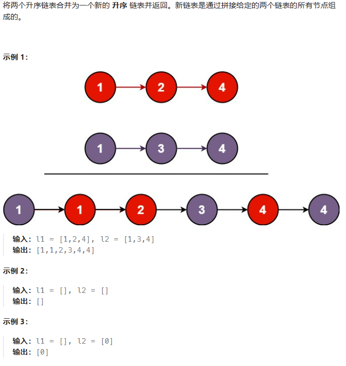
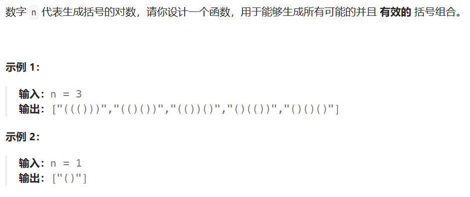
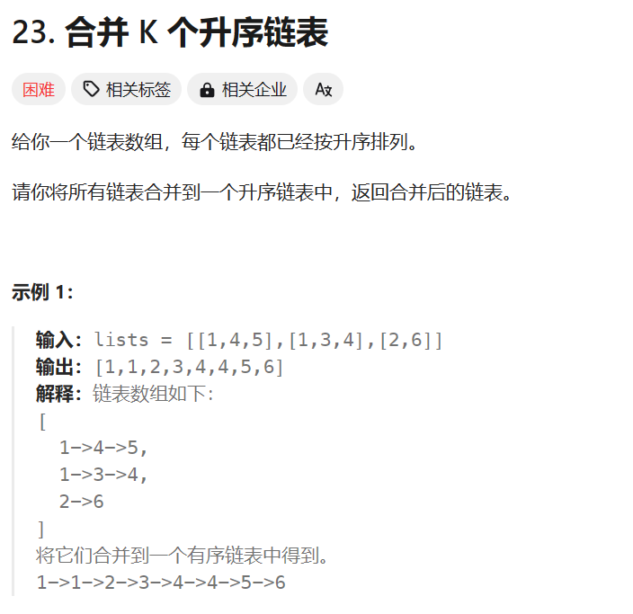
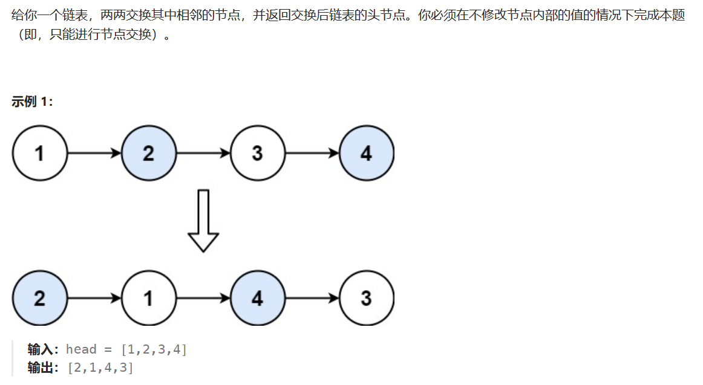

# 力扣记录

## 21. 合并两个有序链表

**题目描述：**



**解题代码：**

```java
class Solution {
    public ListNode mergeTwoLists(ListNode list1, ListNode list2) {
        if(list1==null || list2==null){
            return (list1!=null)?list1:list2;
        }
        ListNode current1 = list1;
        ListNode current2 = list2;
        ListNode new_head = new ListNode(0);
        ListNode nextNode;
        ListNode tail = new_head;

        while(current1!=null && current2!=null){
            if(current1.val <= current2.val){
                nextNode = current1;
                tail.next = nextNode;
                tail = tail.next;
                current1 = current1.next;
            }else{
                nextNode = current2;
                tail.next = nextNode;
                tail = tail.next;
                current2 = current2.next;
            }
        }
        if(current1!=null){
            tail.next = current1;
        }else{
            tail.next = current2;
        }
        return new_head.next;
    }
}
```

**大佬解法：**
其实差不多，就是代码更简洁一点

```java
class Solution {
    public ListNode mergeTwoLists(ListNode l1, ListNode l2) {
        ListNode prehead = new ListNode(-1);

        ListNode prev = prehead;
        while (l1 != null && l2 != null) {
            if (l1.val <= l2.val) {
                prev.next = l1;
                l1 = l1.next;
            } else {
                prev.next = l2;
                l2 = l2.next;
            }
            prev = prev.next;
        }

        // 合并后 l1 和 l2 最多只有一个还未被合并完，我们直接将链表末尾指向未合并完的链表即可
        prev.next = l1 == null ? l2 : l1;

        return prehead.next;
    }
}
```

## 22. 括号生成

**题目描述：**



**解题代码：**
这个有问题，前三个还能解决，但是第4个就不行了，"(())(())"这个就不行了

```java
class Solution {
    public List<String> distinct(List<String> list) {
        List doubleList= new ArrayList();
        Set set = new HashSet();
        set.addAll(list);
        doubleList.addAll(set);

        return doubleList;
    }
    public List<String> generateParenthesis(int n) {
        List<String> ans = new ArrayList<String>();
        ans.add("()");
        for(int i = 1;i < n;i++){
            List<String> tmp = new ArrayList<String>();
            for(String s:ans){
                tmp.add("("+ s + ")");
                tmp.add("()" + s);
                tmp.add(s + "()");
            }
            List<String> tmp2 = distinct(tmp);
            ans.clear();
            ans.addAll(tmp2);
        }
        return ans;
    }
}
```

**大佬解法：**

```java
class Solution {
    public List<String> generateParenthesis(int n) {
        List<String> ans = new ArrayList<String>();
        backtrack(ans, new StringBuilder(), 0, 0, n);
        return ans;
    }

    public void backtrack(List<String> ans, StringBuilder cur, int open, int close, int max){
        if (cur.length() == max * 2) {
            ans.add(cur.toString());
            return;
        }
        if (open < max) {
            cur.append('(');
            backtrack(ans, cur, open+1, close, max);
            cur.deleteCharAt(cur.length() - 1);
        }
        if (close < open) {
            cur.append(')');
            backtrack(ans, cur, open, close+1, max);
            cur.deleteCharAt(cur.length() - 1);
        }
    }
}
```

## 23. 合并K个升序链表

**题目描述：**



**解题代码：**
用了[21题的代码](#21-合并两个有序链表)

```java
public ListNode mergeKLists(ListNode[] lists) {
    if(lists.length == 0) 
        return null;
    else if(lists.length == 1) 
        return lists[0];

    ListNode new_head = mergeTwoLists(lists[0],lists[1]);
    for(int i = 2;i<lists.length;i++){
        new_head = mergeTwoLists(new_head,lists[i]);
    }
    

    return new_head;

}
```

**大佬解法：**
速度超快

```java
/**
 * Definition for singly-linked list.
 * public class ListNode {
 *     int val;
 *     ListNode next;
 *     ListNode() {}
 *     ListNode(int val) { this.val = val; }
 *     ListNode(int val, ListNode next) { this.val = val; this.next = next; }
 * }
 */
class Solution {
    public ListNode mergeKLists(ListNode[] lists) {
        MinHeap heap = new MinHeap(lists.length);
        for (ListNode h : lists) {
            // 1.将链表的头节点加入到小顶堆
            if (h != null) {
                heap.offer(h);
            }
        }
        // 2.不断从堆顶移除最小元素，加入新链表
        ListNode s = new ListNode(-1, null);
        ListNode t = s;
        while (!heap.isEmpty()) {
            ListNode min = heap.poll();
            t.next = min;
            t = min;

            ListNode next = min.next;
            if (next != null) {
                heap.offer(next);
            }
        }
        return s.next;
    }

    static class MinHeap {
    ListNode[] array;
    int size;

    public MinHeap(int capacity) {
        this.array = new ListNode[capacity];
    }

    public boolean offer(ListNode offered) {
        if (isFull()) {
            return false;
        }
        int child = size++;
        int parent = (child - 1) / 2;
        while (child > 0 && array[parent].val > offered.val) {
            array[child] = array[parent];
            child = parent;
            parent = (child - 1) / 2;
        }
        array[child] = offered;
        return true;
    }

    public ListNode poll() {
        if (isEmpty()) {
            return null;
        }
        swap(0, size - 1);
        size--;
        ListNode value = array[size];
        array[size] = null;
        // 下潜
        down(0);
        return value;
    }

    private void down(int parent) {
        int left = 2 * parent + 1;
        int right = left + 1;
        int min = parent; // 假设父元素优先级最大
        if (left < size && array[left].val < array[min].val) {
            min = left;
        }
        if (right < size && array[right].val < array[min].val) {
            min = right;
        }
        if (min != parent) { // 有孩子比父亲小
            swap(min, parent);
            down(min);
        }
    }

    private void swap(int i, int j) {
        ListNode t = array[i];
        array[i] = array[j];
        array[j] = t;
    }

    public boolean isEmpty() {
        return size == 0;
    }

    public boolean isFull() {
        return size == array.length;
    }
}
}
```

## 24. 两两交换链表中的节点

**题目描述：**



**解题代码：**

```java
