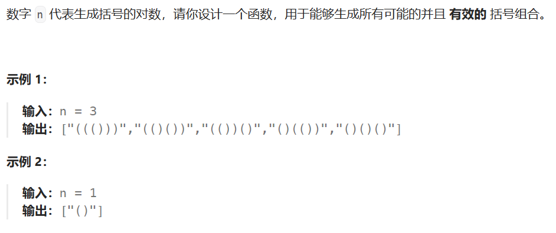
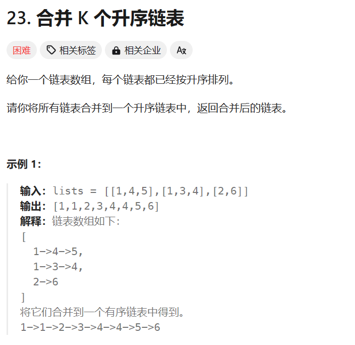

# 力扣记录

## 21. 合并两个有序链表

**题目描述：**


**解题代码：**

```java
class Solution {
    public ListNode mergeTwoLists(ListNode list1, ListNode list2) {
        if(list1==null || list2==null){
            return (list1!=null)?list1:list2;
        }
        ListNode current1 = list1;
        ListNode current2 = list2;
        ListNode new_head = new ListNode(0);
        ListNode nextNode;
        ListNode tail = new_head;

        while(current1!=null && current2!=null){
            if(current1.val <= current2.val){
                nextNode = current1;
                tail.next = nextNode;
                tail = tail.next;
                current1 = current1.next;
            }else{
                nextNode = current2;
                tail.next = nextNode;
                tail = tail.next;
                current2 = current2.next;
            }
        }
        if(current1!=null){
            tail.next = current1;
        }else{
            tail.next = current2;
        }
        return new_head.next;
    }
}
```

**大佬解法：**
其实差不多，就是代码更简洁一点

```java
class Solution {
    public ListNode mergeTwoLists(ListNode l1, ListNode l2) {
        ListNode prehead = new ListNode(-1);

        ListNode prev = prehead;
        while (l1 != null && l2 != null) {
            if (l1.val <= l2.val) {
                prev.next = l1;
                l1 = l1.next;
            } else {
                prev.next = l2;
                l2 = l2.next;
            }
            prev = prev.next;
        }

        // 合并后 l1 和 l2 最多只有一个还未被合并完，我们直接将链表末尾指向未合并完的链表即可
        prev.next = l1 == null ? l2 : l1;

        return prehead.next;
    }
}
```

## 22. 括号生成

**题目描述：**



**解题代码：**
这个有问题，前三个还能解决，但是第4个就不行了，"(())(())"这个就不行了

```java
class Solution {
    public List<String> distinct(List<String> list) {
        List doubleList= new ArrayList();
        Set set = new HashSet();
        set.addAll(list);
        doubleList.addAll(set);

        return doubleList;
    }
    public List<String> generateParenthesis(int n) {
        List<String> ans = new ArrayList<String>();
        ans.add("()");
        for(int i = 1;i < n;i++){
            List<String> tmp = new ArrayList<String>();
            for(String s:ans){
                tmp.add("("+ s + ")");
                tmp.add("()" + s);
                tmp.add(s + "()");
            }
            List<String> tmp2 = distinct(tmp);
            ans.clear();
            ans.addAll(tmp2);
        }
        return ans;
    }
}
```

**大佬解法：**

```java
class Solution {
    public List<String> generateParenthesis(int n) {
        List<String> ans = new ArrayList<String>();
        backtrack(ans, new StringBuilder(), 0, 0, n);
        return ans;
    }

    public void backtrack(List<String> ans, StringBuilder cur, int open, int close, int max){
        if (cur.length() == max * 2) {
            ans.add(cur.toString());
            return;
        }
        if (open < max) {
            cur.append('(');
            backtrack(ans, cur, open+1, close, max);
            cur.deleteCharAt(cur.length() - 1);
        }
        if (close < open) {
            cur.append(')');
            backtrack(ans, cur, open, close+1, max);
            cur.deleteCharAt(cur.length() - 1);
        }
    }
}
```

## 23. 合并K个升序链表

**题目描述：**



**解题代码：**

```java

```
