# 1. 链表

## 1. 反转链表

**题目描述：**

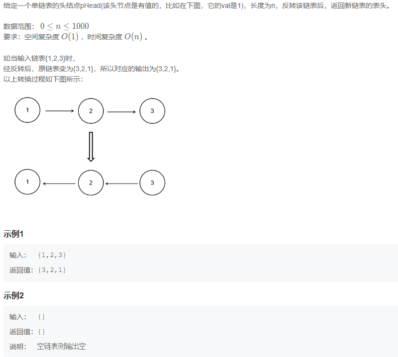

**解题代码:**

```java
import java.util.*;

/*
 * public class ListNode {
 *   int val;
 *   ListNode next = null;
 *   public ListNode(int val) {
 *     this.val = val;
 *   }
 * }
 */

public class Solution {
    /**
     * 代码中的类名、方法名、参数名已经指定，请勿修改，直接返回方法规定的值即可
     *
     *
     * @param head ListNode类
     * @return ListNode类
     */
    public ListNode ReverseList (ListNode head) {
        // write code here
        if (head == null || head.next == null) {
            return head; // 如果链表为空或只有一个节点，直接返回原链表
        }
        ListNode prev = null;
        ListNode current = head;
        ListNode nextNode;

        while (current != null) {
            nextNode = current.next; // 保存下一个节点的引用
            current.next = prev; // 当前节点指向前一个节点
            prev = current; // 前一个节点更新为当前节点
            current = nextNode; // 当前节点更新为下一个节点
        }

        return prev; // prev现在是反转后的链表头结点
    }
}
```

```cpp
/**
 * struct ListNode {
 *  int val;
 *  struct ListNode *next;
 *  ListNode(int x) : val(x), next(nullptr) {}
 * };
 */
class Solution {
public:
    /**
     * 代码中的类名、方法名、参数名已经指定，请勿修改，直接返回方法规定的值即可
     *
     * 
     * @param head ListNode类 
     * @return ListNode类
     */
    ListNode* ReverseList(ListNode* head) {
        // write code here
        if (head == nullptr || head->next == nullptr ) {
            return head;
        }
        ListNode* prev_node = nullptr;
        ListNode* current = head;
        ListNode* nextNode;
        while (current != nullptr) {
            nextNode = current->next;
            current->next = prev_node;
            prev_node = current;
            current = nextNode;
        }

        return prev_node;
    }
};
```

## 2. 链表内指定区间反转

**题目描述：**

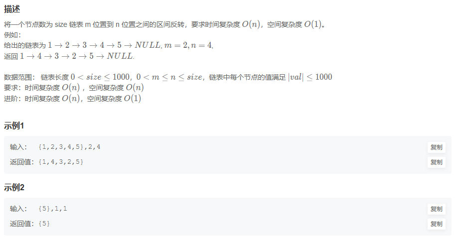

**解题代码:**

```java
import java.util.*;

/*
 * public class ListNode {
 *   int val;
 *   ListNode next = null;
 *   public ListNode(int val) {
 *     this.val = val;
 *   }
 * }
 */

public class Solution {
    /**
     * 代码中的类名、方法名、参数名已经指定，请勿修改，直接返回方法规定的值即可
     *
     *
     * @param head ListNode类
     * @param m int整型
     * @param n int整型
     * @return ListNode类
     */
    public ListNode reverseBetween (ListNode head, int m, int n) {
        // write code here
        //我们可以在链表前加一个表头，后续返回时去掉就好了，因为如果要从链表头的位置开始反转，在多了一个表头的情况下就能保证第一个节点永远不会反转，不会到后面去。
        ListNode HEAD = new ListNode(0);
        HEAD.next = head;
        ListNode prev = null;
        ListNode current = HEAD;
        ListNode nextNode;
        for(int i = 0;i < m;i++){
            nextNode = current.next;
            prev = current;
            current = nextNode;
        }
        ListNode after = current;
        for(int i = 0;i < n - m;i++){
            after = after.next;
        }
        nextNode = after.next;
        after.next = null;
        after = nextNode;
        prev.next = ReverseList(current);
        while(prev.next!=null){
            prev = prev.next;
        }
        prev.next = after;

        return HEAD.next;
    }
}
```

**大佬思路:**

对于反转链表，我们使用递归的思想，将大问题转换为小问题，然后进行相应的求解即可。对于递归过程，判断n的数值，当n为1时返回head指针，否则进行递归，并且反转链表，最后进行拼接，返回拼接之后的链表。（代码简单，但是空间复杂度：其最坏递归空间复杂度为O(N).）

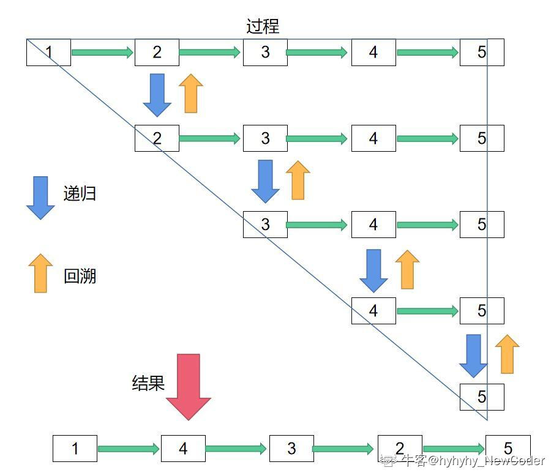

```java
class Solution {
public:
    ListNode* tmp = NULL;
    ListNode* reverseBetween(ListNode* head, int m,int n){
        if( m == 1) return reverse(head, n);
        ListNode* p = reverseBetween(head->next, m-1,n-1); // m,n在子问题中要减1
        head->next = p; //拼接反转之后的部分
        return head;
    }
    ListNode* reverse(ListNode* head,int n)
    {//反转链表，递归的思想，参考贵州大学的漫漫云天自翱翔的思路
        if(n == 1)
        {
            tmp = head->next;
            return head;
        }
        ListNode* new_head = reverse(head->next,n-1);  //子问题，位置要减1
        head->next->next = head; //反转
        head->next = tmp;  //拼接尾部
        return new_head;
    }
};
```

## 3. 链表中的节点每k个一组翻转

**题目描述：**

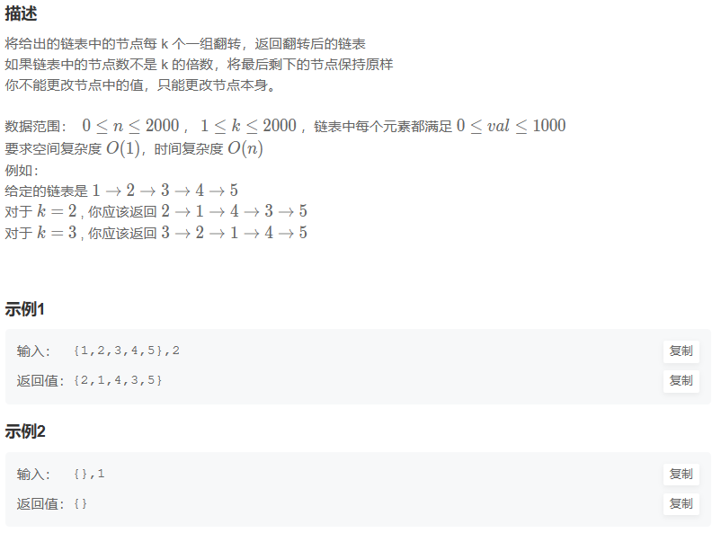

**解题代码:**

```java
public ListNode reverseKGroup (ListNode head, int k) {
    // write code here
    if (head == null || k == 1) {
        return head;
    }
    ListNode current = head;
    int num = 0;
    while(current!=null){
        current = current.next;
        num++;
    }
    int i = 1;
    for(;(i+k -1) <= num;i+=k){
        head = reverseBetween(head ,i,i+k-1);
    }
    
    return head;
}
```

**大佬思路:**

又快又小

```cpp
/**
 * struct ListNode {
 *  int val;
 *  struct ListNode *next;
 * };
 */

class Solution {
public:
    /**
     * 
     * @param head ListNode类 
     * @param k int整型 
     * @return ListNode类
     */
    ListNode* reverseKGroup(ListNode* head, int k) {
        // write code here
        ListNode *p=head;
        ListNode *new_head=head;
        int kk=k;
        ListNode *ne=NULL;
        ListNode *tail=NULL;
        while(p)
        {
            if(kk==1)
            {
                ne=p->next;
                p->next=NULL;
                ListNode *temp=reverse(head);//反转链表输入的head最后指向原链表的最后一个节点
                if(new_head==head)
                    new_head=temp;
                if(tail)
                    tail->next=p;
                tail=head;
                
                head=ne;
                p=ne;
                kk=k;
                continue;
            }
            kk--;
            p=p->next;
        }
        if(tail)
            tail->next=head;
        return new_head;
    }
    ListNode *reverse(ListNode *start)
    {
        ListNode * p=nullptr;
        while(start)
        {
            ListNode *temp=start->next;
            start->next=p;
            p=start;
            start=temp;
        }
        return p;
    }
};
```

## 4.合并两个排序的链表

**题目描述：**

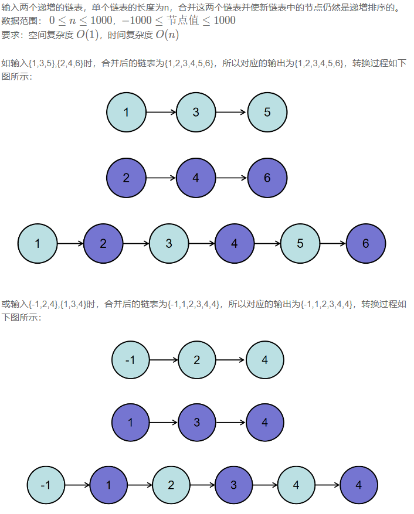

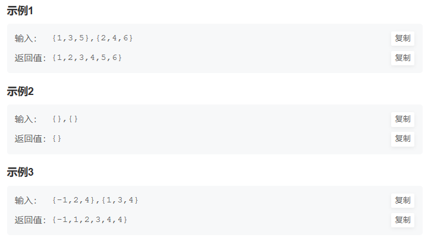

```java
import java.util.*;

/*
 * public class ListNode {
 *   int val;
 *   ListNode next = null;
 *   public ListNode(int val) {
 *     this.val = val;
 *   }
 * }
 */

public class Solution {
    /**
     * 代码中的类名、方法名、参数名已经指定，请勿修改，直接返回方法规定的值即可
     *
     * 
     * @param pHead1 ListNode类 
     * @param pHead2 ListNode类 
     * @return ListNode类
     */
    public ListNode Merge (ListNode pHead1, ListNode pHead2) {
        // write code here
        if(pHead1==null || pHead2==null){
            return (pHead1!=null)?pHead1:pHead2;
        }
        ListNode current1 = pHead1;
        ListNode current2 = pHead2;
        ListNode new_head = new ListNode(0);
        ListNode nextNode;
        ListNode tail = new_head;

        while(current1!=null && current2!=null){
            if(current1.val <= current2.val){
                nextNode = current1;
                tail.next = nextNode;
                tail = tail.next;
                current1 = current1.next;
            }else{
                nextNode = current2;
                tail.next = nextNode;
                tail = tail.next;
                current2 = current2.next;
            }
        }
        if(current1!=null){
            tail.next = current1;
        }else{
            tail.next = current2;
        }
        return new_head.next;
    }
}
```

**大佬思路:**

其实一样

```cpp
/*
struct ListNode {
    int val;
    struct ListNode *next;
    ListNode(int x) :
            val(x), next(NULL) {
    }
};*/
class Solution {
public:
    ListNode* Merge(ListNode* pHead1, ListNode* pHead2) {
        if(pHead1 == nullptr){return pHead2;}
        if(pHead2 == nullptr){return pHead1;}

        ListNode* dummy = new ListNode(0);//这儿必须初始化
        ListNode* cur = dummy;

        while(pHead1 && pHead2){
            if(pHead1->val <= pHead2->val){
                cur->next = pHead1;
                pHead1 = pHead1->next;    
            }
            else{
                cur->next = pHead2;
                pHead2 = pHead2->next;
            }
            cur = cur->next;
        }
        if(pHead1){cur->next = pHead1;}// 可以学学这儿怎么if
        else{cur->next = pHead2;}

        return dummy->next;
    }
};
```

## 5. 合并k个已排序的链表

**题目描述：**

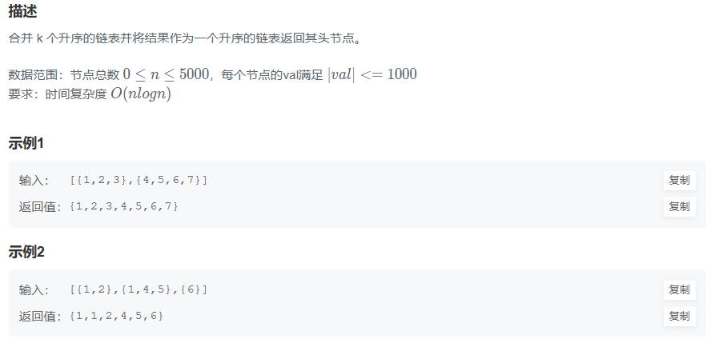

**解题代码:**

```java
public ListNode mergeKLists (ArrayList<ListNode> lists) {
    // write code here
    if(lists.isEmpty()){
        return null;
    }
    ListNode new_head = lists.get(0);
    lists.remove(0);
    for(ListNode node:lists){
        new_head = Merge(new_head,node);
    }
    return new_head;
}
```

```cpp
ListNode* mergeKLists(vector<ListNode*>& lists) {
    // write code here
    if(lists.empty()){
        return nullptr;
    }
    ListNode* new_head = lists[0];
    lists.erase(lists.begin());
    for(ListNode* node:lists){
        new_head = Merge(new_head,node);
    }
    return new_head;
}
```

**大佬思路:**

使用sort,

```cpp
class Solution {
public:
    ListNode *mergeKLists(vector<ListNode *> &lists) {
        vector<int> v;
        for(int i=0;i<lists.size();i++){
            ListNode* temp=lists[i];
            while(temp){
                v.push_back(temp->val);
                temp=temp->next;
            }
 
        }
        sort(v.begin(),v.end());
        ListNode* head=new ListNode(0);
        ListNode* cur=head;
        for(vector<int>::iterator it=v.begin();it!=v.end();it++){
//             cur->val=*it;
            int a=*it;
            ListNode * temp=new ListNode(a);
            cur->next=temp;
            cur=cur->next;
        }
        return head->next;
    }
};
```

## 6. 判断链表中是否有环

**题目描述：**

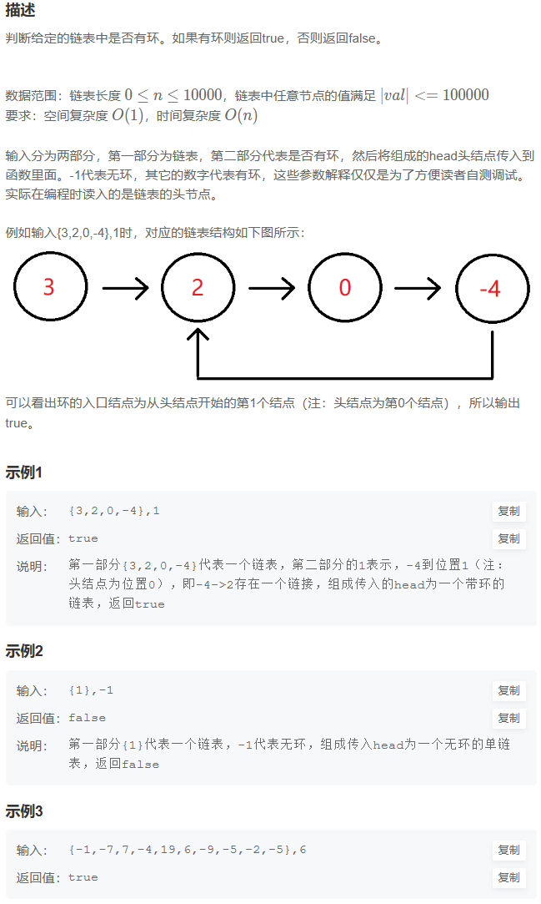

**解题代码:**

```java
import java.util.*;
/**
 * Definition for singly-linked list.
 * class ListNode {
 *     int val;
 *     ListNode next;
 *     ListNode(int x) {
 *         val = x;
 *         next = null;
 *     }
 * }
 */
public class Solution {
    public boolean hasCycle(ListNode head) {
        if(head == null){
            return false;
        }
        HashSet<ListNode> hashMap = new HashSet<>();

        while(head!=null){
            if(hashMap.contains(head)){
                return true;
            }
            hashMap.add(head);
            head = head.next;
        }
        return false;
    }
}
```

**大佬思路:**

一种是我的哈希表，一种是快慢指针

```python
class Solution:
    def hasCycle(self , head ):
        # write code here
        if not head:
            return head
        # 双指针  快慢指针
        slow = head
        fast = head
        while slow and fast:
            slow = slow.next
            if fast.next:
                fast = fast.next.next
            else:
                return False
            # 当双指针相遇 即表示指针有环
            if slow == fast:
                return True
        return False
```

## 7. 链表中环的入口结点

**题目描述：**

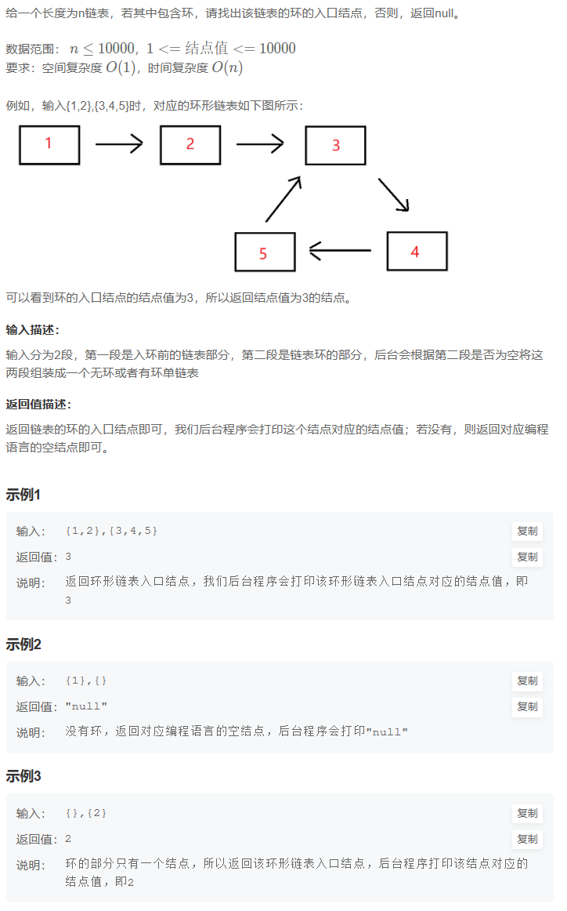

**解题代码:**

```java
public class Solution {

    public ListNode EntryNodeOfLoop(ListNode pHead) {
        if(pHead == null){
            return pHead;
        }
        HashSet<ListNode> hashMap = new HashSet<>();

        while(pHead!=null){
            if(hashMap.contains(pHead)){
                return pHead;
            }
            hashMap.add(pHead);
            pHead = pHead.next;
        }
        return null;
    }
}
```

**大佬思路:**

```cpp
public class Solution {

    public ListNode EntryNodeOfLoop(ListNode pHead) {
        if (pHead==null || pHead.next==null) return null;
        ListNode fast = pHead;
        ListNode slow = pHead;
        while (fast!=null && fast.next!=null) {
            fast=fast.next.next;
            slow=slow.next;
            // 快慢相遇，说明成环
            if (fast==slow) {
                ListNode tmp = pHead;
                while (tmp!=slow) {
                    tmp=tmp.next;
                    slow=slow.next;
                }
                return tmp;
            }
        }
        return null;
    }
}
```

## 8. 链表中倒数最后k个结点

**题目描述：**

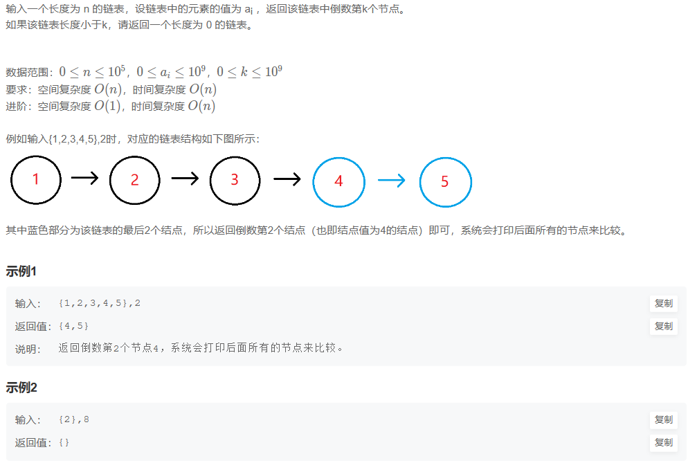

**解题代码:**

```java
public class Solution {
    /**
     * 代码中的类名、方法名、参数名已经指定，请勿修改，直接返回方法规定的值即可
     *
     * 
     * @param pHead ListNode类 
     * @param k int整型 
     * @return ListNode类
     */
    public ListNode FindKthToTail (ListNode pHead, int k) {
        // write code here
        if(k == 0 || pHead==null){
            return null;
        }

        ListNode new_head = pHead;
        while(k > 1){
            new_head = new_head.next;
            if(new_head ==null){
                return null;
            }
            k--;
        }
        while(new_head.next != null){
            pHead = pHead.next;
            new_head = new_head.next;
        }
        return pHead;
    }
}
```

**大佬思路:**

哥就是大佬思路（快慢指针）

```cpp
class Solution {
public:
    ListNode* FindKthToTail(ListNode* pHead, int k) {
        ListNode* fast = pHead; 
        ListNode* slow = pHead;
        //快指针先行k步
        for(int i = 0; i < k; i++){  
            if(fast != NULL)
                fast = fast->next;
            //达不到k步说明链表过短，没有倒数k
            else 
                return slow = NULL;
        }
        //快慢指针同步，快指针先到底，慢指针指向倒数第k个
        while(fast != NULL){ 
            fast = fast->next;
            slow = slow->next;
        }
        return slow;
    }
};
```

## 9. 删除链表的倒数第n个节点

**题目描述：**

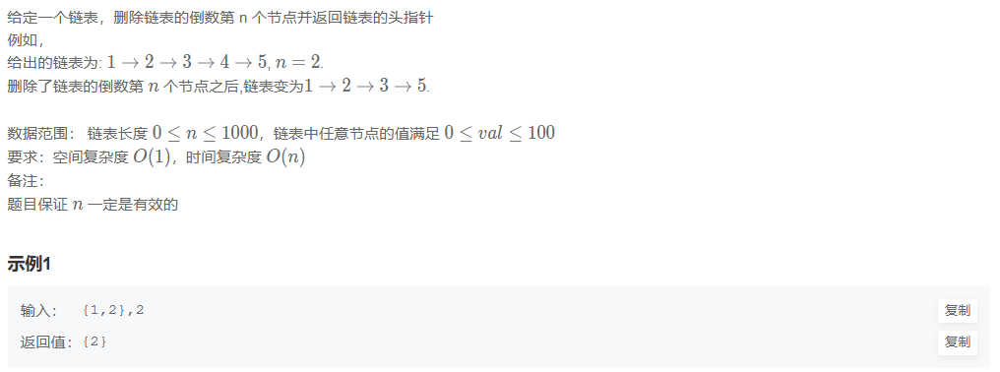

**解题代码:**

```java
public ListNode removeNthFromEnd (ListNode head, int n) {
    // write code here
    if(n == 0 || head == null){
        return head;
    }

    ListNode new_head = head;
    ListNode prev = null;
    ListNode current = head;
    while(n > 1){
        new_head = new_head.next;
        n--;
    }
    if(new_head.next == null){
        return head.next;
    }
    while(new_head.next != null){
        prev = current;
        current = current.next;
        new_head = new_head.next;
    }
    prev.next = current.next;
    return head;
}
```

**大佬思路:**

```cpp
class Solution {
public:
    ListNode* removeNthFromEnd(ListNode* head, int n) {
        //添加表头
        ListNode* res = new ListNode(-1); 
        res->next = head;
        //当前节点
        ListNode* cur = head;
        //前序节点 
        ListNode* pre = res; 
        ListNode* fast = head;
        //快指针先行n步
        while(n--) 
            fast = fast->next;
        //快慢指针同步，快指针到达末尾，慢指针就到了倒数第n个位置
        while(fast != NULL){ 
            fast = fast->next;
            pre = cur;
            cur = cur->next;
        }
        //删除该位置的节点
        pre->next = cur->next; 
        //返回去掉头
        return res->next; 
    }
};
```

## 10. 两个链表的第一个公共结点

**题目描述：**

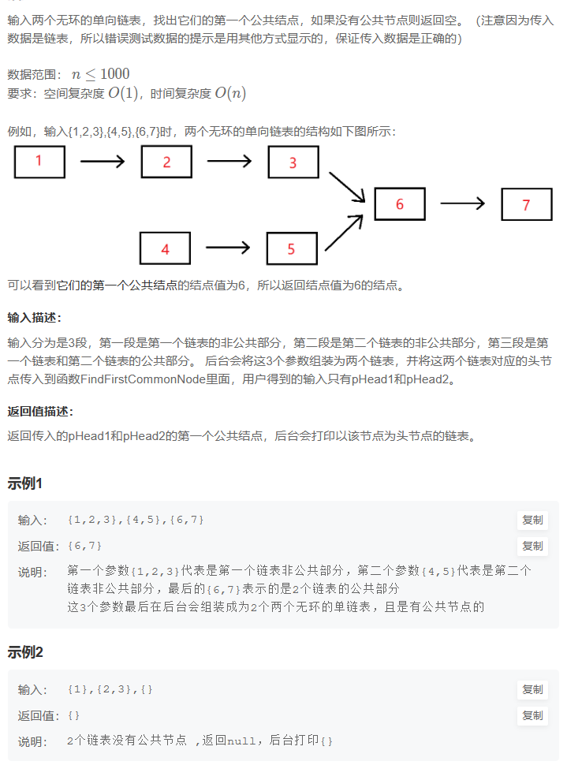

**解题代码:**

```java
public ListNode FindFirstCommonNode(ListNode pHead1, ListNode pHead2) {
    HashSet<ListNode> hashMap = new HashSet<>();
    while(pHead1!=null){
        hashMap.add(pHead1);
        pHead1 = pHead1.next;
    }
    while(pHead2!=null){
        if(hashMap.contains(pHead2)){
            return pHead2;
        }
        pHead2 = pHead2.next;
    }
    return null;
}
```

**大佬思路:**

因为两个指针，同样的速度，走完同样长度（链表1+链表2），不管两条链表有无相同节点，都能够到达同时到达终点。


```cpp
public ListNode FindFirstCommonNode(ListNode pHead1, ListNode pHead2) {
    ListNode l1 = pHead1, l2 = pHead2;
    while(l1 != l2){
        l1 = (l1==null)?pHead2:l1.next;
        l2 = (l2==null)?pHead1:l2.next;
    }
    return l1;
}
```

## 11. 链表相加(二)

**题目描述：**

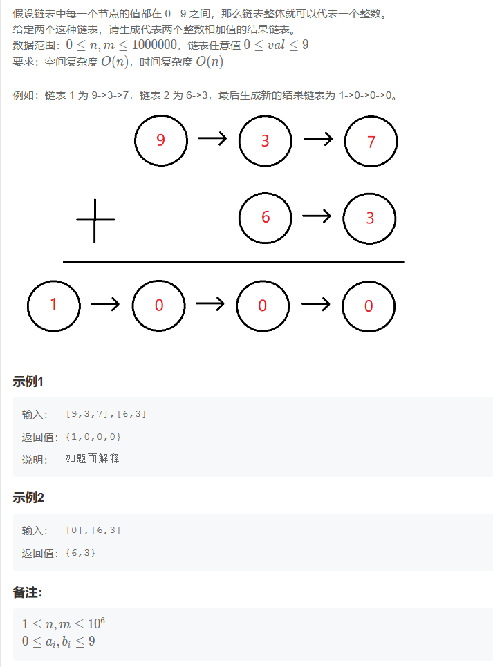

**解题代码:**

```java
public ListNode addInList (ListNode head1, ListNode head2) {
    // write code here
    ListNode Tmp1 = ReverseList(head1);
    ListNode Tmp2 = ReverseList(head2);

    ListNode head = new ListNode(0);
    ListNode current = head;
    int carry = 0;
    int value;
    while(Tmp1!=null && Tmp2!=null){
        value = (Tmp1.val+Tmp2.val + carry)%10;
        carry = (Tmp1.val+Tmp2.val + carry)/10;
        current.next = new ListNode(value);
        current = current.next;
        Tmp1 = Tmp1.next;
        Tmp2 = Tmp2.next;
    }
    while(Tmp1!=null){
        value = (Tmp1.val+ carry)%10;
        carry = (Tmp1.val+ carry)/10;
        current.next = new ListNode(value);
        current = current.next;
        Tmp1 = Tmp1.next;
    }
    while(Tmp2!=null){
        value = (Tmp2.val+ carry)%10;
        carry = (Tmp2.val+ carry)/10;
        current.next = new ListNode(value);
        current = current.next;
        Tmp2 = Tmp2.next;
    }
    if(carry == 1){
        current.next = new ListNode(1);
        current = current.next;
    }
    // head.next = null;
    return ReverseList(head.next);
}
```

**大佬思路:**

我的方法是先反转链表，然后相加，最后再反转回来，这样做的话，空间复杂度为O(N),时间复杂度为O(N),但是我们可以不用反转链表，直接使用栈，这样空间复杂度为O(1),时间复杂度为O(N).

```java
public class Solution {
    /**
     * 
     * @param head1 ListNode类 
     * @param head2 ListNode类 
     * @return ListNode类
     */
    public ListNode addInList (ListNode head1, ListNode head2) {
        // write code here
        if(head1 == null)
            return head2;
        if(head2 == null){
            return head1;
        }
        // 使用两个辅助栈，利用栈先进后出，相当于反转了链表
        Stack<ListNode> stack1 = new Stack<>();
        Stack<ListNode> stack2 = new Stack<>();
        ListNode p1=head1;
        ListNode p2=head2;
        // 将两个链表的结点入栈
        while(p1!=null){
            stack1.push(p1);
            p1=p1.next;
        }
        while(p2!=null){
            stack2.push(p2);
            p2=p2.next;
        }
        // 进位
        int tmp = 0;
        // 创建新的链表头节点
        ListNode head = new ListNode(-1);
        ListNode nHead = head.next;
        while(!stack1.isEmpty()||!stack2.isEmpty()){
            // val用来累加此时的数值（加数+加数+上一位的进位=当前总的数值）
            int val = tmp;
            // 栈1不为空的时候，弹出结点并累加值
            if (!stack1.isEmpty()) {
                val += stack1.pop().val;
            }
            // 栈2不为空的时候，弹出结点并累加值
            if (!stack2.isEmpty()) {
                val += stack2.pop().val;
            }
            // 求出进位
            tmp = val/10;
            // 进位后剩下的数值即为当前节点的数值
            ListNode node = new ListNode(val%10);
            // 将结点插在头部
            node.next = nHead;
            nHead = node;
        }
        if(tmp > 0){
            // 头插
            ListNode node = new ListNode(tmp);
            node.next = nHead;
            nHead = node;
        }
        return nHead;
    }
}
```

## 12. 单链表的排序

**题目描述：**

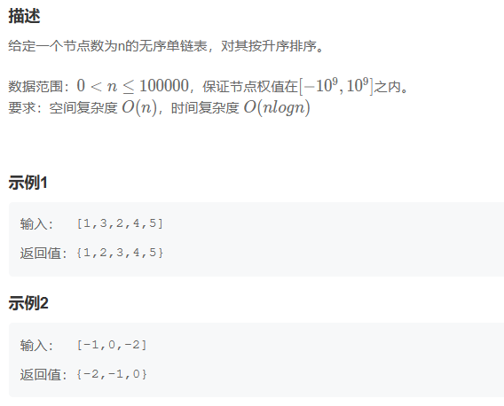

**解题代码:**

运行超时了，但是思路是对的

```java
public ListNode sortInList (ListNode head) {
    // write code here
    if(head == null){
        return head;
    }
    ListNode new_head = new ListNode(head.val);
    head = head.next;
    ListNode nextNode;
    while(head!=null){
        nextNode = new ListNode(head.val);
        new_head = Merge(new_head,nextNode);
        head=head.next;
    }
    return new_head;
}
```

**大佬思路:**

```java
import java.util.*;

/*
 * public class ListNode {
 *   int val;
 *   ListNode next = null;
 * }
 */

public class Solution {
    /**
     * 
     * @param head ListNode类 the head node
     * @return ListNode类
     */
    public ListNode sortInList (ListNode head) {
        // write code here
        if(head ==null || head.next ==null){
            return head;
        }
        ListNode left = head;
        ListNode mid = head.next;
        ListNode right = head.next.next;
        
        while(right!=null && right.next !=null){
            left = left.next;
            mid = mid.next;
            right = right.next.next;
        }
        left.next = null;
        return merge(sortInList(head),sortInList(mid));
    }
    //两个有序链表排序
    public ListNode merge(ListNode head1,ListNode head2){
        if(head1==null){
            return head2;
        }
        if(head2==null){
            return head1;
        }
        ListNode res = new ListNode(0);
        ListNode cur = res;
        while(head1!=null && head2!=null){
            if(head1.val<head2.val){
                cur.next = head1;
                head1 = head1.next;
            }else{
                cur.next = head2;
                head2 = head2.next;
            }
            cur = cur.next;
        }
        if(head1!=null){
            cur.next = head1;
        }
        if(head2!=null){
            cur.next = head2;
        }
        return res.next;
    }
}
```

## 13. 判断一个链表是否为回文结构

**题目描述：**

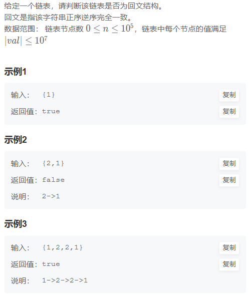

**解题代码:**

```java
public boolean isPail (ListNode head) {
    // write code here
    if(head == null || head.next == null){
        return true;
    }
    ListNode new_head = new ListNode(head.val);
    ListNode current = head.next;
    ListNode nextNode;
    while(current!=null){
        nextNode = new ListNode(current.val);
        nextNode.next = new_head;
        new_head = nextNode;
        current = current.next;
    }
    while(head!=null){
        if(head.val != new_head.val){
            return false;
        }
        head = head.next;
        new_head = new_head.next;
    }
    return true;
}
```

**大佬思路:**

```java
import java.util.*;

/*
 * public class ListNode {
 *   int val;
 *   ListNode next = null;
 * }
 */

public class Solution {
    /**
     * 
     * @param head ListNode类 the head
     * @return bool布尔型
     */
    public boolean isPail (ListNode head) {
        // write code here
        //快慢指针找到中点 -> 反转后半部分 -> 双指针同时遍历
        if(head == null || head.next == null) return true;
        ListNode slow = head, fast = head.next;
        while(fast != null && fast.next != null){
            slow = slow.next;
            fast = fast.next.next;
        }
        //反转slow结点往后的部分
        fast = slow.next;
        while(fast != null && fast.next != null){
            ListNode next = fast.next;
            fast.next = next.next;
            next.next = slow.next;
            slow.next = next;
        }
        fast = slow.next;
        slow = head;
        while(fast != null){
            if(slow.val != fast.val) return false;
            slow = slow.next;
            fast = fast.next;   
        }
        return true;
    }
}
```

## 14. 链表的奇偶重排

**题目描述：**

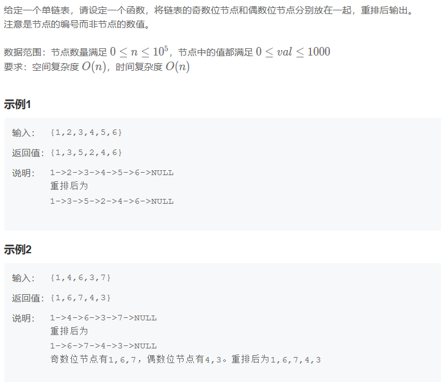

**解题代码:**

```java
public ListNode oddEvenList (ListNode head) {
    // write code here
    if(head == null || head.next == null){
        return head;
    }
    ListNode odd = head;
    ListNode even = head.next;
    ListNode even_head = even;
    while(even!=null && even.next!=null){
        odd.next = even.next;
        odd = odd.next;
        even.next = odd.next;
        even = even.next;
    }
    odd.next = even_head;
    return head;
}
```

已经是大佬思路了

## 15.删除有序链表中重复的元素-I

**题目描述：**

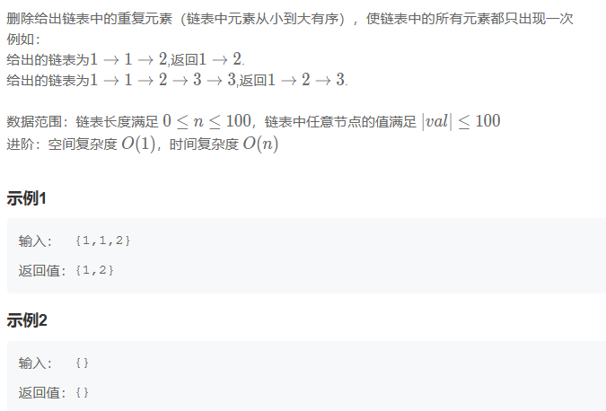

**解题代码:**

```java
public ListNode deleteDuplicates (ListNode head) {
    // write code here
    if(head == null || head.next == null){
        return head;
    }
    int val = head.val;
    ListNode cur = head;
    ListNode tail = head;
    while(cur.next!=null){
        cur = cur.next;
        if(cur.val == val){
            continue;
        }
        tail.next = cur;
        tail = cur;
        val = cur.val;
    }
    if(tail.val == cur.val){
        tail.next = null;
    }
    return head;
}
```

**大佬思路:**

```java
public ListNode deleteDuplicates (ListNode head) {
    // write code here
    if (head == null || head.next == null){
        return head;
    }
    ListNode q = head;
    while(q != null) {
        int cache = q.val;
        ListNode p = q.next;
        while(p != null && p.val == cache) {
            p = p.next;
        }
        q.next = p;
        q = p;
    }
    return head;
}
```

## 16.删除有序链表中重复的元素-II

**题目描述：**

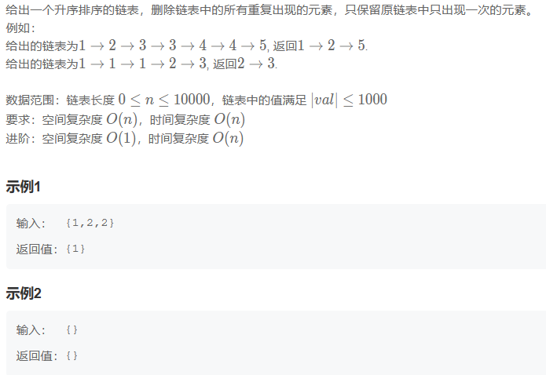

**解题代码:**

```java
public ListNode deleteDuplicates (ListNode head) {
    // write code here
    if (head == null || head.next == null){
        return head;
    }
    ListNode new_head = new ListNode(0);
    new_head.next = head;
    ListNode cur = new_head;
    while(head != null) {
        int i = 0;
        int cache = head.val;
        ListNode p = head.next;
        while(p != null && p.val == cache) {
            i++;
            p = p.next;
        }
        if(i == 0){
            cur.next = head;
            cur = cur.next;
            head = head.next;
            cur.next = null;
        }else{
            head = p;
        }
    }
    if(new_head.next.next!=null && new_head.next.val == new_head.next.next.val){
        new_head.next = null;
    }
    return new_head.next;
}
```

**大佬思路:**

```java
public ListNode deleteDuplicates (ListNode head) {
    ListNode dummy=new ListNode(0);
    dummy.next=head;
    ListNode pre=dummy;
    ListNode p=head;
    while(p!=null&&p.next!=null){
        if(p.val==p.next.val){
            while(p.next!=null&&p.val==p.next.val){
                p=p.next;                   
            }
            pre.next=p.next;
            p=p.next;
        }           
        else{
            pre=p;
            p=p.next;              
        }       
    }
    return dummy.next;
}
```
