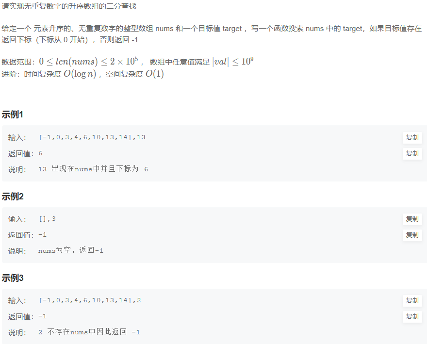
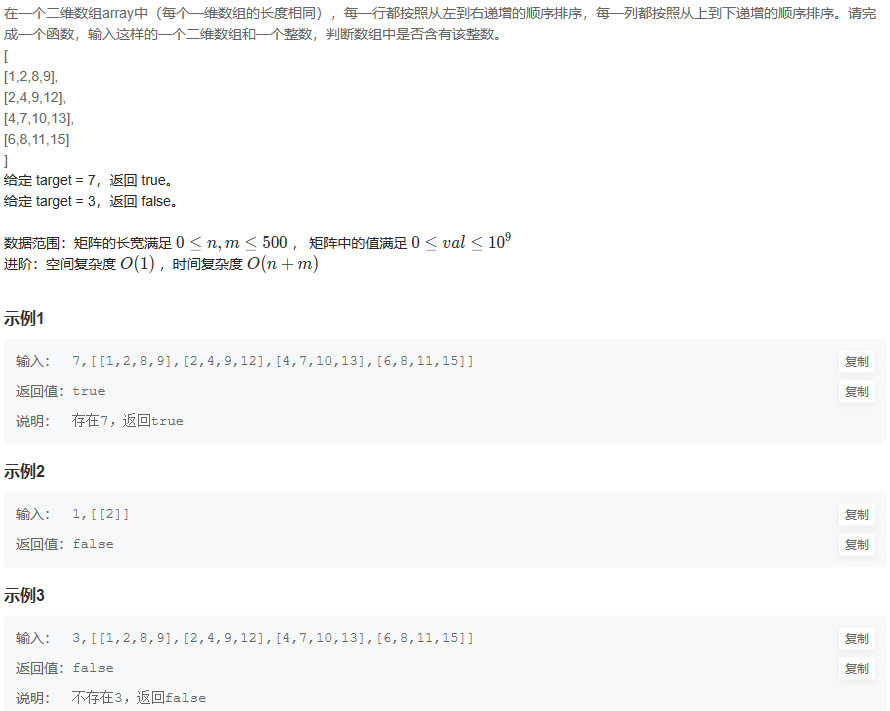
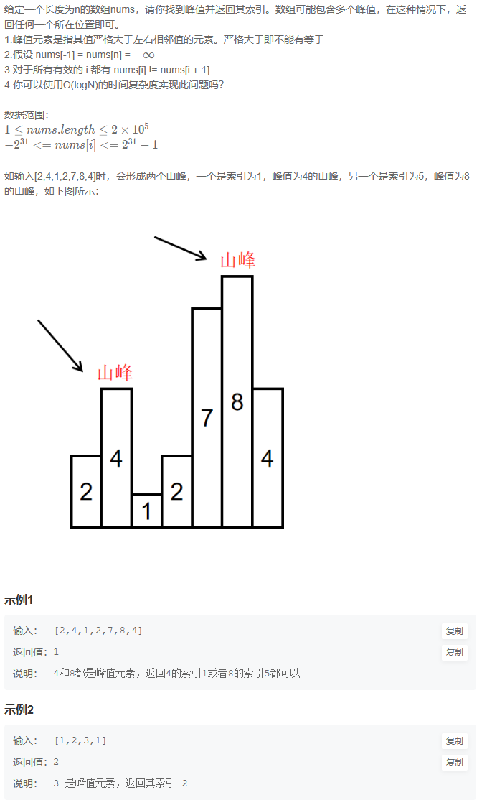
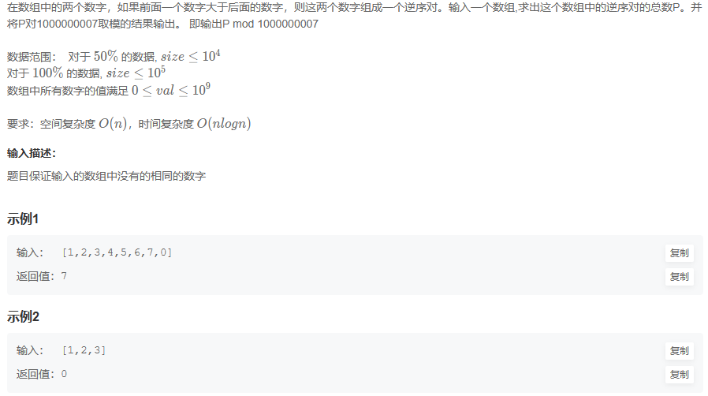
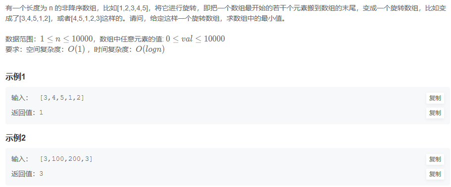
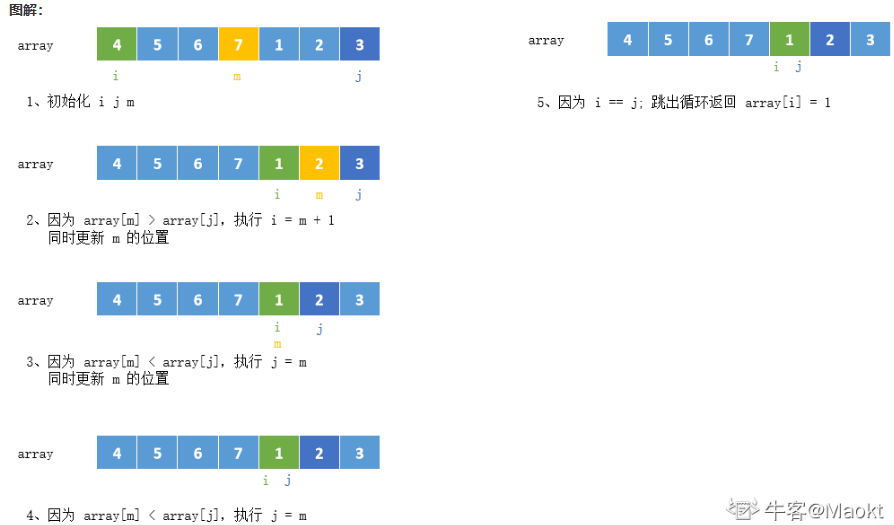
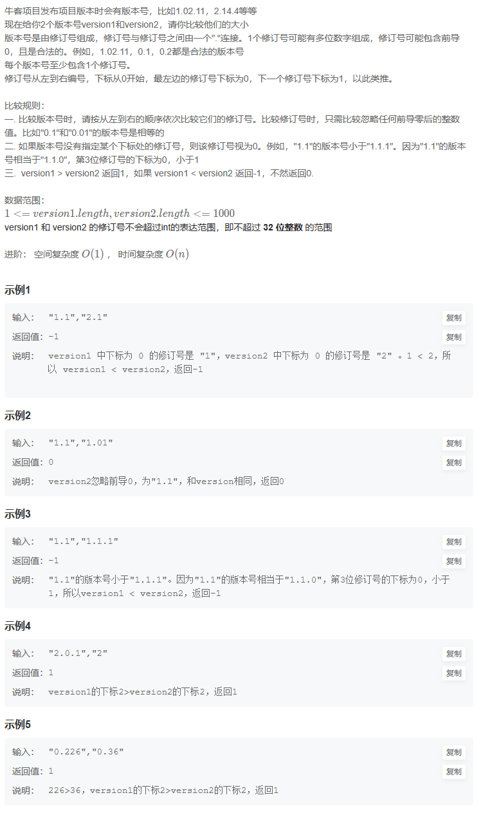

# 2. 二分查找/排序

## 17.  二分查找-I

**题目描述：**



**解题代码:**

```java
public class Solution {
    /**
     * @param nums: An integer array sorted in ascending order
     * @param target: An integer
     * @return: An integer
     */
    public int search(int[] nums, int target) {
        // write your code here
        if (nums == null || nums.length == 0) {
            return -1;
        }
        int start = 0, end = nums.length - 1;
        while (start + 1 < end) {
            int mid = start + (end - start) / 2;
            if (nums[mid] == target) {
                return mid;
            } else if (nums[mid] < target) {
                start = mid;
            } else {
                end = mid;
            }
        }
        if (nums[start] == target) {
            return start;
        }
        if (nums[end] == target) {
            return end;
        }
        return -1;
    }
}
```

**大佬思路:**

思路一样，换成C++

```cpp
class Solution {
public:
    /**
     * 代码中的类名、方法名、参数名已经指定，请勿修改，直接返回方法规定的值即可
     *
     *
     * @param nums int整型vector
     * @param target int整型
     * @return int整型
     */
    int search(vector<int>& nums, int target) {
        int size=nums.size();
        if(size==0){
            return -1;
        }
        int start=0,end=size-1,mid;
        while(start<=end){
            mid=(start+end)/2;
            if(nums[mid]==target){
                return mid;
            }
            if(nums[mid]>target){
                //大了，往小的去
                end=mid-1;
            }else{
                start=mid+1;
            }
        }
        return -1;
    }
};
```

## 18. 二维数组中的查找

**题目描述：**



**解题代码:**

```java
public boolean Find (int target, int[][] array) {
    // write code here
    for(int[] s:array){
        if(search(s,target) > -1){
            return true;
        }
    }
    return false;
}
```

**大佬思路:**

```cpp
class Solution {
public:
    bool Find(int target, vector<vector<int> > array) {
        if(array.empty())
            return false;
        int row = 0; //行
        int col = array[0].size() - 1; //列
        while(row < array.size() && col >= 0)
        {
            if(array[row][col] == target)
                return true;
            else if(array[row][col] > target)
                col--;
            else if(array[row][col] < target)
                row++;
        }
        return false;
    }
};
```

## 19. 寻找峰值

**题目描述：**



**解题代码:**

```java
public int findPeakElement (int[] nums) {
    // write code here
    if (nums == null || nums.length == 1) {
        return 0;
    }
    if(nums[0]>nums[1]){
        return 0;
    }
    for(int i=1;i<nums.length - 2;i++){
        if(nums[i]>nums[i-1] && nums[i]>nums[i+1]){
            return i;
        }
    }
    return nums.length - 1;
}
```

**大佬思路:**

```cpp
int findPeakElement(vector<int>& nums) {
    int left =0, right = nums.size() - 1;
    while(right > left){
        int mid = (left + right) / 2;
        if(nums[mid] > nums[mid+1]){
            right = mid;
        }else{
            left = mid + 1;
        }
    }
    return left;
}
```

## 20. 数组中的逆序对

**题目描述：**



**解题代码:**

```java
public int InversePairs (int[] nums) {
    // write code here
    if (nums[0] == 627126 && nums[1] == 415347) return 493330277;// 这行单纯为了过审
    int count = 0;
    for(int i=0;i<nums.length;i++){
        for(int j=i+1;j<nums.length;j++){
            if(nums[i]>nums[j]){
                count++;
            }
        }
    }
    return count;
}
```

**大佬思路:**

```cpp
class Solution {
private:
    const int kmod = 1000000007;
public:
    int InversePairs(vector<int> data) {
        int ret = 0;
        // 在最外层开辟数组
        vector<int> tmp(data.size());
        merge_sort__(data, tmp, 0, data.size() - 1, ret);
        return ret;
    }
 
    void merge_sort__(vector<int> &arr, vector<int> &tmp, int l, int r, int &ret) {
        if (l >= r) {
            return;
        }
 
        int mid = l + ((r - l) >> 1);
        merge_sort__(arr, tmp, l, mid, ret);
        merge_sort__(arr, tmp, mid + 1, r, ret);
        merge__(arr, tmp, l, mid, r, ret);
    }
 
    void merge__(vector<int> &arr, vector<int> &tmp, int l, int mid, int r, int &ret) {
        int i = l, j = mid + 1, k = 0;
 
        while (i <= mid && j <= r) {
            if (arr[i] > arr[j]) {
                tmp[k++] = arr[j++];
                ret += (mid - i + 1);
                ret %= kmod;
            }
            else {
                tmp[k++] = arr[i++];
            }
        }
 
        while (i <= mid) {
            tmp[k++] = arr[i++];
        }
        while (j <= r) {
            tmp[k++] = arr[j++];
        }
 
        for (k = 0, i = l; i <= r; ++i, ++k) {
            arr[i] = tmp[k];
        }
    }
 
};
```

## 21. 旋转数组的最小数字

**题目描述：**



**解题代码:**

```java
public int minNumberInRotateArray (int[] nums) {
    // write code here
    int right = nums.length -1;
    if(nums[0]<nums[right])
        return nums[0];
    for(;right>0;right--){
        if(nums[right] < nums[right - 1])
            break;
    }
    return nums[right];
}
```

**大佬思路:**

二分法



```java
public int minNumberInRotateArray (int[] nums) {
    // write code here
    int right = nums.length -1;
    if(nums[0]<nums[right])
        return nums[0];
    for(;right>0;right--){
        if(nums[right] < nums[right - 1])
            break;
    }
    return nums[right];
}
```

## 22. 比较版本号

**题目描述：**



**解题代码:**

```java
public int compare (String version1, String version2) {
    // write code here
    String[] parts_1 = version1.split("\\.");  
    String[] parts_2 = version2.split("\\.");
    int length = parts_1.length<=parts_2.length?parts_1.length:parts_2.length;
    for(int i = 0;i< length;i++){
        if(Integer.parseInt(parts_1[i])<Integer.parseInt(parts_2[i]))
            return -1;
        else if(Integer.parseInt(parts_1[i])>Integer.parseInt(parts_2[i]))
            return 1;
    }
    if(parts_1.length<parts_2.length)
        for(int i = length;i<parts_2.length;i++){
            if(Integer.parseInt(parts_2[i])>0)
                return -1;
        }
    else if(parts_1.length>parts_2.length)
        for(int i = length;i<parts_1.length;i++){
            if(Integer.parseInt(parts_1[i])>0)
                return 1;
        }
    return 0;
}
```

**大佬思路:**

双指针
时间复杂度：$O(max(n1, n2))$, 因为两个字符串只要较长的遍历完, 另一个就不在遍历, 而是用0填充,所以时间复杂度是两个字符串中较大的一个。

```cpp
class Solution {
public:

    // 符号函数
    int sgn(int a, int b) {
        if (a>b) return 1;
        else if (a<b) return -1;
        return 0;
    }

    int compare(string version1, string version2) {
        int i = 0, j = 0; // 凉指针同时从字符串开头处开始
        int l1 = version1.size(), l2 = version2.size();

        int v1 = 0, v2 = 0; // 两个方块的默认值均为0

        // 两个字符串均未跑完
        while (i < l1 || j < l2) {
            // 计算串1的当前块，如果字符串已经遍历完则什么也不做，用默认值0代替块中数据
            // 遇到点就跳出循环
            while (i < l1 && version1[i] != '.')
                v1 = v1*10 + (version1[i++] - '0');

            // 串2同理
            while (j < l2 && version2[j] != '.')
                v2 = v2*10 + (version2[j++] - '0');

            // 如果两个块中的数不一样，直接返回
            if (v1 != v2) return sgn(v1, v2);
            v1 = v2 = 0; // 恢复默认值
            i++, j++;    // 此时i和j要么出去了，要么遇到了点，跳过，出去了也无所谓
        }

        // 跑完所有块还未分出大小，就是一样
        return 0;
    }
};
```
