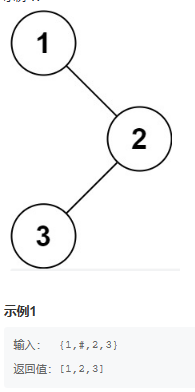
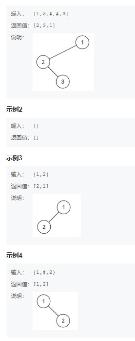
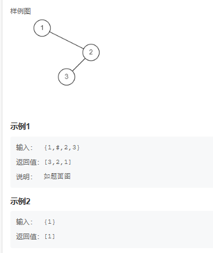
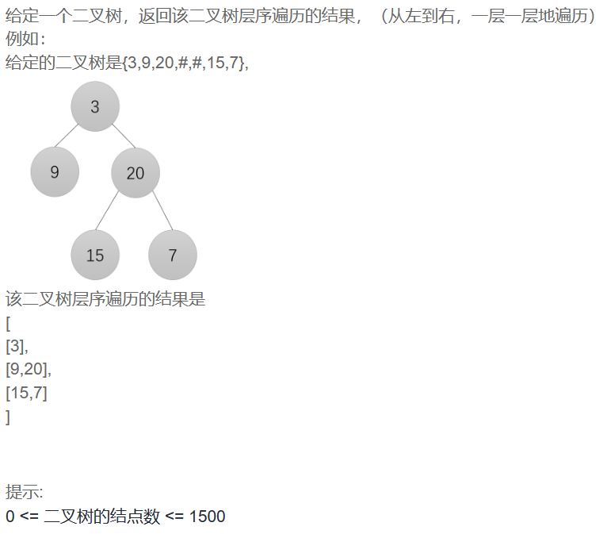
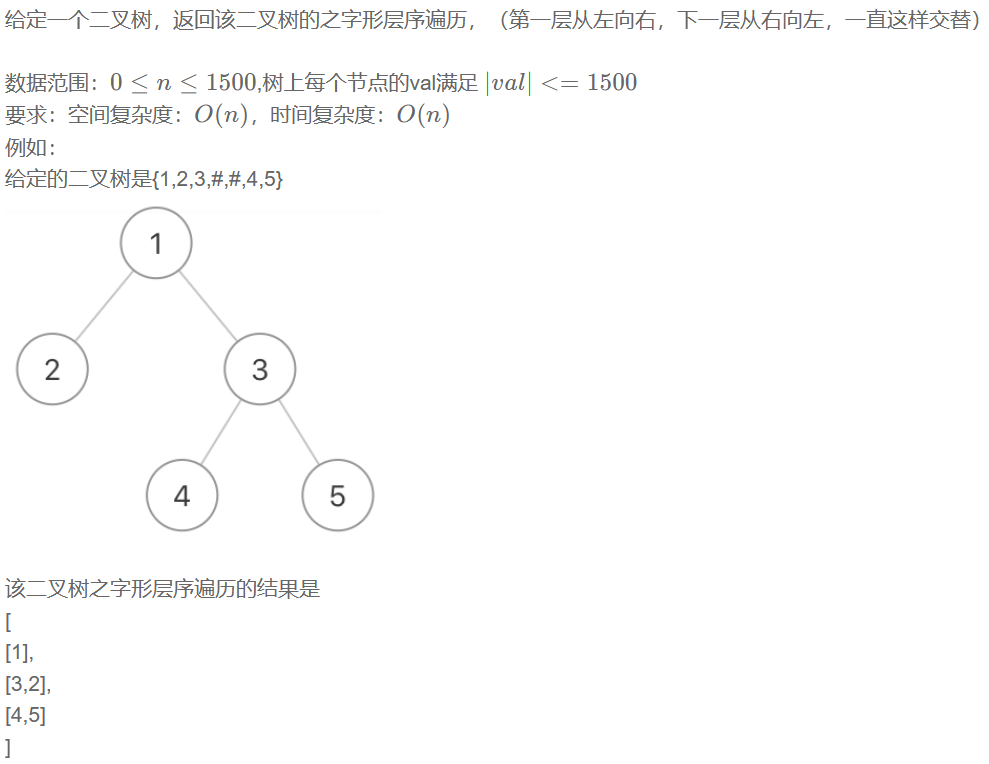
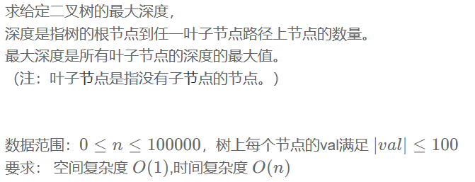
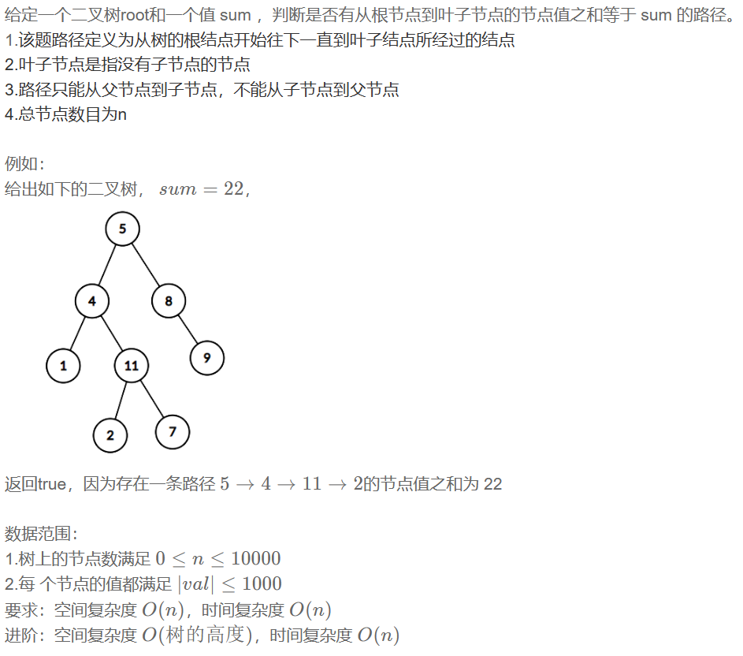
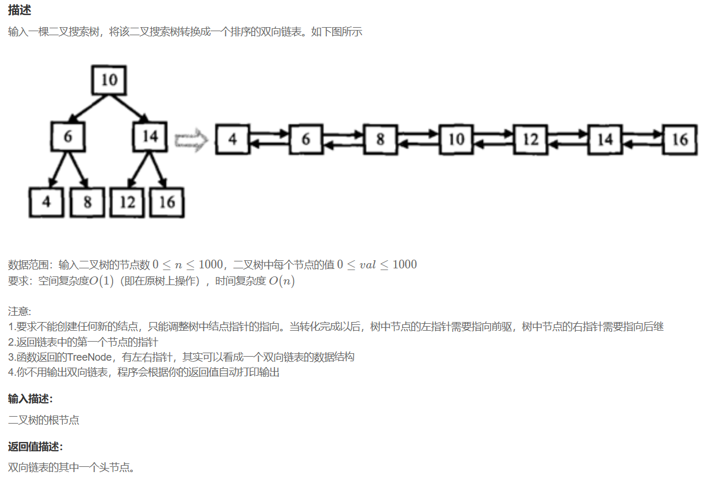
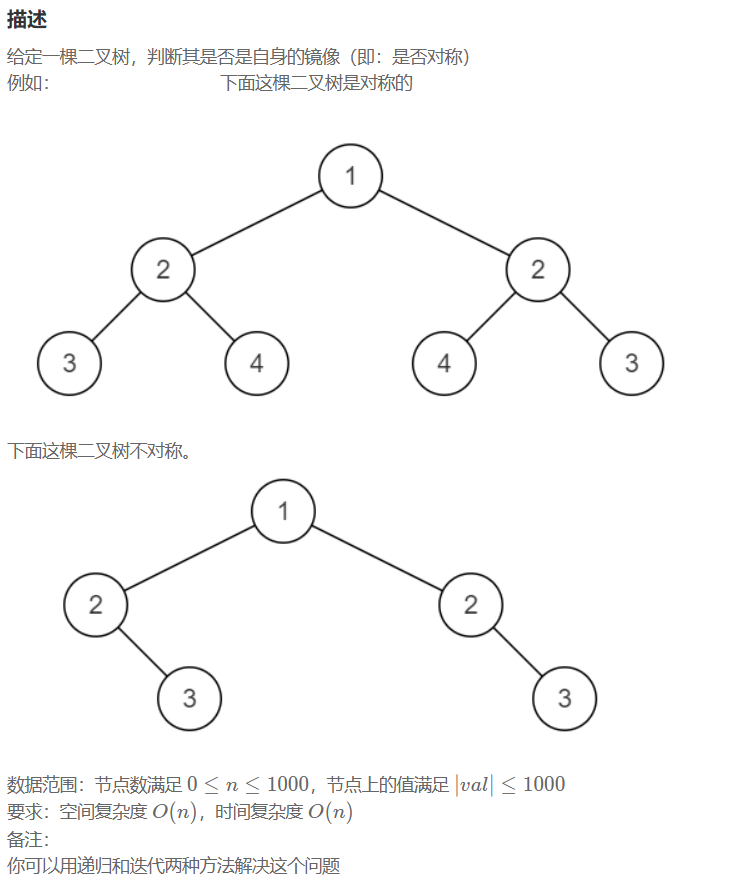

# 2. 二叉树

## 23. 二叉树的前序遍历

**题目描述：**



**解题代码:**

```java
import java.util.*;

/*
 * public class TreeNode {
 *   int val = 0;
 *   TreeNode left = null;
 *   TreeNode right = null;
 *   public TreeNode(int val) {
 *     this.val = val;
 *   }
 * }
 */

public class Solution {
    /**
     * 代码中的类名、方法名、参数名已经指定，请勿修改，直接返回方法规定的值即可
     *
     * 
     * @param root TreeNode类 
     * @return int整型一维数组
     */

    public int[] preorderTraversal (TreeNode root) {
        // write code here
        List<Integer> ans = LJT(root);
        int size = ans.size(); // 获取 ArrayList 中元素的个数
        int[] array=new int[size]; 
        for(int i=0;i<ans.size();i++){ // 循环遍历将 ArrayList 中的数组存入数组
          array[i]=ans.get(i);
        }
        return array;

    }
    public List<Integer> LJT(TreeNode root) {
        // write code here
        List<Integer> list = new ArrayList<>();
        if(root == null)
            return list;
        list.add(root.val);
        list.addAll(LJT(root.left));
        list.addAll(LJT(root.right));
        return list;
    }
}
```

**大佬思路:**

```cpp
/**
 * struct TreeNode {
 *  int val;
 *  struct TreeNode *left;
 *  struct TreeNode *right;
 *  TreeNode(int x) : val(x), left(nullptr), right(nullptr) {}
 * };
 */
class Solution {
public:
    vector<int> res;
    void dfs(TreeNode* Node){
        if(Node == nullptr) return;
        res.push_back(Node->val);
        dfs(Node->left);
        dfs(Node->right);
    }
    vector<int> preorderTraversal(TreeNode* root) {
        // write code here
        dfs(root);
        return res;
    }
};
```

## 24. 二叉树的中序遍历

**题目描述：**



**解题代码:**

```cpp
vector<int> res;
void dfs(TreeNode* Node){
    if(Node == nullptr) return;
    dfs(Node->left);
    res.push_back(Node->val);
    dfs(Node->right);
}
vector<int> inorderTraversal(TreeNode* root) {
    // write code here
    dfs(root);
    return res;
}
```

## 25. 二叉树的后序遍历

**题目描述：**



**解题代码:**

```cpp
 vector<int> res;
void dfs(TreeNode* Node){
    if(Node == nullptr) return;
    dfs(Node->left);
    dfs(Node->right);
    res.push_back(Node->val);
}
vector<int> postorderTraversal(TreeNode* root) {
    // write code here
    dfs(root);
    return res;
}
```

## 26. 二叉树的层次遍历

**题目描述：**



**解题代码:**

```cpp
vector<vector<int>> levelOrder(TreeNode* root) {
    vector<vector<int>> res;
    if(root == nullptr) return res;
    queue<TreeNode*> q;
    q.push(root);
    while(!q.empty()){
        int size = q.size();
        vector<int> tmp;
        for(int i = 0; i < size; i++){
            TreeNode* node = q.front();
            q.pop();
            tmp.push_back(node->val);
            if(node->left) q.push(node->left);
            if(node->right) q.push(node->right);
        }
        res.push_back(tmp);
    }
    return res;
}
```

## 27. 按之字形顺序打印二叉树

**题目描述：**



**解题代码:**

```cpp
vector<vector<int> > Print(TreeNode* pRoot) {
    // write code here
    vector<vector<int>> res;
    if(pRoot == nullptr) return res;
    stack<TreeNode*> s;
    s.push(pRoot);
    bool flag = true;
    while(!s.empty()){
        stack<TreeNode*> stmp;// 建立一个临时的栈
        int size = s.size();
        vector<int> tmp;
        for(int i = 0; i < size; i++){
            TreeNode* node = s.top();
            s.pop();
            tmp.push_back(node->val);
            if(flag){
                if(node->left) stmp.push(node->left);
                if(node->right) stmp.push(node->right);
            }else {
                if(node->right) stmp.push(node->right);
                if(node->left) stmp.push(node->left);
            }                
        }
        flag = !flag;
        res.push_back(tmp);
        s = stmp;
    }
    return res;
}
```

**大佬思路：**

区别就在于我是真的按照之字形遍历的，这个思路只是在输出这步反转了一下，所以效率更高。

```cpp
class Solution {
public:
    vector<vector<int> > Print(TreeNode* pRoot) {
        vector<vector<int>> ret;
        if (!pRoot) return ret;
        queue<TreeNode*> q;
        q.push(pRoot);
        int level = 0;
  
        while (!q.empty()) {
            int sz = q.size();
            vector<int> ans;
            while (sz--) {
                TreeNode *node = q.front();
                q.pop();
                ans.push_back(node->val);
  
                if (node->left) q.push(node->left);
                if (node->right) q.push(node->right);
            }
            ++level;
            if (!(level&1)) // 偶数层 反转一下
                reverse(ans.begin(), ans.end());
            ret.push_back(ans);
        }
        return ret;
    }
     
};
```

## 28. 二叉树的最大深度

**题目描述：**



**解题代码:**

```cpp
class Solution {
public:
    /**
     *
     * @param root TreeNode类
     * @return int整型
     */
    int max_depth=0;
    void DFS(TreeNode* root, int lever){
        if(root==nullptr) return;
        max_depth=max(max_depth,lever);
        DFS(root->left,lever+1);
        DFS(root->right,lever+1);
    }
    int maxDepth(TreeNode* root) {
        // write code here
        DFS(root,1);
        return max_depth;
    }
};
```

**大佬思路：**

```cpp
int maxDepth(TreeNode* root) {
    if(root == nullptr) return 0;
    return max(maxDepth(root->left), maxDepth(root->right)) + 1;
}
```

## 29. 二叉树中和为某一值的路径(一)

**题目描述：**



**解题代码:**

```cpp
class Solution {
public:
    /**
     * 代码中的类名、方法名、参数名已经指定，请勿修改，直接返回方法规定的值即可
     *
     * 
     * @param root TreeNode类 
     * @param sum int整型 
     * @return bool布尔型
     */
    bool Flag = false;
    void DFS(TreeNode* root, int num){
        if(root==nullptr) return;// 不需要<0时就返回，因为值可能为负数，因此只能遍历
        if(root->val == num && root->left==nullptr && root->right==nullptr){
            Flag = true;
            return;
        }
        DFS(root->left, num-root->val);
        DFS(root->right, num-root->val);
    }
    bool hasPathSum(TreeNode* root, int sum) {
        // write code here
        
        DFS(root, sum);

        return Flag;
    }
};
```

**大佬思路：**

```cpp
class Solution {
public:
    /**
     *
     * @param root TreeNode类
     * @param sum int整型
     * @return bool布尔型
     */
    bool hasPathSum(TreeNode* root, int sum) {
        // write code here
        if(!root) return false;
        if(!root->left && !root->right && !(sum-root->val)) return true;
        return hasPathSum(root->left, sum-root->val) || hasPathSum(root->right, sum-root->val);
    }
};
```

## 30. 二叉搜索树与双向链表

**题目描述：**



**解题代码:**
只知道应该得用[中序遍历](#24-二叉树的中序遍历)

**大佬思路：**

```cpp
class Solution {
  public:
    TreeNode* Convert(TreeNode* pRootOfTree) {
        if (!pRootOfTree) 
            return pRootOfTree;
        TreeNode *p = pRootOfTree;
        if(pRootOfTree->left)
        {
            Convert(pRootOfTree->left);
            p=pRootOfTree->left;
            while(p->right)
                p=p->right;
            pRootOfTree->left=p;
            p->right=pRootOfTree;
        }
        if(pRootOfTree->right)
        {
            Convert(pRootOfTree->right);
            p=pRootOfTree->right;
            while(p->left)
                p=p->left;
            pRootOfTree->right=p;
            p->left=pRootOfTree;
        }
        while(p->left)
            p=p->left;
        return p;
        
    }
};
```

## 31. 对称的二叉树

**题目描述：**



**解题代码:**

```cpp

```
