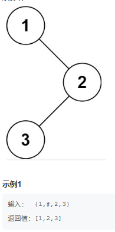
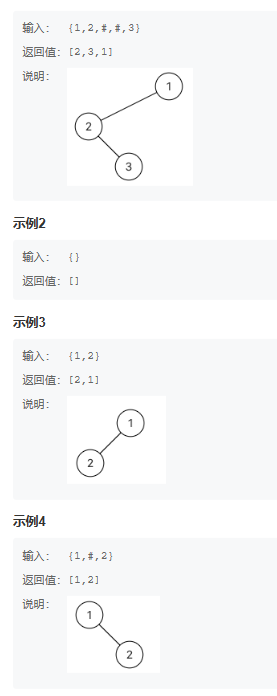
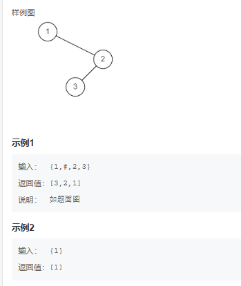

# 2. 二叉树

## 23. 二叉树的前序遍历

**题目描述：**



**解题代码:**

```java
public int[] preorderTraversal (TreeNode root) {
        // write code here
        List<Integer> ans = LJT(root);
        int size = ans.size(); // 获取 ArrayList 中元素的个数
        int[] array=new int[size]; 
        for(int i=0;i<ans.size();i++){ // 循环遍历将 ArrayList 中的数组存入数组
          array[i]=ans.get(i);
        }
        return array;

    }
    public List<Integer> LJT(TreeNode root) {
        // write code here
        List<Integer> list = new ArrayList<>();
        if(root == null)
            return list;
        list.add(root.val);
        list.addAll(LJT(root.left));
        list.addAll(LJT(root.right));
        return list;
    }
```

**大佬思路:**

```cpp
/**
 * struct TreeNode {
 *  int val;
 *  struct TreeNode *left;
 *  struct TreeNode *right;
 *  TreeNode(int x) : val(x), left(nullptr), right(nullptr) {}
 * };
 */
class Solution {
public:
    vector<int> res;
    void dfs(TreeNode* Node){
        if(Node == nullptr) return;
        res.push_back(Node->val);
        dfs(Node->left);
        dfs(Node->right);
    }
    vector<int> preorderTraversal(TreeNode* root) {
        // write code here
        dfs(root);
        return res;
    }
};
```

## 24. 二叉树的中序遍历

**题目描述：**



**解题代码:**

```cpp
vector<int> res;
void dfs(TreeNode* Node){
    if(Node == nullptr) return;
    dfs(Node->left);
    res.push_back(Node->val);
    dfs(Node->right);
}
vector<int> inorderTraversal(TreeNode* root) {
    // write code here
    dfs(root);
    return res;
}
```

## 25. 二叉树的后序遍历

**题目描述：**



**解题代码:**

```cpp
 vector<int> res;
void dfs(TreeNode* Node){
    if(Node == nullptr) return;
    dfs(Node->left);
    dfs(Node->right);
    res.push_back(Node->val);
}
vector<int> postorderTraversal(TreeNode* root) {
    // write code here
    dfs(root);
    return res;
}
```
